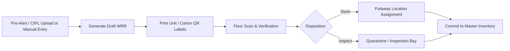

# Dyna-Serv WIMS — User Manual & Operations Guide

## Chapter: Incoming Receiving & Warehouse Receipt (WRR) Operations

---

### 1. Overview of Inbound Processing

The Warehouse Receipt Record (WRR) is the legal and physical intake document for all materials entering the Dyna-Serv warehouse.

---

### 2. Creating a New WRR

1. Navigate to **Receiving** $\rightarrow$ **+ New WRR** (`/receiving/new`).
2. **Select Inbound Mode**:
   * **CIPL / Pre-Alert Upload**: Upload the supplier's Commercial Invoice and Packing List (`.xlsx`, `.csv`, `.pdf`). The parsing engine extracts Item Codes, Lot Numbers, Box Quantities, Dimensions, and declared SPQ.
   * **Manual Entry**: Select the Source Organization (Supplier/Vendor), enter the Reference Invoice / Packing List Number, select the Inventory Model (`Trading`, `VMI`, or `Supplies`), and add declared lot lines.
3. Click **Create WRR**.

---

### 3. Printing QR Carton & Pallet Labels

* Once the WRR is drafted, navigate to the WRR detail screen (`/receiving/[wrrId]`).
* Click **Print Unit Labels**.
* The system generates standardized, high-contrast QR labels formatted for industrial thermal label printers (or standard sheets).
* Affix one QR label per physical box/carton.

---

### 4. Floor Receiving & QR Verification Scan

Floor receiving is optimized for handheld mobile scanners and tablets:

1. Click **Start Receiving** on the WRR detail screen to enter the dedicated scan route (`/receiving/[wrrId]/receive`).
2. **Scan Pallet / Carton QR**:
   * Point the handheld scanner (or tap **Open Camera Scanner**) at the QR label.
   * The system immediately validates the item code and lot against expected declaration lines and increments the scanned box count.
3. **Disposition**:
   * **STORE**: Ready for standard putaway into active warehouse racks.
   * **INSPECT**: Placed on hold for quality assurance / inspection.
4. **Putaway Allocation**:
   * Select an eligible storage location with available CBM capacity (or accept system-recommended locations).
   * Confirm the location assignment.
5. **Completion**:
   * When all declared lines are verified and stored, the WRR automatically transitions to `confirmed` status, making stock instantly available in the **Stock View** (Master Inventory).
