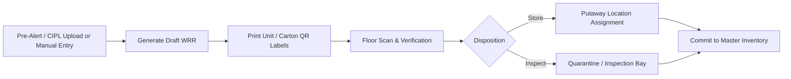

# Dyna-Serv WIMS — User Manual & Operations Guide

## Chapter: Incoming Receiving & Warehouse Receipt (WRR) Operations

---

### 1. Overview of Inbound Processing

The Warehouse Receipt Record (WRR) is the legal and physical intake document for all materials entering the Dyna-Serv warehouse.

---

### 2. Creating a New WRR

1. Navigate to **Receiving** $\rightarrow$ **+ New WRR** (`/receiving/new`).
2. **Select Inbound Mode**:
   * **CIPL / Pre-Alert Upload**: Upload the supplier's Commercial Invoice and Packing List (`.xlsx`, `.csv`, `.pdf`). The parsing engine extracts Item Codes, Lot Numbers, Box Quantities, Dimensions, and declared SPQ.
   * **Manual Entry**: Select the Source Organization (Supplier/Vendor), enter the Reference Invoice / Packing List Number, select the Inventory Model (`Trading`, `VMI`, or `Supplies`), and add declared lot lines.
3. Click **Create WRR**.

---

### 3. Printing QR Carton & Pallet Labels

* Once the WRR is drafted, navigate to the WRR detail screen (`/receiving/[wrrId]`).
* Click **Print Unit Labels**.
* The system generates standardized, high-contrast QR labels formatted for industrial thermal label printers (or standard sheets).
* Affix one QR label per physical box/carton.

---

### 4. Floor Receiving, QR Verification & Batch Putaway

Floor receiving is optimized for handheld mobile scanners, tablets, and forklift operators:

1. **Enter Floor Mode**:
   * Click **Start Receiving** on the WRR detail screen (`/receiving/[wrrId]`) to enter the dedicated floor scan route (`/receiving/[wrrId]/receive`).

2. **Single-Scan Pallet / Batch Recognition**:
   * Point your handheld barcode scanner (or tap **Open Camera Scanner**) at **one** carton label from the pallet.
   * Scanning one carton automatically identifies the item code, lot number, flow type, and expected carton count for the entire line, immediately unlocking the putaway location selector.

3. **Disposition (Store vs. Inspect)**:
   * **STORE**: Standard inventory placement into active storage racks.
   * **INSPECT (Hold)**: Routes the stock to an Inbound Inspection Holding Bay for QA review.

4. **Location Assignment & Handling Shortages**:
   * **Step 1 (Primary Location)**: Quickly assign all declared boxes to a single primary storage rack or inspection bay.
   * **Step 2 (Split Storage / Hold / Shortage per box)**:
     * Expand **Step 2** to allocate individual boxes across multiple racks or isolate damaged/missing cartons.
     * **Multi-Rack Placement**: If a rack reaches capacity, assign Box 1–4 to Rack A and Box 5–10 to Rack B.
     * **Damaged Goods (Hold)**: Select **`Inspection Bay / Hold`** for damaged cartons to automatically quarantine them while storing good cartons.
     * **Missing Goods (Shortage)**: Select **`— Unassigned / Shortage —`** for any missing cartons.
   * **Step 3 (Review & Shortage Detection)**:
     * If missing boxes exist, the system calculates the exact shortage count and displays a clear variance warning.
   * **Step 4 (Presence Attestation & Commit)**:
     * Check the physical presence confirmation checkbox.
     * Tap **Store** / **Hold** to commit the line.
     * Only physically present boxes are posted into inventory and balances. Missing boxes are recorded as OS&D discrepancies.

5. **Independent Line-by-Line Progression**:
   * Each line commits atomically. A shortage on Line 1 never blocks Line 2 or subsequent lines from being scanned and stored.

---

### 5. Final WRR Closure & OS&D Variance Resolution

1. **Full Receipt (Zero Shortage)**:
   * When all lines reach 100% committed status, the WRR automatically flips to **`confirmed`**, and stock becomes available for FIFO/FEFO picking in the Master Inventory.

2. **Partial Receipt / Delivery Shortages**:
   * If some boxes were missing across the shipment, the WRR remains in **`receiving_in_progress`** until all arrived lines are placed.
   * If missing boxes cannot be found, a supervisor clicks **Finalize with Shortage (OS&D)**.
   * The WRR status transitions to **`confirmed`**, locking the transaction and generating an official WRR document showing Expected In-Transit Qty vs. Actual Received Qty for vendor claims and debit memos.

