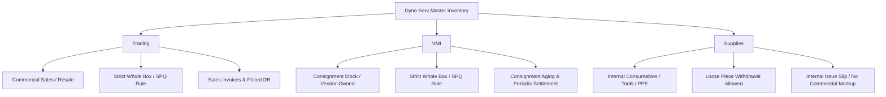

# Dyna-Serv WIMS — User Manual & Operations Guide

## Chapter: Master Inventory, Inventory Models & Withdrawal Protocols

---

### 1. Inventory Counting Fundamentals

In Dyna-Serv WIMS, physical warehouse stock is governed by a strict hierarchy of packaging and units:

$$\mathbf{Total\ Quantity\ (Available\ Balance)} = \mathbf{Boxes\ On\ Hand} \times \mathbf{Standard\ Pack\ Quantity\ (SPQ)}$$

* **Base Unit of Measure (UOM)**: The smallest physical counting unit enrolled in Master Data (e.g., `PCS`, `ROLL`, `KG`, `METER`).
* **Standard Pack Quantity (SPQ)**: The number of base units packed into a standard master carton / box (e.g. `50 PCS/box`).
* **Boxes On Hand**: The physical carton / box count currently located in warehouse storage bins.
* **Current Net Balance**: Displayed across all inventory cards as the **Total Quantity** (in base UOM) as the primary headline metric, with the **Box Count** and **SPQ factor** underneath as the descriptive subtitle.

```
┌─────────────────────────────────────────────────────────────┐
│ CURRENT NET BALANCE                                     📦 │
│ 500 PCS                                                     │
│ 10 boxes · SPQ: 50 PCS/box                                  │
└─────────────────────────────────────────────────────────────┘
```

---

### 2. The Three Inventory Models

Every item enrolled in Dyna-Serv WIMS belongs to one of three authoritative Inventory Models:



| Dimension | 1. Trading | 2. VMI (Vendor-Managed) | 3. Supplies (Internal) |
| :--- | :--- | :--- | :--- |
| **Ownership** | Dyna-Serv / Client Commercial Stock | Consignor / Vendor (Consignment) | Internal Dyna-Serv Operations |
| **Withdrawal Rule** | **Strict SPQ (Whole Boxes Only)** | **Strict SPQ (Whole Boxes Only)** | **Loose Pieces Permitted** (Per piece) |
| **Min. Order Unit** | $1\text{ box } (1 \times \text{SPQ})$ | $1\text{ box } (1 \times \text{SPQ})$ | $1\text{ piece / unit}$ |
| **Pricing Nature** | Commercial Selling Price (Contracted) | Reference Consignment Release Price | Non-Commercial / Cost Tracking Only |
| **Outbound Document** | Priced Delivery Receipt / AR | Priced Delivery Receipt / AR | Internal Material Issue Slip |
| **DRA Matching** | Required for customer orders | Required for vendor releases | **None required** |

---

### 3. Outbound Withdrawal Protocols

#### Protocol A: Commercial Outbound (Trading & VMI)
Commercial withdrawals protect manufacturer carton seals, contractual minimum order quantities, and customer billing:

1. **Initiation**: Operator initiates a pick list from `/inventory?tab=pick-lists`.
2. **DRA Matching (Optional / Automated)**: The system can parse customer Delivery Release Advice (DRA) files in Excel/PDF.
3. **SPQ Validation**: The requested quantity must be an exact multiple of the item's SPQ ($N \times \text{SPQ}$). Requests for partial boxes are rejected by the server.
4. **Stage 1 (Allocation & Commitment)**: System selects lots via **FEFO** (perishable) or **FIFO** (non-perishable) and increments `qty_committed` without decrementing physical stock.
5. **Physical Picking**: Floor staff picks boxes and marks document as **Picked** (`/outgoing`).
6. **Stage 2 (Dispatch Confirmation)**: Floor operator scans the item/lot QR codes at `/pick-lists/[id]/dispatch`. Upon completion, physical stock decrements and the priced **Delivery Receipt / Acknowledgement Receipt** is generated.

---

#### Protocol B: Internal Supplies Withdrawal (Fast Quick-Issue)
Supplies are internal consumables used for warehouse operations (e.g. bubble wrap, stretch film, packaging tape, barcode ribbon, gloves, cutter blades, pens).

To withdraw supplies without commercial overhead:

1. Navigate to **Master Inventory** $\rightarrow$ **Pick Lists** (`/inventory?tab=pick-lists`).
2. Set **Destination Organization** to `Dyna-Serv Warehouse` / `Internal Operations`.
3. Set **Inventory Model** to **`Supplies`**.
4. Select the supply item and enter the **exact loose quantity** needed (e.g., `3 pcs` from a 100-pc box).
5. Click **Generate Pick List**.
6. Mark as **Picked $\rightarrow$ Dispatched**.
7. The system immediately decrements the inventory balance and records an audit log entry tied to the Person in Charge.

---

### 4. Master Inventory Item View & Movement History Audit

When inspecting any item from the Master Inventory register via the **View** action:

* **Tab 1: Master Specifications**: Item codes, category/subcategory hierarchy, enrolled UOM, SPQ standard, dimensions, and financial pricing.
* **Tab 2: Live Stock & Lots**: Real-time lot-by-lot breakdown with storage location bins, expiration dates, and printable lot QR labels.
* **Tab 3: Movement History Trail**:
  * **Date Filter Toolbar**: Filter movements for **Today**, **All Time**, or any specific date picker value.
  * **Movement Type Filter**: Filter by `Inbound / Received`, `Outbound / Dispatched`, or `Internal Transfers`.
  * **Daily Trail View**: Groups transactions day-by-day with daily KPI summaries (`Received: +X bx`, `Dispatched: -Y bx`, `Net: ±Z bx`).
  * **Accountability Audit**: Every transaction displays the exact transaction ID, source/destination locations, reference documents (WRR #, Pick List #, CI #), and the **Person in Charge (Audit Snapshot)**.
