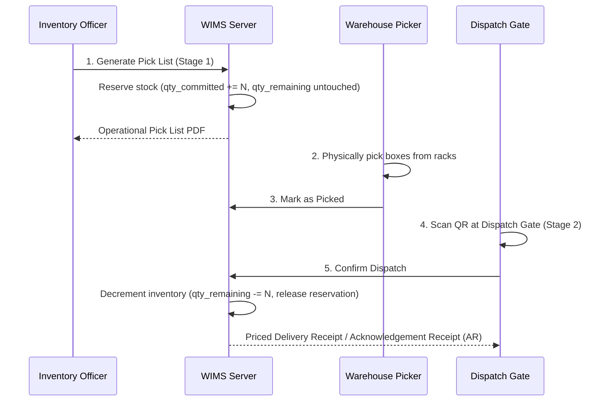

# Dyna-Serv WIMS — User Manual & Operations Guide

## Chapter: Outgoing Picking, Logistics & Dispatch Confirmation

---

### 1. The Two-Stage Commitment Model

Dyna-Serv WIMS enforces a two-stage safety commitment protocol to prevent stockouts and inventory discrepancy during picking:

---

### 2. Initiating a Pick List from Master Inventory

1. Navigate to **Master Inventory** $\rightarrow$ **Pick Lists** (`/inventory?tab=pick-lists`).
2. **Select Destination Organization & Inventory Model**:
   * For **Trading / VMI**: Selected destination customer or vendor. Quantities must adhere to full SPQ cartons.
   * For **Supplies**: Internal warehouse organization. Loose piece quantities permitted.
3. **Delivery Release Advice (DRA) Import (Optional)**:
   * Upload customer DRA (`.xlsx`, `.csv`, `.pdf`).
   * The DRA engine extracts requested item codes and quantities, checks available stock, and auto-allocates lots via FIFO/FEFO.
4. Review lines and click **Generate Pick List**.

---

### 3. Physical Picking & Dispatch Confirmation

1. The committed pick list appears in the **To Pick** queue under `/outgoing` $\rightarrow$ **Logistics**.
2. Floor staff prints or views the pick list PDF and retrieves the items.
3. Click **Mark as Picked**. The pick list moves to the **To Dispatch** queue.
4. At the loading dock / dispatch gate:
   * Open `/pick-lists/[id]/dispatch`.
   * Scan each box QR code using the handheld scanner.
   * Once all boxes are verified, tap **Confirm Dispatch**.
5. The system immediately:
   * Decrements physical stock from master inventory.
   * Records an immutable `pick` movement transaction with Person in Charge audit data.
   * Generates the priced **Delivery Receipt (DR) / Acknowledgement Receipt (AR)**.
