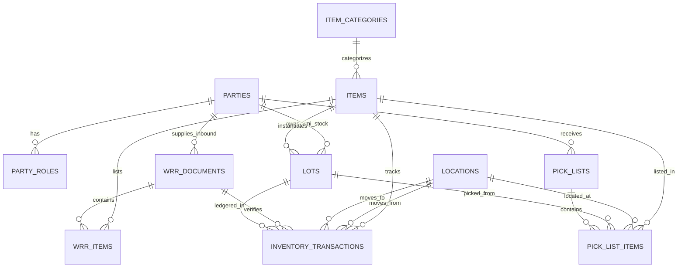

# Core Data Model — Design
Status: Approved
Updated: 2026-08-06
Depends on: specs/00-steering/ (tech.md, structure.md), specs/01-core-data-model/requirements.md

## 1. Data Model & Schema Definitions

### 1.1 Enumerations (`lib/db/schema/enums.ts`)

```typescript
import { pgEnum } from "drizzle-orm/pg-core";

export const partyRoleEnum = pgEnum("party_role", [
  "vendor",
  "supplier",
  "customer",
  "end_customer",
  "internal_warehouse",
]);

export const flowTypeEnum = pgEnum("flow_type", ["vmi", "trading", "supplies"]);

export const locationTypeEnum = pgEnum("location_type", [
  "receiving_bay", // Unloading dock (separate from storage racks)
  "inspection",    // Pre-receiving inspection for TDC/mismatch/damage (not yet incremented in inventory)
  "storage",      // High rack storage slots (A1-01)
  "picking",      // Fast-moving pick face / floor picking staging
  "dispatch",     // Outbound staging area prior to final barcode scan
]);

export const lotStatusEnum = pgEnum("lot_status", [
  "staged",
  "available",
  "quarantined",
  "depleted",
  "expired",
]);

export const wrrStatusEnum = pgEnum("wrr_status", [
  "staged_pending_arrival",
  "receiving_in_progress",
  "confirmed",
  "cancelled",
]);

export const pickListStatusEnum = pgEnum("pick_list_status", [
  "allocated",
  "picked",
  "dispatched",
]);

export const movementTypeEnum = pgEnum("movement_type", [
  "receiving",
  "putaway",
  "pick",
  "transfer",
  "inventory_reconciliation",
]);

export const conformanceStatusEnum = pgEnum("conformance_status", [
  "pending",
  "conformance",       // Passed inspection, paper/barcode match, 0 defect
  "non_conformance",   // Failed inspection (TDC / mismatch / damage)
]);

export const nonConformanceReasonEnum = pgEnum("non_conformance_reason", [
  "tdc_defect",          // Technical Defect Claim
  "quantity_mismatch",   // Paper CIPL vs physical carton count mismatch
  "damaged_carton",      // Damaged packaging or box
  "wrong_item_code",     // Incorrect SKU/part delivered
  "missing_paperwork",   // Missing PEZA permit or IP paperwork
  "other",
]);

export const commitmentStatusEnum = pgEnum("commitment_status", [
  "active",             // Stage 1 reservation is live; qty_committed holds the reservation
  "inspection_pending", // Post-pick disposition sent to further inspection; reservation stays active
  "executed",           // Stage 2 dispatch completed; qty_committed released, qty_executed set
  "released",           // Reservation released without executing (e.g. cancelled before dispatch)
  "expired",            // expires_at passed before execution; reservation released automatically
  "cancelled",          // Manually cancelled before execution
]);
```

### 1.2 Table Schemas

#### `parties` & `party_roles` (`lib/db/schema/parties.ts`)
```typescript
import { pgTable, uuid, varchar, text, boolean, timestamp } from "drizzle-orm/pg-core";
import { partyRoleEnum } from "./enums";

export const parties = pgTable("parties", {
  id: uuid("id").primaryKey().defaultRandom(),
  code: varchar("code", { length: 50 }).notNull().unique(),
  name: varchar("name", { length: 255 }).notNull(),
  contactPerson: varchar("contact_person", { length: 255 }),
  email: varchar("email", { length: 255 }),
  phone: varchar("phone", { length: 50 }),
  taxId: varchar("tax_id", { length: 50 }), // Tax ID / TIN
  address: text("address"),
  notes: text("notes"),
  isActive: boolean("is_active").default(true).notNull(),
  createdAt: timestamp("created_at").defaultNow().notNull(),
  updatedAt: timestamp("updated_at").defaultNow().notNull(),
});

export const partyRoles = pgTable("party_roles", {
  id: uuid("id").primaryKey().defaultRandom(),
  partyId: uuid("party_id").references(() => parties.id, { onDelete: "cascade" }).notNull(),
  role: partyRoleEnum("role").notNull(),
  createdAt: timestamp("created_at").defaultNow().notNull(),
});
```

#### `lot_location_balances` (`lib/db/schema/lot_location_balances.ts`)

`lots` is the identity and lifecycle record for a received physical lot.
Physical quantity is held in this child table because one lot may be split
across multiple locations. This is the authoritative placement and quantity
model; there is no `stock_levels` or other aggregate inventory ledger.

```typescript
import { pgTable, uuid, integer, timestamp, unique, check } from "drizzle-orm/pg-core";
import { sql } from "drizzle-orm";
import { lots } from "./lots";
import { locations } from "./locations";

export const lotLocationBalances = pgTable("lot_location_balances", {
  id: uuid("id").primaryKey().defaultRandom(),
  lotId: uuid("lot_id").references(() => lots.id).notNull(),
  locationId: uuid("location_id").references(() => locations.id).notNull(),
  qtyReceived: integer("qty_received").notNull(),
  qtyRemaining: integer("qty_remaining").notNull(),
  qtyCommitted: integer("qty_committed").default(0).notNull(),
  version: integer("version").default(1).notNull(), // optimistic concurrency token, incremented on every update
  createdAt: timestamp("created_at").defaultNow().notNull(),
  updatedAt: timestamp("updated_at").defaultNow().notNull(),
}, (table) => ({
  uniqueLotLocation: unique().on(table.lotId, table.locationId),
  qtyReceivedNonNegative: check("qty_received_non_negative", sql`${table.qtyReceived} >= 0`),
  qtyRemainingNonNegative: check("qty_remaining_non_negative", sql`${table.qtyRemaining} >= 0`),
  qtyCommittedWithinRemaining: check(
    "qty_committed_within_remaining",
    sql`${table.qtyCommitted} >= 0 AND ${table.qtyCommitted} <= ${table.qtyRemaining}`
  ),
}));
```

The database exposes an aggregate read model named `lot_inventory_totals`,
grouped by `lot_id`, as a plain SQL view (not a Drizzle-managed table):

```sql
CREATE VIEW lot_inventory_totals AS
SELECT
  lot_id,
  SUM(qty_received)  AS qty_received,
  SUM(qty_remaining) AS qty_remaining,
  SUM(qty_committed) AS qty_committed,
  SUM(qty_remaining) - SUM(qty_committed) AS qty_available
FROM lot_location_balances
GROUP BY lot_id;
```

`qty_available` is derived and never stored. FIFO/FEFO allocation joins this
read model to `lots`, uses `lots.status = 'available'` as its sole eligibility
gate, and allocates against individual `lot_location_balances` rows.

#### `inventory_commitments` & `inventory_commitment_lines` (`lib/db/schema/commitments.ts`)

These tables are the durable reservation relation for Stage 1 outbound
commitment. Quantity fields on `lot_location_balances` are maintained in the
same transaction as these rows; the commitment lines provide ownership,
release, execution, expiry, and audit linkage rather than acting as a second
inventory ledger.

```typescript
import { pgTable, uuid, varchar, integer, timestamp, check } from "drizzle-orm/pg-core";
import { sql } from "drizzle-orm";
import { commitmentStatusEnum } from "./enums";
import { pickLists, pickListItems } from "./pick_lists";
import { lotLocationBalances } from "./lot_location_balances";

export const inventoryCommitments = pgTable("inventory_commitments", {
  id: uuid("id").primaryKey().defaultRandom(),
  commitmentNumber: varchar("commitment_number", { length: 50 }).notNull().unique(),
  pickListId: uuid("pick_list_id").references(() => pickLists.id).notNull().unique(), // exactly one commitment per pick list
  status: commitmentStatusEnum("status").default("active").notNull(),
  expiresAt: timestamp("expires_at"),
  createdByUserId: uuid("created_by_user_id").notNull(),
  releasedAt: timestamp("released_at"),
  completedAt: timestamp("completed_at"),
  createdAt: timestamp("created_at").defaultNow().notNull(),
  updatedAt: timestamp("updated_at").defaultNow().notNull(),
});

export const inventoryCommitmentLines = pgTable("inventory_commitment_lines", {
  id: uuid("id").primaryKey().defaultRandom(),
  commitmentId: uuid("commitment_id").references(() => inventoryCommitments.id, { onDelete: "cascade" }).notNull(),
  pickListItemId: uuid("pick_list_item_id").references(() => pickListItems.id).notNull(),
  lotLocationBalanceId: uuid("lot_location_balance_id").references(() => lotLocationBalances.id).notNull(),
  qtyCommitted: integer("qty_committed").notNull(),
  qtyExecuted: integer("qty_executed").default(0).notNull(),
  status: commitmentStatusEnum("status").default("active").notNull(),
  createdAt: timestamp("created_at").defaultNow().notNull(),
  updatedAt: timestamp("updated_at").defaultNow().notNull(),
}, (table) => ({
  qtyCommittedPositive: check("qty_committed_positive", sql`${table.qtyCommitted} > 0`),
  qtyExecutedWithinCommitted: check(
    "qty_executed_within_committed",
    sql`${table.qtyExecuted} >= 0 AND ${table.qtyExecuted} <= ${table.qtyCommitted}`
  ),
}));
```

Beyond the declared constraints, the active commitment quantity must not
exceed the selected balance row's `qty_remaining`; this is a cross-row
invariant enforced by the Stage 1 commitment transaction (which locks or
version-checks the affected balance and commitment rows), not a single-table
CHECK constraint. Release, expiry, and dispatch transitions are idempotent.

The commitment and pick-list snapshot are created atomically. `pick_list_items`
remains the operational document snapshot, while
`inventory_commitment_lines` remains the authoritative reservation ownership
record.

#### `item_categories` & `items` (`lib/db/schema/items.ts`)
```typescript
import { pgTable, uuid, varchar, text, integer, decimal, boolean, timestamp } from "drizzle-orm/pg-core";
import { flowTypeEnum } from "./enums";
import { parties } from "./parties";

export const itemCategories = pgTable("item_categories", {
  id: uuid("id").primaryKey().defaultRandom(),
  name: varchar("name", { length: 100 }).notNull(), // Category or Subcategory Name
  flowType: flowTypeEnum("flow_type"), // Optional partition scoping ('vmi', 'trading', 'supplies')
  parentId: uuid("parent_id"), // Null for Parent Category, references item_categories.id for Subcategory
  description: text("description"),
  createdAt: timestamp("created_at").defaultNow().notNull(),
});

export const items = pgTable("items", {
  id: uuid("id").primaryKey().defaultRandom(),
  code: varchar("code", { length: 100 }).notNull().unique(), // Dyna-Serv Item Code / SKU
  supplierItemCode: varchar("supplier_item_code", { length: 100 }), // Supplier Item Code
  customerItemCode: varchar("customer_item_code", { length: 100 }), // Customer Item Code
  dsgcItemNumber: varchar("dsgc_item_number", { length: 100 }), // DSGC Item Number
  name: varchar("name", { length: 255 }).notNull(),
  description: text("description"),
  barcode: varchar("barcode", { length: 100 }).notNull().unique(),
  itemType: varchar("item_type", { length: 50 }).default("standard").notNull(), // Type (raw_material, packaging, etc.)
  categoryId: uuid("category_id").references(() => itemCategories.id), // Category / Subcategory
  defaultSupplierPartyId: uuid("default_supplier_party_id").references(() => parties.id), // Supplier Party
  uom: varchar("uom", { length: 50 }).default("piece").notNull(), // UOM (piece, box, roll, meter)
  currency: varchar("currency", { length: 10 }).default("USD").notNull(), // Currency (USD, PHP)
  buyingPrice: decimal("buying_price", { precision: 12, scale: 4 }), // Buying Price (Trading buy price)
  sellingPrice: decimal("selling_price", { precision: 12, scale: 4 }), // Selling Price
  spq: integer("spq").default(1).notNull(), // Standard Packaging Quantity (pcs/roll per box)
  spqMeter: decimal("spq_meter", { precision: 10, scale: 2 }), // SPQ Meter (meters per roll)
  lengthCm: decimal("length_cm", { precision: 10, scale: 2 }), // Length (cm)
  widthCm: decimal("width_cm", { precision: 10, scale: 2 }), // Width (cm)
  heightCm: decimal("height_cm", { precision: 10, scale: 2 }), // Height (cm)
  volumeCm3: decimal("volume_cm3", { precision: 12, scale: 2 }), // Gross Volume in CM³ (Length × Width × Height)
  volumeCbm: decimal("volume_cbm", { precision: 10, scale: 4 }).notNull(), // CBM per box ((L×W×H)/1,000,000)
  boxesPerPallet: integer("boxes_per_pallet"), // No. of Boxes per Pallet
  weightKg: decimal("weight_kg", { precision: 10, scale: 3 }), // Weight in KG per box/carton
  minReorderLevel: integer("min_reorder_level").default(0).notNull(),
  isPerishable: boolean("is_perishable").default(false).notNull(), // Triggers mandatory expiry check at receiving
  isActive: boolean("is_active").default(true).notNull(),
  createdAt: timestamp("created_at").defaultNow().notNull(),
  updatedAt: timestamp("updated_at").defaultNow().notNull(),
});
```

#### `locations` (`lib/db/schema/locations.ts`)
```typescript
import { pgTable, uuid, varchar, decimal, boolean, timestamp } from "drizzle-orm/pg-core";
import { locationTypeEnum } from "./enums";

export const locations = pgTable("locations", {
  id: uuid("id").primaryKey().defaultRandom(),
  zone: varchar("zone", { length: 50 }).notNull(),
  rack: varchar("rack", { length: 50 }).notNull(),
  level: varchar("level", { length: 50 }).notNull(),
  position: varchar("position", { length: 50 }).notNull(),
  label: varchar("label", { length: 100 }).notNull().unique(), // Format: Rack+Level-Position (e.g. 'A1-01' for Rack A, Level 1, Position 01)
  locationType: locationTypeEnum("location_type").default("storage").notNull(),
  maxCbmCapacity: decimal("max_cbm_capacity", { precision: 10, scale: 4 }).notNull(),
  isActive: boolean("is_active").default(true).notNull(),
  createdAt: timestamp("created_at").defaultNow().notNull(),
});
```

#### `lots` (`lib/db/schema/lots.ts`)
```typescript
import { pgTable, uuid, varchar, decimal, date, timestamp } from "drizzle-orm/pg-core";
import { flowTypeEnum, lotStatusEnum } from "./enums";
import { items } from "./items";
import { parties } from "./parties";
import { wrrItems } from "./wrr";

export const lots = pgTable("lots", {
  id: uuid("id").primaryKey().defaultRandom(),
  lotNumber: varchar("lot_number", { length: 100 }).notNull(), // Business lot number copied from the WRR item
  wrrItemId: uuid("wrr_item_id").references(() => wrrItems.id).notNull(), // Source WRR line
  itemId: uuid("item_id").references(() => items.id).notNull(),
  flowType: flowTypeEnum("flow_type").notNull(), // 'vmi' | 'trading' | 'supplies'
  ownerPartyId: uuid("owner_party_id").references(() => parties.id), // Required for VMI, optional for Trading/Supplies
  status: lotStatusEnum("status").default("staged").notNull(), // FIFO/FEFO eligibility gate
  pezaNumber: varchar("peza_number", { length: 100 }), // PEZA Permit Number (manual)
  commercialInvoiceNo: varchar("commercial_invoice_no", { length: 100 }), // Commercial Invoice (CIPL)
  ipNumber: varchar("ip_number", { length: 100 }), // Import Permit (IP) Number
  manufactureDate: date("manufacture_date"),
  expiryDate: date("expiry_date"),
  unitCost: decimal("unit_cost", { precision: 12, scale: 4 }), // Unit Cost in USD (Final for Trading, reference-only for VMI)
  createdAt: timestamp("created_at").defaultNow().notNull(),
  updatedAt: timestamp("updated_at").defaultNow().notNull(),
});
```

#### `wrr_documents` & `wrr_items` (`lib/db/schema/wrr.ts`)
```typescript
import { pgTable, uuid, varchar, text, integer, decimal, timestamp } from "drizzle-orm/pg-core";
import { flowTypeEnum, wrrStatusEnum, conformanceStatusEnum, nonConformanceReasonEnum } from "./enums";
import { parties } from "./parties";
import { items } from "./items";

export const wrrDocuments = pgTable("wrr_documents", {
  id: uuid("id").primaryKey().defaultRandom(),
  wrrNumber: varchar("wrr_number", { length: 50 }).notNull().unique(), // e.g. 'WRR-2026-00001'
  commercialInvoiceNo: varchar("commercial_invoice_no", { length: 100 }), // Commercial Invoice / CIPL reference
  ciplFileUrl: text("cipl_file_url"), // Attached PDF/Image CIPL document in Supabase Storage
  pezaNumber: varchar("peza_number", { length: 100 }), // PEZA Permit Number (manual)
  ipNumber: varchar("ip_number", { length: 100 }), // Import Permit (IP) Number
  vendorPartyId: uuid("vendor_party_id").references(() => parties.id).notNull(),
  flowType: flowTypeEnum("flow_type").notNull(),
  status: wrrStatusEnum("status").default("staged_pending_arrival").notNull(),
  stagedByUserId: uuid("staged_by_user_id").notNull(),
  confirmedByUserId: uuid("confirmed_by_user_id"),
  confirmedAt: timestamp("confirmed_at"),
  createdAt: timestamp("created_at").defaultNow().notNull(),
  updatedAt: timestamp("updated_at").defaultNow().notNull(),
});

export const wrrItems = pgTable("wrr_items", {
  id: uuid("id").primaryKey().defaultRandom(),
  wrrId: uuid("wrr_id").references(() => wrrDocuments.id, { onDelete: "cascade" }).notNull(),
  itemId: uuid("item_id").references(() => items.id), // Nullable: CIPL may reference an item not yet enrolled; resolved via 06's enrollment flow before receipt confirmation (07 design.md §6, §8 requires resolved item data as a commit prerequisite)
  itemCode: varchar("item_code", { length: 100 }), // Supplier Part Number from CIPL
  customerItemCode: varchar("customer_item_code", { length: 100 }), // Customer Part Number from CIPL
  lotNumber: varchar("lot_number", { length: 100 }).notNull(), // Source business lot number from the WRR
  expectedQty: integer("expected_qty").notNull(),
  scannedQty: integer("scanned_qty").default(0).notNull(),
  unitCbm: decimal("unit_cbm", { precision: 10, scale: 4 }).notNull(),
  uom: varchar("uom", { length: 50 }).notNull(),
  createdAt: timestamp("created_at").defaultNow().notNull(),
});

export const wrrInspectionLogs = pgTable("wrr_inspection_logs", {
  id: uuid("id").primaryKey().defaultRandom(),
  wrrId: uuid("wrr_id").references(() => wrrDocuments.id, { onDelete: "cascade" }).notNull(),
  wrrItemId: uuid("wrr_item_id").references(() => wrrItems.id),
  itemId: uuid("item_id").references(() => items.id).notNull(),
  vendorPartyId: uuid("vendor_party_id").references(() => parties.id).notNull(), // For Vendor Conformance Analytics
  inspectorUserId: uuid("inspector_user_id").notNull(),
  conformanceStatus: conformanceStatusEnum("conformance_status").notNull(), // conformance vs non_conformance
  nonConformanceReason: nonConformanceReasonEnum("non_conformance_reason"), // Reason dropdown
  remarks: text("remarks"), // Free-text remarks / TDC details
  evidencePhotoUrl: text("evidence_photo_url"), // Photo evidence attachment in Supabase storage
  actionTaken: varchar("action_taken", { length: 50 }), // 'accepted_with_variance', 'quarantined', 'returned_to_vendor'
  createdAt: timestamp("created_at").defaultNow().notNull(),
});
```

#### `forex_rates` (`lib/db/schema/forex.ts`)
```typescript
import { pgTable, uuid, varchar, date, decimal, timestamp } from "drizzle-orm/pg-core";

export const forexRates = pgTable("forex_rates", {
  id: uuid("id").primaryKey().defaultRandom(),
  effectiveDate: date("effective_date").notNull().unique(), // Daily Forex date
  usdToPhpRate: decimal("usd_to_php_rate", { precision: 10, scale: 4 }).notNull(), // USD to PHP daily exchange rate
  source: varchar("source", { length: 100 }).default("manual").notNull(),
  createdAt: timestamp("created_at").defaultNow().notNull(),
});
```

#### `inventory_transactions` (`lib/db/schema/transactions.ts`)
```typescript
import { pgTable, uuid, varchar, integer, timestamp } from "drizzle-orm/pg-core";
import { flowTypeEnum, movementTypeEnum } from "./enums";
import { lots } from "./lots";
import { items } from "./items";
import { locations } from "./locations";
import { wrrDocuments } from "./wrr";

export const inventoryTransactions = pgTable("inventory_transactions", {
  id: uuid("id").primaryKey().defaultRandom(),
  transactionNumber: varchar("transaction_number", { length: 50 }).notNull().unique(),
  lotId: uuid("lot_id").references(() => lots.id).notNull(),
  itemId: uuid("item_id").references(() => items.id).notNull(),
  movementType: movementTypeEnum("movement_type").notNull(),
  fromLocationId: uuid("from_location_id").references(() => locations.id),
  toLocationId: uuid("to_location_id").references(() => locations.id),
  qty: integer("qty").notNull(),
  flowType: flowTypeEnum("flow_type").notNull(),
  commercialInvoiceNo: varchar("commercial_invoice_no", { length: 100 }), // Associated with incoming WRR receipts
  arReferenceNo: varchar("ar_reference_no", { length: 100 }), // Associated with outgoing Dispatch/Withdrawal
  wrrId: uuid("wrr_id").references(() => wrrDocuments.id),
  performedByUserId: uuid("performed_by_user_id").notNull(),
  createdAt: timestamp("created_at").defaultNow().notNull(),
});
```

#### `audit_log` (`lib/db/schema/audit.ts`)

`audit_log` is the immutable, cross-entity accountability record. It is deliberately separate from `inventory_transactions`: the inventory table records physical stock movement and quantity, while this table records who performed a business/security action, what entity changed, and the state-transition evidence. A trusted server/database path writes an audit row in the same transaction as the audited mutation; browser clients have no direct mutation policy.

```typescript
import { pgTable, uuid, varchar, jsonb, timestamp, index, check } from "drizzle-orm/pg-core";
import { sql } from "drizzle-orm";

export const auditLog = pgTable("audit_log", {
  id: uuid("id").primaryKey().defaultRandom(),
  actorUserId: uuid("actor_user_id").notNull(),
  actorRole: varchar("actor_role", { length: 50 }).notNull(), // role snapshot at event time
  action: varchar("action", { length: 100 }).notNull(),
  entityType: varchar("entity_type", { length: 100 }).notNull(),
  entityId: uuid("entity_id").notNull(),
  beforeData: jsonb("before_data"),
  afterData: jsonb("after_data"),
  diffData: jsonb("diff_data"),
  // Canonical X-Correlation-Id from 04 §15.3: server-generated or validated UUID v4, max 64 chars.
  correlationId: varchar("correlation_id", { length: 64 }).notNull(),
  createdAt: timestamp("created_at", { withTimezone: true }).defaultNow().notNull(),
}, (table) => ({
  entityIdx: index("audit_log_entity_idx").on(table.entityType, table.entityId),
  actorIdx: index("audit_log_actor_idx").on(table.actorUserId),
  correlationIdx: index("audit_log_correlation_idx").on(table.correlationId),
  payloadPresent: check(
    "audit_log_payload_present",
    sql`${table.beforeData} IS NOT NULL OR ${table.afterData} IS NOT NULL OR ${table.diffData} IS NOT NULL`,
  ),
}));
```

Audit rows are retained for **3 years** from `created_at`, as resolved by the product owner on 2026-08-06. After that period, the authorized retention/deletion job must follow `04` §10.4: deletion is separately authorized and produces its own audit record. Audit deletion is never a casual cascade from the entity being audited. Any broader business/provider-log retention decision in `04` §23.8 remains separate.

#### `pick_lists` & `pick_list_items` (`lib/db/schema/pick_lists.ts`)
```typescript
import { pgTable, uuid, varchar, text, integer, decimal, timestamp } from "drizzle-orm/pg-core";
import { flowTypeEnum, pickListStatusEnum } from "./enums";
import { parties } from "./parties";
import { items } from "./items";
import { locations } from "./locations";
import { lots } from "./lots";

export const pickLists = pgTable("pick_lists", {
  id: uuid("id").primaryKey().defaultRandom(),
  pickListNumber: varchar("pick_list_number", { length: 50 }).notNull().unique(),
  customerPartyId: uuid("customer_party_id").references(() => parties.id).notNull(),
  flowType: flowTypeEnum("flow_type").notNull(),
  status: pickListStatusEnum("status").default("allocated").notNull(),
  createdAt: timestamp("created_at").defaultNow().notNull(),
  updatedAt: timestamp("updated_at").defaultNow().notNull(),
});

export const pickListItems = pgTable("pick_list_items", {
  id: uuid("id").primaryKey().defaultRandom(),
  pickListId: uuid("pick_list_id").references(() => pickLists.id, { onDelete: "cascade" }).notNull(),
  itemId: uuid("item_id").references(() => items.id).notNull(),
  itemCode: varchar("item_code", { length: 100 }).notNull(), // Item Code
  customerItemCode: varchar("customer_item_code", { length: 100 }), // CUST PN
  itemDescription: text("item_description"), // Item Description
  lotId: uuid("lot_id").references(() => lots.id).notNull(),
  lotNumber: varchar("lot_number", { length: 100 }).notNull(), // Lot Number
  locationId: uuid("location_id").references(() => locations.id).notNull(),
  locationLabel: varchar("location_label", { length: 100 }).notNull(), // Location
  qty: integer("qty").notNull(), // Qty
  spq: integer("spq").notNull(), // SPQ
  numberOfBoxes: integer("number_of_boxes").notNull(), // No. of Packages/Boxes
  unitPrice: decimal("unit_price", { precision: 12, scale: 4 }), // Priced on Document
  createdAt: timestamp("created_at").defaultNow().notNull(),
});
```

## 2. Entity Relationship Diagram



## 3. Key Workflows & Invariants

1. **Email CIPL Ingestion & Pre-Receiving WRR Staging**:
   - Back-office staff receive Commercial Invoice & Packing List (CIPL) files via email and pre-encode the manifest into `wrr_documents` in `staged_pending_arrival` status with attached `cipl_file_url`, `invoice_number`, and `ip_number`.
   - Expected incoming items/cartons sit in a **standby staging table** (`wrr_items`). At this stage, stock is strictly on standby and is **NOT YET incremented** in inventory balance or recorded in the inbound ledger.

2. **WRR Document Print & Barcode Scanning Confirmation Lifecycle**:
   - **Paper WRR Generation**: System generates and prints the official WRR document (with barcode reference `WRR-2026-00001`), which serves as the physical cross-reference sheet for floor receiving staff.
   - **Floor Barcode Scanning**: When pallets arrive at `receiving_bay`, floor staff scan each carton barcode against the printed WRR reference.
   - **Conditional Item Enrollment Trigger**: If an incoming carton contains a new item/SKU not yet in the master catalog, the system prompts staff to complete a **New Item Enrollment Form** on-the-fly before confirmation.
   - **Receipt Confirmation & Ledger Write**: Once physical barcode scans match expected quantities, confirming the receipt transitions WRR to `confirmed`:
     - Creates active physical `lots` (`status = 'available'`).
     - Transfers stock from standby staging tables into active inventory balance.
     - Inserts an immutable `inventory_transaction` ledger entry (`movement_type = 'receiving'`).

3. **FEFO / FIFO Rotation**:
   - Allocation engines evaluate `lots.status = 'available'` sorted by `expiry_date` ascending (FEFO for perishable items) then `created_at` ascending (FIFO for non-perishable items).

4. **Master Inventory UI & Item Drill-Down**:
   - **Summary Table**: The Master Inventory summary table MUST prioritize and display the **Item Code** as the first and most prominent column, along with item balances and the **Oldest Received Date** across active stock.
   - **Drill-Down View**: Clicking an item expands/drills down to show the **Stacked Location & Active Lots Breakdown**, displaying active `lots` (`status = 'available'`) with Received Date, Lot #, Vendor Lot #, Partition (`vmi`/`trading`/`supplies`), Stacked Location Tag (e.g. `A1-01`), Expiration Date, Pcs, Boxes, and CBM occupied, ordered by strict FEFO/FIFO sequence.
   - **History Modal**: The full stock movement history is NOT shown inline to prevent clutter. Instead, an action button ("View History") opens a modal that fetches `inventory_transactions`. The modal displays the exact date, time, performing user, total quantity received, and total quantity dispatched/withdrawn.

   - **Canonical Master Inventory read models**: The Master Inventory and reporting surfaces consume two read-model contracts owned by `01`: `master_inventory_tracking` for current lot/location balances and `lot_history_export` for connected history. These are derived read models, not duplicate ledgers.
     - `master_inventory_tracking` is keyed by `lot_number`, item/category, `flow_type`, and `location`; it exposes derived quantities from `lot_inventory_totals`/`lot_location_balances`, FEFO/FIFO ordering metadata, and the flow-based displayed code (`supplier_item_code` for VMI; `dsgc_item_number` for Trading/Supplies).
     - `lot_history_export` emits one detail row per connected `inventory_transaction`, inspection/disposition record, and current-balance reference, retaining `lot_number` and source-record identity. A grouped summary is an additional projection and never substitutes for detail rows.
     - Aging is calculated as report `as_of` minus the earliest confirmed receiving transaction connected to the same `lot_number`; `lots.created_at` is metadata only and is not the aging basis.
     - Financial fields (revenue, cost, profit, margin, and price references) are a separate projection. `02-rbac-roles` owns the capability and RLS enforcement; a user without the approved financial grant receives no financial columns, not merely null values.
     - This canonical read-model approach is preferred over browser-side joins across independently filtered endpoints because it preserves lot traceability, makes export grouping deterministic, and gives RLS one server-side query boundary. `lot_history_export` refreshes daily, retains three years, and is generated/served by `16-reporting-and-analytics`; `01` owns the canonical read-model contract and connected source identity.

5. **Unified Conditional Item Enrollment Workflow**:
   - Item enrollment operates via a single unified form interface. Selecting the primary `flow_type` (`vmi`, `trading`, or `supplies`) dynamically reveals conditional fields (e.g. default supplier party & SPQ meters for VMI; currency, buying price & selling price for Trading; internal reorder threshold for Supplies), writing cleanly to the single unified `items` table.

6. **Interactive Bi-Directional Form Calculation (`Unit (roll)` $\leftrightarrow$ `Unit (meter)`)**:
   - Order, enrollment, and withdrawal entry forms contain two real-time synchronized input fields for roll items:
     - **Typing into `Unit (meter)`**: `onChange` immediately updates the `Unit (roll)` field via $\text{Unit (roll)} = \frac{\text{Unit (meter)}}{\text{spq\_meter}}$ (e.g., typing $750$ in `Unit (meter)` auto-fills $1$ in `Unit (roll)`).
     - **Typing into `Unit (roll)`**: `onChange` immediately updates the `Unit (meter)` field via $\text{Unit (meter)} = \text{Unit (roll)} \times \text{spq\_meter}$ (e.g., typing $2$ in `Unit (roll)` auto-fills $1,500$ in `Unit (meter)`).
     - **Dual Document Output**: Form submissions send both values so that floor picking sheets use `Unit (roll)` while customer withdrawal receipts render `Unit (meter)` and `Unit (roll)`.

7. **Category & Subcategory Cascading Hierarchy (VMI & Trading)**:
   - `item_categories` maintains a parent-child self-referential hierarchy (`parent_id` = `null` for Top Categories; `parent_id` = Top Category ID for Subcategories, with optional `flow_type` scoping).
   - **VMI Taxonomy**:
     - *Packaging Material* $\rightarrow$ Subcategories: `Plastic Tray`, `U-Clip`, `Carrier Tape`, `End-Plug`, `Cover Tape`
     - *Raw Material* $\rightarrow$ Subcategories: `Polysheet`, `Resin`
     - *Fabrication* $\rightarrow$ Custom fabrication items
     - *Spare Parts* $\rightarrow$ Equipment spare parts
     - *Machines* $\rightarrow$ Industrial machinery & equipment
   - **Trading Taxonomy**:
     - *Packaging Material* $\rightarrow$ Subcategories: `ESD`, `Chemicals`
     - *Raw Material* $\rightarrow$ General raw materials & consumables
     - *Fabrication* $\rightarrow$ Subcategories: `Plastic`, `Metal`
     - *Spare Parts* $\rightarrow$ Subcategories: `Tester Boards`
     - *Machines* $\rightarrow$ Machinery & equipment
   - **UI Behavior**: Selecting the Flow (`vmi` / `trading`) and Category dynamically filters the Subcategory dropdown options.

8. **Standardized Form Select & Dropdown Controls**:
   - The Item Enrollment form enforces explicit dropdown selections:
     - **Currency Dropdown**: Select between `PHP` and `USD`.
     - **UOM Dropdown**: Select between `pc` (piece), `roll`, and `meter`.
     - **Supplier Dropdown**: Dynamic dropdown list querying `parties` having `party_roles` set to `'supplier'` or `'vendor'`.

9. **Partition-Based Withdrawal Quantity Rules (SPQ Enforcement)**:
   - System allocation and pick-list validation engines enforce strict withdrawal unit constraints based on `flow_type`:
     - **VMI Flow (`flow_type = 'vmi'`)**: Withdrawal per piece is **strictly forbidden**. Quantities MUST be in full SPQ box multiples ($\text{qty} \pmod{\text{spq}} = 0$).
     - **Trading Flow (`flow_type = 'trading'`)**: Withdrawal per piece is **strictly forbidden**. Quantities MUST be in full SPQ box multiples ($\text{qty} \pmod{\text{spq}} = 0$).
     - **Supplies Flow (`flow_type = 'supplies'`)**: Withdrawal per piece **IS allowed** ($\text{qty} \ge 1$), enabling staff to withdraw exact individual piece counts for internal warehouse operations.
   - This rule is enforced by the allocation/pick-list validation engine owned by `08-outgoing-withdrawal-and-two-stage-commitment`, not by a database CHECK constraint on `pick_list_items.qty`. `pick_list_items.spq` is a priced-document snapshot field, not itself an enforcement mechanism.

10. **Smart Dispersed Putaway Location Recommendation & Capacity Preview UI**:
    - **Putaway Recommendation Engine**: Upon receiving and scanning items at `receiving_bay`, the system queries available storage slots (`max_cbm_capacity - occupied_cbm`), filtering locations that fit the item's box CBM (`volume_cbm`).
    - **Multi-Location Dispersed Storage**: Cartons from a single receipt line can be divided and assigned across multiple storage locations if space is dispersed.
    - **Location Dropdown UI**:
      - Location dropdown displays: `[ Location Label (e.g. A1-01) | Remaining Box Capacity | CBM Utilization % (e.g. 65% - 1.20 CBM Available) ]`.
    - **Selected Location Inventory Preview Panel**:
      - When a location is selected, a slide-over/preview card displays:
        - **Currently Stored Items**: Detailed list of stored items capturing Item Code, Name, Lot #, Owner Party, **Flow Type** (`vmi`/`trading`/`supplies`), **Item Type**, **Category**, and **Subcategory** (e.g., `Packaging Material > Plastic Tray`).
        - **Stored Cartons & CBM Breakdown**: Current stored carton count, occupied CBM, and maximum CBM limit.

11. **Party Enrollment Workflow**:
    - Enrolls corporate entities into `parties` capturing `code`, legal `name`, `contact_person`, `email`, `phone`, `tax_id` / TIN, PEZA `address`, and `notes`.
    - Staff assign one or more multi-role flags in `party_roles`: `[ Vendor | Supplier | Customer | End-Customer | Internal Warehouse ]`.

12. **Location Enrollment & Physical Types**:
    - Enrolls physical warehouse storage slots into `locations` capturing `zone`, `rack`, `level`, and `position`.
    - System auto-generates formatted labels as `Rack+Level-Position` (e.g. `A1-01` for Rack `A`, Level `1`, Position `01`).
    - Enforces explicit `location_type` dropdown options:
      - **`receiving_bay`**: Inbound unloading dock (separate from rack slots).
      - **`inspection`**: Pre-receiving verification area for TDC (Technical Defect Claim), paper-versus-barcode cross-referencing, and damage/mismatch triage (stock here is **NOT YET scanned or incremented** into system inventory).
      - **`storage`**: High rack storage slots for putaway stock.
      - **`picking`**: Fast-moving pick face / floor picking staging slots.
      - **`dispatch`**: Outbound staging area prior to final outgoing barcode scan.
    - Enforces `max_cbm_capacity` and optional `max_weight_kg`.

13. **Two-Stage Outbound Commitment — Schema Invariants**:
    - **Stage 1 (commitment)**: `pick_list` and `inventory_commitments`/`inventory_commitment_lines` are created atomically. The selected `lot_location_balances.qty_committed` values increase, reserving stock to prevent double-allocation, while `qty_remaining` is unchanged.
    - **Stage 2 (execution)**: On dispatch, the selected `lot_location_balances.qty_remaining` is decremented, `qty_committed` is released, the commitment line is marked executed/released, an immutable `inventory_transaction` (`movement_type = 'pick'`) is recorded, and priced `acknowledgement_receipt` generation is triggered.
    - FIFO/FEFO enforcement, override request submission, Approval Queue review, and dispatch/further-inspection disposition are workflow behavior owned by `08-outgoing-withdrawal-and-two-stage-commitment` and `09-approval-queue`, which cite these tables by name. This design guarantees only the underlying schema/constraint contract those features build on.

14. **Inspection Conformance — Schema Invariants**:
    - `wrr_inspection_logs` records `conformance_status`, `non_conformance_reason`, `remarks`, `evidence_photo_url`, and `action_taken` for inbound inspection observations.
    - On `conformance`: an active `lots` row (`status = 'available'`) and its `lot_location_balances` are created/incremented.
    - On `non_conformance`: inventory balance is **not** incremented; the observation is logged into `wrr_inspection_logs` and the affected stock is held pending resolution.
    - Inspection triage screens, vendor email alerts, and vendor-quality analytics/dashboards are workflow behavior owned by `07-incoming-receiving` and `16-reporting-and-analytics`, which cite this table by name. This design guarantees only the underlying schema/constraint contract those features build on.

## 4. Access Control & RLS
- Supabase Row-Level Security policies restrict tenant/party visibility while keeping physical locations unified.

## 5. Offline Behavior
- Tier 1: Hardware scanner barcode matching & offline receiving scan queue.
- Tier 2: Pre-receiving CIPL file uploads and master item catalog encoding.

## 6. Schema amendment (2026-08-06): `wrr_advance_notices`

**Status of this section**: `01-core-data-model` reached `Status: Approved` on 2026-08-05, with both sign-offs recorded and two real-Postgres `db-migration-verifier` passes against the schema documented in §1–§5 above. This §6 addition remains separately unverified and separately signed off; it does not inherit the verification completed for the rest of this document. It requires its own dedicated `db-migration-verifier` pass before it may be treated as implementation-ready. This section exists so the table shape is written down precisely (per this repo's own established bug history — `01`'s earlier real-Postgres pass specifically caught tables left as prose instead of literal code, and code blocks with missing imports) rather than left as an unresolved prose description in a downstream spec.

**Origin**: `22-parties-portal` requirements.md R11 / design.md §7c (supplier-initiated barcode pre-labeling of inbound dispatches) and `07-incoming-receiving`'s confirmed advance-notice matching flow (see `07` requirements.md's new "Supplier advance-notice intake" clause). A party in the inbound-supplying role (VMI vendor, or Trading `vendor`/`supplier`) submits a thin pre-arrival label form; this table stores that submission. It is never written to directly by `07`'s WRR-creation path, and it is never treated as authoritative for receiving — see `declared_qty` below.

```typescript
import { pgTable, uuid, varchar, integer, timestamp, check } from "drizzle-orm/pg-core";
import { sql } from "drizzle-orm";
import { wrrAdvanceNoticeStatusEnum, flowTypeEnum } from "./enums";
import { parties } from "./parties";
import { items } from "./items";
import { wrrItems } from "./wrr";

export const wrrAdvanceNotices = pgTable("wrr_advance_notices", {
  id: uuid("id").primaryKey().defaultRandom(),
  partyId: uuid("party_id").references(() => parties.id).notNull(), // inbound-supplying party (vendor/supplier); RLS also requires a party_roles row per 02 design.md §7.4
  submittedByUserId: uuid("submitted_by_user_id").notNull(), // Added 2026-08-06, rbac-rls-reviewer self-review-prohibition finding. The party_user session's auth.uid() at INSERT time. Enforced as non-spoofable by 02 design.md §7.4's WITH CHECK condition 4 (submitted_by_user_id = auth.uid()), added 2026-08-06 after db-migration-verifier pass 4 proved a client could otherwise INSERT an arbitrary UUID here, silently defeating the self-review check this column exists for. Exists solely so 02 §7.4a's confirm/reject function can independently verify the confirming/rejecting staff identity does not equal the submitting party_user, mirroring the requester_user_id comparison 02 §3.4 already requires for fifo_override.approve self-approval.
  flowType: flowTypeEnum("flow_type").notNull(), // 'vmi' | 'trading' ONLY — never 'supplies'. Mirrors the same Supplies-exclusion rule already enforced everywhere else in this repo (02 design.md §3.2's has_party_scope/can_access_party_resource two-gate mechanism; every other assigned_party-scoped table in this schema). Required so 02 §7.4's can_access_party_resource(resource, action, party_id, flow_type) RLS predicate has a real column to evaluate against — no such column existed when 02's RLS pattern was first drafted against this table (rbac-rls-reviewer finding A, 2026-08-06).
  itemId: uuid("item_id").references(() => items.id).notNull(),
  declaredQty: integer("declared_qty").notNull(), // Label-only declared value for this specific label (per carton/pallet). NOT authoritative — a receiving commitment is never derived from this field alone; 07's scanned-vs-expected discrepancy handling (R3.2, R3.3) runs unchanged at physical receipt regardless of what this value says.
  supplierLotNumber: varchar("supplier_lot_number", { length: 100 }), // Nullable. The supplier's own business lot number, collected pre-shipment. Distinct from the canonical wrr_items.lot_number, which remains the sole authoritative lot identifier copied to lots at confirmation (structure.md glossary; 01 §3 workflow 2).
  status: wrrAdvanceNoticeStatusEnum("status").default("pending_review").notNull(),
  matchedWrrItemId: uuid("matched_wrr_item_id").references(() => wrrItems.id), // Nullable. Set when back office confirms/converts this advance notice into a staged wrr_items line.
  createdAt: timestamp("created_at").defaultNow().notNull(),
  confirmedAt: timestamp("confirmed_at"), // Nullable until back-office confirmation/rejection.
  confirmedByUserId: uuid("confirmed_by_user_id"), // Nullable. The back-office actor who confirmed or rejected this advance notice.
}, (table) => ({
  flowTypeNotSupplies: check("wrr_advance_notices_flow_type_not_supplies", sql`${table.flowType} <> 'supplies'`),
}));
```

Add to `enums.ts` (also part of this same unverified amendment):

```typescript
export const wrrAdvanceNoticeStatusEnum = pgEnum("wrr_advance_notice_status", [
  "pending_review",
  "confirmed",
  "rejected",
]);
```

**Invariants (proposed, pending `db-migration-verifier`)**:
- `flow_type` is `NOT NULL` and CHECK-constrained to exclude `'supplies'` at the database level — a `wrr_advance_notice` can only ever be `'vmi'` or `'trading'`. This is the same Supplies-exclusion invariant already enforced everywhere else in this repo's schema (mirroring `02` design.md §3.2's two-gate `has_party_scope`/`can_access_party_resource` mechanism, which itself exists to guarantee no `assigned_party`-scoped resource ever exposes Supplies data). **Added 2026-08-06 in response to `rbac-rls-reviewer` finding A**: `02` design.md §7.4's RLS predicate for this table calls `can_access_party_resource(..., party_id, flow_type)`, which requires a real `flow_type` column to evaluate against — this column did not exist in the original 2026-08-06 amendment draft.
- `declared_qty` is explicitly non-authoritative labeling input, never a receiving commitment — this is a documentation/comment-level distinction here, not enforceable by a CHECK constraint, matching how `01`'s existing §3 item 9 (SPQ enforcement) already documents an application-layer-only rule where a DB constraint isn't the right mechanism.
- `matched_wrr_item_id` is set only by the controlled back-office confirmation service (owned by `07`), never directly by the submitting `party_user` — RLS enforcement of this is `02-rbac-roles`'s responsibility (see `02` design.md §7.4's `wrr_advance_notices` pattern and new §7.4a controlled-function section), not this table's own constraint layer.
- **`submitted_by_user_id` (added 2026-08-06)**: **`db-migration-verifier` pass 4 (2026-08-06)** ran against this column: NOT NULL enforcement PASS; but the column was found genuinely spoofable — the RLS policy as it stood after pass 3 never referenced it, so a client could INSERT an arbitrary UUID (not their own `auth.uid()`) and the self-review check §7.4a exists to enable would silently never fire. **Fixed**: added condition 4 (`submitted_by_user_id = auth.uid()`) to `02` design.md §7.4's WITH CHECK clause. **`db-migration-verifier` pass 5 (2026-08-06)** confirmed the fix: the spoofed insert is now rejected outright (no row ever created), the honest case still succeeds, and a simulated confirm correctly blocks the same dual-role identity from self-reviewing. **This column and its RLS enforcement are now fully verified.**
- **`db-migration-verifier` pass 1 (2026-08-06)**: real-Postgres run against this literal DDL — every FK (`party_id`, `item_id`, `matched_wrr_item_id`), the `status` enum, required-field NOT NULL constraints, `supplier_lot_number` nullability, and the documented no-uniqueness-on-`(party_id, item_id)` behavior all PASS. RESTRICT-by-default delete behavior on all three FK columns confirmed (no silent orphaning of `matched_wrr_item_id`). One real bug found and fixed: the code block's import line included an unused `text` import (no column uses `text`; `supplier_lot_number` is `varchar`), which fails a literal `tsc --noEmit` compile under `noUnusedLocals` — removed. RLS enforcement itself remains untested here (correctly out of scope for `01`, owned by `02`); a second `db-migration-verifier` pass is still needed once `02`'s corrected RLS pattern (the `rbac-rls-reviewer` fixes below) can be exercised together with this table.
- No uniqueness constraint is proposed on `(party_id, item_id)` — a party may submit multiple advance notices for the same item across different shipments.
