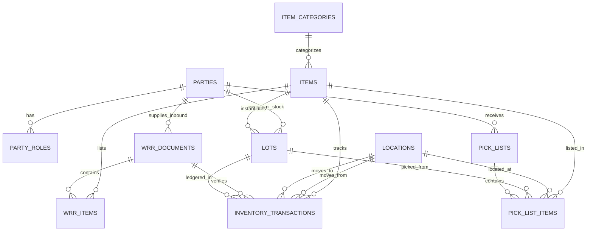

# Core Data Model — Design
Status: Approved
Depends on: specs/00-steering/ (tech.md, structure.md), specs/01-core-data-model/requirements.md

## 1. Data Model & Schema Definitions

### 1.1 Enumerations (`lib/db/schema/enums.ts`)

```typescript
import { pgEnum } from "drizzle-orm/pg-core";

export const partyRoleEnum = pgEnum("party_role", [
  "vendor",
  "supplier",
  "customer",
  "end_customer",
  "internal_warehouse",
]);

export const flowTypeEnum = pgEnum("flow_type", ["vmi", "trading", "supplies"]);

export const locationTypeEnum = pgEnum("location_type", [
  "receiving_bay", // Unloading dock (separate from storage racks)
  "inspection",    // Pre-receiving inspection for TDC/mismatch/damage (not yet incremented in inventory)
  "storage",      // High rack storage slots (A1-01)
  "picking",      // Fast-moving pick face / floor picking staging
  "dispatch",     // Outbound staging area prior to final barcode scan
]);

export const lotStatusEnum = pgEnum("lot_status", [
  "staged",
  "available",
  "quarantined",
  "depleted",
  "expired",
]);

export const wrrStatusEnum = pgEnum("wrr_status", [
  "staged_pending_arrival",
  "receiving_in_progress",
  "confirmed",
  "cancelled",
]);

export const pickListStatusEnum = pgEnum("pick_list_status", [
  "allocated",
  "picked",
  "dispatched",
]);

export const movementTypeEnum = pgEnum("movement_type", [
  "receiving",
  "putaway",
  "pick",
  "transfer",
  "inventory_reconciliation",
]);

export const conformanceStatusEnum = pgEnum("conformance_status", [
  "pending",
  "conformance",       // Passed inspection, paper/barcode match, 0 defect
  "non_conformance",   // Failed inspection (TDC / mismatch / damage)
]);

export const nonConformanceReasonEnum = pgEnum("non_conformance_reason", [
  "tdc_defect",          // Technical Defect Claim
  "quantity_mismatch",   // Paper CIPL vs physical carton count mismatch
  "damaged_carton",      // Damaged packaging or box
  "wrong_item_code",     // Incorrect SKU/part delivered
  "missing_paperwork",   // Missing PEZA permit or IP paperwork
  "other",
]);
```

### 1.2 Table Schemas

#### `parties` & `party_roles` (`lib/db/schema/parties.ts`)
```typescript
import { pgTable, uuid, varchar, text, boolean, timestamp } from "drizzle-orm/pg-core";
import { partyRoleEnum } from "./enums";

export const parties = pgTable("parties", {
  id: uuid("id").primaryKey().defaultRandom(),
  code: varchar("code", { length: 50 }).notNull().unique(),
  name: varchar("name", { length: 255 }).notNull(),
  contactPerson: varchar("contact_person", { length: 255 }),
  email: varchar("email", { length: 255 }),
  phone: varchar("phone", { length: 50 }),
  taxId: varchar("tax_id", { length: 50 }), // Tax ID / TIN
  address: text("address"),
  notes: text("notes"),
  isActive: boolean("is_active").default(true).notNull(),
  createdAt: timestamp("created_at").defaultNow().notNull(),
  updatedAt: timestamp("updated_at").defaultNow().notNull(),
});

export const partyRoles = pgTable("party_roles", {
  id: uuid("id").primaryKey().defaultRandom(),
  partyId: uuid("party_id").references(() => parties.id, { onDelete: "cascade" }).notNull(),
  role: partyRoleEnum("role").notNull(),
  createdAt: timestamp("created_at").defaultNow().notNull(),
});
```

#### `item_categories` & `items` (`lib/db/schema/items.ts`)
```typescript
import { pgTable, uuid, varchar, text, integer, decimal, boolean, timestamp } from "drizzle-orm/pg-core";

export const itemCategories = pgTable("item_categories", {
  id: uuid("id").primaryKey().defaultRandom(),
  name: varchar("name", { length: 100 }).notNull(), // Category or Subcategory Name
  flowType: flowTypeEnum("flow_type"), // Optional partition scoping ('vmi', 'trading', 'supplies')
  parentId: uuid("parent_id"), // Null for Parent Category, references item_categories.id for Subcategory
  description: text("description"),
  createdAt: timestamp("created_at").defaultNow().notNull(),
});

export const items = pgTable("items", {
  id: uuid("id").primaryKey().defaultRandom(),
  code: varchar("code", { length: 100 }).notNull().unique(), // Dyna-Serv Item Code / SKU
  supplierItemCode: varchar("supplier_item_code", { length: 100 }), // Supplier Item Code
  customerItemCode: varchar("customer_item_code", { length: 100 }), // Customer Item Code
  dsgcItemNumber: varchar("dsgc_item_number", { length: 100 }), // DSGC Item Number
  name: varchar("name", { length: 255 }).notNull(),
  description: text("description"),
  barcode: varchar("barcode", { length: 100 }).notNull().unique(),
  itemType: varchar("item_type", { length: 50 }).default("standard").notNull(), // Type (raw_material, packaging, etc.)
  categoryId: uuid("category_id").references(() => itemCategories.id), // Category / Subcategory
  defaultSupplierPartyId: uuid("default_supplier_party_id").references(() => parties.id), // Supplier Party
  uom: varchar("uom", { length: 50 }).default("piece").notNull(), // UOM (piece, box, roll, meter)
  currency: varchar("currency", { length: 10 }).default("USD").notNull(), // Currency (USD, PHP)
  buyingPrice: decimal("buying_price", { precision: 12, scale: 4 }), // Buying Price (Trading buy price)
  sellingPrice: decimal("selling_price", { precision: 12, scale: 4 }), // Selling Price
  spq: integer("spq").default(1).notNull(), // Standard Packaging Quantity (pcs/roll per box)
  spqMeter: decimal("spq_meter", { precision: 10, scale: 2 }), // SPQ Meter (meters per roll)
  lengthCm: decimal("length_cm", { precision: 10, scale: 2 }), // Length (cm)
  widthCm: decimal("width_cm", { precision: 10, scale: 2 }), // Width (cm)
  heightCm: decimal("height_cm", { precision: 10, scale: 2 }), // Height (cm)
  volumeCm3: decimal("volume_cm3", { precision: 12, scale: 2 }), // Gross Volume in CM³ (Length × Width × Height)
  volumeCbm: decimal("volume_cbm", { precision: 10, scale: 4 }).notNull(), // CBM per box ((L×W×H)/1,000,000)
  boxesPerPallet: integer("boxes_per_pallet"), // No. of Boxes per Pallet
  weightKg: decimal("weight_kg", { precision: 10, scale: 3 }), // Weight in KG per box/carton
  minReorderLevel: integer("min_reorder_level").default(0).notNull(),
  isPerishable: boolean("is_perishable").default(false).notNull(), // Triggers mandatory expiry check at receiving
  isActive: boolean("is_active").default(true).notNull(),
  createdAt: timestamp("created_at").defaultNow().notNull(),
  updatedAt: timestamp("updated_at").defaultNow().notNull(),
});
```

#### `locations` (`lib/db/schema/locations.ts`)
```typescript
import { pgTable, uuid, varchar, decimal, boolean, timestamp } from "drizzle-orm/pg-core";
import { locationTypeEnum } from "./enums";

export const locations = pgTable("locations", {
  id: uuid("id").primaryKey().defaultRandom(),
  zone: varchar("zone", { length: 50 }).notNull(),
  rack: varchar("rack", { length: 50 }).notNull(),
  level: varchar("level", { length: 50 }).notNull(),
  position: varchar("position", { length: 50 }).notNull(),
  label: varchar("label", { length: 100 }).notNull().unique(), // Format: Rack+Level-Position (e.g. 'A1-01' for Rack A, Level 1, Position 01)
  locationType: locationTypeEnum("location_type").default("storage").notNull(),
  maxCbmCapacity: decimal("max_cbm_capacity", { precision: 10, scale: 4 }).notNull(),
  isActive: boolean("is_active").default(true).notNull(),
  createdAt: timestamp("created_at").defaultNow().notNull(),
});
```

#### `lots` (`lib/db/schema/lots.ts`)
```typescript
import { pgTable, uuid, varchar, decimal, date, timestamp } from "drizzle-orm/pg-core";
import { flowTypeEnum, lotStatusEnum } from "./enums";
import { items } from "./items";
import { parties } from "./parties";

export const lots = pgTable("lots", {
  id: uuid("id").primaryKey().defaultRandom(),
  lotNumber: varchar("lot_number", { length: 100 }).notNull().unique(), // System-generated lot code
  vendorLotNumber: varchar("vendor_lot_number", { length: 100 }), // Vendor/Supplier pallet lot code
  itemId: uuid("item_id").references(() => items.id).notNull(),
  flowType: flowTypeEnum("flow_type").notNull(), // 'vmi' | 'trading' | 'supplies'
  ownerPartyId: uuid("owner_party_id").references(() => parties.id), // Required for VMI, optional for Trading/Supplies
  status: lotStatusEnum("status").default("staged").notNull(), // FIFO/FEFO eligibility gate
  pezaNumber: varchar("peza_number", { length: 100 }), // PEZA Permit Number (manual)
  commercialInvoiceNo: varchar("commercial_invoice_no", { length: 100 }), // Commercial Invoice (CIPL)
  ipNumber: varchar("ip_number", { length: 100 }), // Import Permit (IP) Number
  manufactureDate: date("manufacture_date"),
  expiryDate: date("expiry_date"),
  unitCost: decimal("unit_cost", { precision: 12, scale: 4 }), // Unit Cost in USD (Final for Trading, reference-only for VMI)
  createdAt: timestamp("created_at").defaultNow().notNull(),
  updatedAt: timestamp("updated_at").defaultNow().notNull(),
});
```

#### `wrr_documents` & `wrr_items` (`lib/db/schema/wrr.ts`)
```typescript
import { pgTable, uuid, varchar, text, integer, decimal, timestamp } from "drizzle-orm/pg-core";
import { flowTypeEnum, wrrStatusEnum } from "./enums";
import { parties } from "./parties";
import { items } from "./items";

export const wrrDocuments = pgTable("wrr_documents", {
  id: uuid("id").primaryKey().defaultRandom(),
  wrrNumber: varchar("wrr_number", { length: 50 }).notNull().unique(), // e.g. 'WRR-2026-00001'
  commercialInvoiceNo: varchar("commercial_invoice_no", { length: 100 }), // Commercial Invoice / CIPL reference
  ciplFileUrl: text("cipl_file_url"), // Attached PDF/Image CIPL document in Supabase Storage
  ipNumber: varchar("ip_number", { length: 100 }), // Import Permit (IP) Number
  vendorPartyId: uuid("vendor_party_id").references(() => parties.id).notNull(),
  flowType: flowTypeEnum("flow_type").notNull(),
  status: wrrStatusEnum("status").default("staged_pending_arrival").notNull(),
  stagedByUserId: uuid("staged_by_user_id").notNull(),
  confirmedByUserId: uuid("confirmed_by_user_id"),
  confirmedAt: timestamp("confirmed_at"),
  createdAt: timestamp("created_at").defaultNow().notNull(),
  updatedAt: timestamp("updated_at").defaultNow().notNull(),
});

export const wrrItems = pgTable("wrr_items", {
  id: uuid("id").primaryKey().defaultRandom(),
  wrrId: uuid("wrr_id").references(() => wrrDocuments.id, { onDelete: "cascade" }).notNull(),
  itemId: uuid("item_id").references(() => items.id).notNull(),
  itemCode: varchar("item_code", { length: 100 }), // Supplier Part Number from CIPL
  customerItemCode: varchar("customer_item_code", { length: 100 }), // Customer Part Number from CIPL
  vendorLotNumber: varchar("vendor_lot_number", { length: 100 }),
  expectedQty: integer("expected_qty").notNull(),
  scannedQty: integer("scanned_qty").default(0).notNull(),
  unitCbm: decimal("unit_cbm", { precision: 10, scale: 4 }).notNull(),
  uom: varchar("uom", { length: 50 }).notNull(),
  createdAt: timestamp("created_at").defaultNow().notNull(),
});

export const wrrInspectionLogs = pgTable("wrr_inspection_logs", {
  id: uuid("id").primaryKey().defaultRandom(),
  wrrId: uuid("wrr_id").references(() => wrrDocuments.id, { onDelete: "cascade" }).notNull(),
  wrrItemId: uuid("wrr_item_id").references(() => wrrItems.id),
  itemId: uuid("item_id").references(() => items.id).notNull(),
  vendorPartyId: uuid("vendor_party_id").references(() => parties.id).notNull(), // For Vendor Conformance Analytics
  inspectorUserId: uuid("inspector_user_id").notNull(),
  conformanceStatus: conformanceStatusEnum("conformance_status").notNull(), // conformance vs non_conformance
  nonConformanceReason: nonConformanceReasonEnum("non_conformance_reason"), // Reason dropdown
  remarks: text("remarks"), // Free-text remarks / TDC details
  evidencePhotoUrl: text("evidence_photo_url"), // Photo evidence attachment in Supabase storage
  actionTaken: varchar("action_taken", { length: 50 }), // 'accepted_with_variance', 'quarantined', 'returned_to_vendor'
  createdAt: timestamp("created_at").defaultNow().notNull(),
});
```

#### `forex_rates` (`lib/db/schema/forex.ts`)
```typescript
import { pgTable, uuid, varchar, date, decimal, timestamp } from "drizzle-orm/pg-core";

export const forexRates = pgTable("forex_rates", {
  id: uuid("id").primaryKey().defaultRandom(),
  effectiveDate: date("effective_date").notNull().unique(), // Daily Forex date
  usdToPhpRate: decimal("usd_to_php_rate", { precision: 10, scale: 4 }).notNull(), // USD to PHP daily exchange rate
  source: varchar("source", { length: 100 }).default("manual").notNull(),
  createdAt: timestamp("created_at").defaultNow().notNull(),
});
```

#### `inventory_transactions` (`lib/db/schema/transactions.ts`)
```typescript
import { pgTable, uuid, varchar, integer, timestamp } from "drizzle-orm/pg-core";
import { flowTypeEnum, movementTypeEnum } from "./enums";
import { lots } from "./lots";
import { items } from "./items";
import { locations } from "./locations";
import { wrrDocuments } from "./wrr";

export const inventoryTransactions = pgTable("inventory_transactions", {
  id: uuid("id").primaryKey().defaultRandom(),
  transactionNumber: varchar("transaction_number", { length: 50 }).notNull().unique(),
  lotId: uuid("lot_id").references(() => lots.id).notNull(),
  itemId: uuid("item_id").references(() => items.id).notNull(),
  movementType: movementTypeEnum("movement_type").notNull(),
  fromLocationId: uuid("from_location_id").references(() => locations.id),
  toLocationId: uuid("to_location_id").references(() => locations.id),
  qty: integer("qty").notNull(),
  flowType: flowTypeEnum("flow_type").notNull(),
  commercialInvoiceNo: varchar("commercial_invoice_no", { length: 100 }), // Associated with incoming WRR receipts
  arReferenceNo: varchar("ar_reference_no", { length: 100 }), // Associated with outgoing Dispatch/Withdrawal
  wrrId: uuid("wrr_id").references(() => wrrDocuments.id),
  performedByUserId: uuid("performed_by_user_id").notNull(),
  createdAt: timestamp("created_at").defaultNow().notNull(),
});
```

#### `pick_lists` & `pick_list_items` (`lib/db/schema/pick_lists.ts`)
```typescript
import { pgTable, uuid, varchar, text, integer, decimal, timestamp } from "drizzle-orm/pg-core";
import { flowTypeEnum, pickListStatusEnum } from "./enums";
import { parties } from "./parties";
import { items } from "./items";
import { locations } from "./locations";
import { lots } from "./lots";

export const pickLists = pgTable("pick_lists", {
  id: uuid("id").primaryKey().defaultRandom(),
  pickListNumber: varchar("pick_list_number", { length: 50 }).notNull().unique(),
  customerPartyId: uuid("customer_party_id").references(() => parties.id).notNull(),
  flowType: flowTypeEnum("flow_type").notNull(),
  status: pickListStatusEnum("status").default("allocated").notNull(),
  createdAt: timestamp("created_at").defaultNow().notNull(),
  updatedAt: timestamp("updated_at").defaultNow().notNull(),
});

export const pickListItems = pgTable("pick_list_items", {
  id: uuid("id").primaryKey().defaultRandom(),
  pickListId: uuid("pick_list_id").references(() => pickLists.id, { onDelete: "cascade" }).notNull(),
  itemId: uuid("item_id").references(() => items.id).notNull(),
  itemCode: varchar("item_code", { length: 100 }).notNull(), // Item Code
  customerItemCode: varchar("customer_item_code", { length: 100 }), // CUST PN
  itemDescription: text("item_description"), // Item Description
  lotId: uuid("lot_id").references(() => lots.id).notNull(),
  lotNumber: varchar("lot_number", { length: 100 }).notNull(), // Lot Number
  locationId: uuid("location_id").references(() => locations.id).notNull(),
  locationLabel: varchar("location_label", { length: 100 }).notNull(), // Location
  qty: integer("qty").notNull(), // Qty
  spq: integer("spq").notNull(), // SPQ
  numberOfBoxes: integer("number_of_boxes").notNull(), // No. of Packages/Boxes
  unitPrice: decimal("unit_price", { precision: 12, scale: 4 }), // Priced on Document
  createdAt: timestamp("created_at").defaultNow().notNull(),
});
```

## 2. Entity Relationship Diagram



## 3. Key Workflows & Invariants

1. **Email CIPL Ingestion & Pre-Receiving WRR Staging**:
   - Back-office staff receive Commercial Invoice & Packing List (CIPL) files via email and pre-encode the manifest into `wrr_documents` in `staged_pending_arrival` status with attached `cipl_file_url`, `invoice_number`, and `ip_number`.
   - Expected incoming items/cartons sit in a **standby staging table** (`wrr_items`). At this stage, stock is strictly on standby and is **NOT YET incremented** in inventory balance or recorded in the inbound ledger.

2. **WRR Document Print & Barcode Scanning Confirmation Lifecycle**:
   - **Paper WRR Generation**: System generates and prints the official WRR document (with barcode reference `WRR-2026-00001`), which serves as the physical cross-reference sheet for floor receiving staff.
   - **Floor Barcode Scanning**: When pallets arrive at `receiving_bay`, floor staff scan each carton barcode against the printed WRR reference.
   - **Conditional Item Enrollment Trigger**: If an incoming carton contains a new item/SKU not yet in the master catalog, the system prompts staff to complete a **New Item Enrollment Form** on-the-fly before confirmation.
   - **Receipt Confirmation & Ledger Write**: Once physical barcode scans match expected quantities, confirming the receipt transitions WRR to `confirmed`:
     - Creates active physical `lots` (`status = 'available'`).
     - Transfers stock from standby staging tables into active inventory balance.
     - Inserts an immutable `inventory_transaction` ledger entry (`movement_type = 'receiving'`).

3. **FEFO / FIFO Rotation**:
   - Allocation engines evaluate `lots.status = 'available'` sorted by `expiry_date` ascending (FEFO for perishable items) then `created_at` ascending (FIFO for non-perishable items).

4. **Master Inventory UI & Item Drill-Down**:
   - **Summary Table**: The Master Inventory summary table MUST prioritize and display the **Item Code** as the first and most prominent column, along with item balances and the **Oldest Received Date** across active stock.
   - **Drill-Down View**: Clicking an item expands/drills down to show the **Stacked Location & Active Lots Breakdown**, displaying active `lots` (`status = 'available'`) with Received Date, Lot #, Vendor Lot #, Partition (`vmi`/`trading`/`supplies`), Stacked Location Tag (e.g. `A1-01`), Expiration Date, Pcs, Boxes, and CBM occupied, ordered by strict FEFO/FIFO sequence.
   - **History Modal**: The full stock movement history is NOT shown inline to prevent clutter. Instead, an action button ("View History") opens a modal that fetches `inventory_transactions`. The modal displays the exact date, time, performing user, total quantity received, and total quantity dispatched/withdrawn.

5. **Unified Conditional Item Enrollment Workflow**:
   - Item enrollment operates via a single unified form interface. Selecting the primary `flow_type` (`vmi`, `trading`, or `supplies`) dynamically reveals conditional fields (e.g. default supplier party & SPQ meters for VMI; currency, buying price & selling price for Trading; internal reorder threshold for Supplies), writing cleanly to the single unified `items` table.

6. **Interactive Bi-Directional Form Calculation (`Unit (roll)` $\leftrightarrow$ `Unit (meter)`)**:
   - Order, enrollment, and withdrawal entry forms contain two real-time synchronized input fields for roll items:
     - **Typing into `Unit (meter)`**: `onChange` immediately updates the `Unit (roll)` field via $\text{Unit (roll)} = \frac{\text{Unit (meter)}}{\text{spq\_meter}}$ (e.g., typing $750$ in `Unit (meter)` auto-fills $1$ in `Unit (roll)`).
     - **Typing into `Unit (roll)`**: `onChange` immediately updates the `Unit (meter)` field via $\text{Unit (meter)} = \text{Unit (roll)} \times \text{spq\_meter}$ (e.g., typing $2$ in `Unit (roll)` auto-fills $1,500$ in `Unit (meter)`).
     - **Dual Document Output**: Form submissions send both values so that floor picking sheets use `Unit (roll)` while customer withdrawal receipts render `Unit (meter)` and `Unit (roll)`.

7. **Category & Subcategory Cascading Hierarchy (VMI & Trading)**:
   - `item_categories` maintains a parent-child self-referential hierarchy (`parent_id` = `null` for Top Categories; `parent_id` = Top Category ID for Subcategories, with optional `flow_type` scoping).
   - **VMI Taxonomy**:
     - *Packaging Material* $\rightarrow$ Subcategories: `Plastic Tray`, `U-Clip`, `Carrier Tape`, `End-Plug`, `Cover Tape`
     - *Raw Material* $\rightarrow$ Subcategories: `Polysheet`, `Resin`
     - *Fabrication* $\rightarrow$ Custom fabrication items
     - *Spare Parts* $\rightarrow$ Equipment spare parts
     - *Machines* $\rightarrow$ Industrial machinery & equipment
   - **Trading Taxonomy**:
     - *Packaging Material* $\rightarrow$ Subcategories: `ESD`, `Chemicals`
     - *Raw Material* $\rightarrow$ General raw materials & consumables
     - *Fabrication* $\rightarrow$ Subcategories: `Plastic`, `Metal`
     - *Spare Parts* $\rightarrow$ Subcategories: `Tester Boards`
     - *Machines* $\rightarrow$ Machinery & equipment
   - **UI Behavior**: Selecting the Flow (`vmi` / `trading`) and Category dynamically filters the Subcategory dropdown options.

8. **Standardized Form Select & Dropdown Controls**:
   - The Item Enrollment form enforces explicit dropdown selections:
     - **Currency Dropdown**: Select between `PHP` and `USD`.
     - **UOM Dropdown**: Select between `pc` (piece), `roll`, and `meter`.
     - **Supplier Dropdown**: Dynamic dropdown list querying `parties` having `party_roles` set to `'supplier'` or `'vendor'`.

9. **Partition-Based Withdrawal Quantity Rules (SPQ Enforcement)**:
   - System allocation and pick-list validation engines enforce strict withdrawal unit constraints based on `flow_type`:
     - **VMI Flow (`flow_type = 'vmi'`)**: Withdrawal per piece is **strictly forbidden**. Quantities MUST be in full SPQ box multiples ($\text{qty} \pmod{\text{spq}} = 0$).
     - **Trading Flow (`flow_type = 'trading'`)**: Withdrawal per piece is **strictly forbidden**. Quantities MUST be in full SPQ box multiples ($\text{qty} \pmod{\text{spq}} = 0$).
     - **Supplies Flow (`flow_type = 'supplies'`)**: Withdrawal per piece **IS allowed** ($\text{qty} \ge 1$), enabling staff to withdraw exact individual piece counts for internal warehouse operations.

10. **Smart Dispersed Putaway Location Recommendation & Capacity Preview UI**:
    - **Putaway Recommendation Engine**: Upon receiving and scanning items at `receiving_bay`, the system queries available storage slots (`max_cbm_capacity - occupied_cbm`), filtering locations that fit the item's box CBM (`volume_cbm`).
    - **Multi-Location Dispersed Storage**: Cartons from a single receipt line can be divided and assigned across multiple storage locations if space is dispersed.
    - **Location Dropdown UI**:
      - Location dropdown displays: `[ Location Label (e.g. A1-01) | Remaining Box Capacity | CBM Utilization % (e.g. 65% - 1.20 CBM Available) ]`.
    - **Selected Location Inventory Preview Panel**:
      - When a location is selected, a slide-over/preview card displays:
        - **Currently Stored Items**: Detailed list of stored items capturing Item Code, Name, Lot #, Owner Party, **Flow Type** (`vmi`/`trading`/`supplies`), **Item Type**, **Category**, and **Subcategory** (e.g., `Packaging Material > Plastic Tray`).
        - **Stored Cartons & CBM Breakdown**: Current stored carton count, occupied CBM, and maximum CBM limit.

11. **Party Enrollment Workflow**:
    - Enrolls corporate entities into `parties` capturing `code`, legal `name`, `contact_person`, `email`, `phone`, `tax_id` / TIN, PEZA `address`, and `notes`.
    - Staff assign one or more multi-role flags in `party_roles`: `[ Vendor | Supplier | Customer | End-Customer | Internal Warehouse ]`.

12. **Location Enrollment & Physical Types**:
    - Enrolls physical warehouse storage slots into `locations` capturing `zone`, `rack`, `level`, and `position`.
    - System auto-generates formatted labels as `Rack+Level-Position` (e.g. `A1-01` for Rack `A`, Level `1`, Position `01`).
    - Enforces explicit `location_type` dropdown options:
      - **`receiving_bay`**: Inbound unloading dock (separate from rack slots).
      - **`inspection`**: Pre-receiving verification area for TDC (Technical Defect Claim), paper-versus-barcode cross-referencing, and damage/mismatch triage (stock here is **NOT YET scanned or incremented** into system inventory).
      - **`storage`**: High rack storage slots for putaway stock.
      - **`picking`**: Fast-moving pick face / floor picking staging slots.
      - **`dispatch`**: Outbound staging area prior to final outgoing barcode scan.
    - Enforces `max_cbm_capacity` and optional `max_weight_kg`.

13. **Integrated Inventory Picking & Two-Stage Outbound Commitment**:
   - **Stage 1 (Inventory Page Picking & Pick List Generation)**: The standalone picking page is removed. Picking is initiated directly from the Master Inventory page.
     - **Lot Selection & FIFO Enforcement**: When an item is selected for picking, a dropdown of its available lot numbers is displayed, strictly enforcing the FIFO rule even if the lots are dispersed across different physical locations.
     - **FIFO Override & Approval Queue**: If staff need to bypass the FIFO sequence (e.g., picking a newer lot because the oldest is physically inaccessible), they must submit a **FIFO Override Request**. The system blocks pick list generation until the request is approved by a manager via the Approval Queue.
     - **Commitment**: Once lots are selected (and approved if overridden), the final `pick_list` is generated. The system logs the allocated quantity as **Committed Quantity** (`committed_qty`), reserving the stock to prevent double-allocation while the physical inventory balance remains un-decremented.
   - **Stage 2 (Dispatch Barcode Scan Confirmation)**: Stock physically moves to `dispatch`. Once floor staff scan the barcode at outgoing/dispatch:
     - Physical inventory balance is officially **decremented** (`lots` balance decreased).
     - Reserved **committed quantity** is released (`committed_qty` cleared).
     - Immutable `inventory_transaction` is recorded (`movement_type = 'pick'`).
     - Priced **`acknowledgement_receipt`** is generated for signature.

14. **Inspection Conformance Tagging, Analytics & Feedback Workflow**:
    - **Inspection Tagging**: Items evaluated in `inspection` are tagged with `conformance_status`:
      - **`conformance`**: 0 defects, paper/barcode match $\rightarrow$ moves to confirmed receiving scan & putaway.
      - **`non_conformance`**: Requires selecting a `non_conformance_reason` dropdown (`tdc_defect`, `quantity_mismatch`, `damaged_carton`, `wrong_item_code`, `missing_paperwork`, `other`), entering remarks, and attaching evidence photo URL (`evidence_photo_url`), logged into `wrr_inspection_logs`.
    - **Feedback Flow per Tag**:
      - **On `conformance` Tag**: Physical `lots` created (`status = 'available'`), stock incremented in inventory balance, putaway location recommended.
      - **On `non_conformance` Tag**: Stock is **NOT YET incremented** in inventory balance; logged into `wrr_inspection_logs`; triggers automated email alert to Vendor & Procurement via Resend; stock is quarantined or flagged for Return-to-Vendor (`action_taken`).
    - **Vendor Performance Analytics**: `wrr_inspection_logs` data feeds vendor quality dashboards (Vendor Conformance Rate %, TDC frequency, defect trends per supplier).

## 4. Access Control & RLS
- Supabase Row-Level Security policies restrict tenant/party visibility while keeping physical locations unified.

## 5. Offline Behavior
- Tier 1: Hardware scanner barcode matching & offline receiving scan queue.
- Tier 2: Pre-receiving CIPL file uploads and master item catalog encoding.
