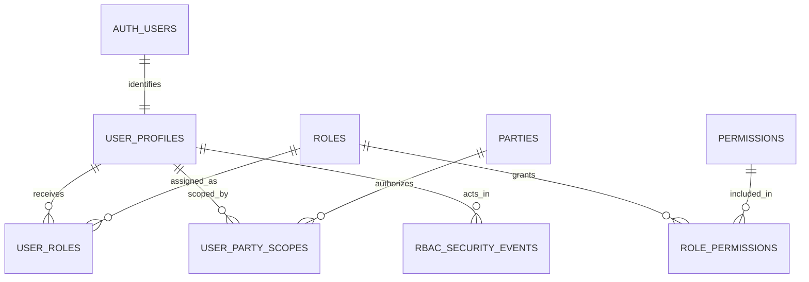
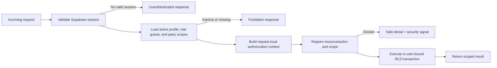

# RBAC & Roles — Design

Status: Approved
Updated: 2026-08-05 (pass-2 db-migration-verifier run — all 5 remaining items verified PASS; two bugs found and fixed)

Depends on:

- `specs/00-steering/tech.md`
- `specs/00-steering/structure.md`
- `specs/00-steering/brand-design-system.md`
- `specs/00-steering/testing.md`
- `specs/01-core-data-model/requirements.md`
- `specs/01-core-data-model/design.md`
- `specs/02-rbac-roles/requirements.md`
- `specs/03-offline-mode-and-client-storage/` for sync-time authorization integration
- `specs/04-services-and-infrastructure/` for Supabase Auth, email, rate limits, and monitoring
- `specs/05-ui-shell-and-navigation/` for protected route groups and navigation

## 1. Design summary

RBAC uses fixed system roles backed by centrally defined capabilities. Users may hold multiple active roles; grants combine additively, and all ungranted access is denied. Party users also require explicit party scope, optionally narrowed by `flow_type`.

Supabase Auth owns identity and sessions. PostgreSQL owns profiles, roles, capabilities, assignments, party scopes, and durable security events. Every protected request resolves current authorization data from PostgreSQL. The result is memoized only within that request, so deactivation or revocation takes effect on the next protected request.

Authorization is enforced in three layers:

1. The UI hides or disables unavailable actions for clarity.
2. Server code calls a shared capability-and-scope guard.
3. PostgreSQL RLS independently enforces row access using the authenticated user's identity and current database assignments.

The UI layer is not a security boundary. Middleware is an authentication convenience, not a replacement for server checks or RLS.

## 2. Foundational dependencies and touched tables

### 2.1 Foundational specs

- `01-core-data-model` supplies canonical business entities and the party/flow relationships used by RLS.
- `03-offline-mode-and-client-storage` must re-authorize queued Tier 1 operations during sync.
- `04-services-and-infrastructure` supplies Auth administration, private email delivery, Upstash rate limiting, Sentry, and deployment configuration.
- `05-ui-shell-and-navigation` consumes the effective capability set to build protected navigation.

### 2.2 Tables from `01-core-data-model`

This feature does not redefine the following tables. It references or protects them:

| Table | RBAC use |
|---|---|
| `parties` | Canonical target of party-scope assignments and admin party selector. |
| `party_roles` | Read only for business classification; never used as an application-user role table. |
| `items` | Protected master data; party visibility must be derived from an approved related record rather than broad catalog access. |
| `item_categories` | Protected reference/master data according to the consuming capability. |
| `locations` | Operational warehouse data protected by capabilities; no `warehouse_id` scope. |
| `lots` | Party/flow-scoped inventory through `owner_party_id` and `flow_type` where those fields represent the requesting party. |
| `wrr_documents` | Party/flow-scoped inbound documents through `vendor_party_id` and `flow_type`. |
| `wrr_items` | Inherits scope from its parent `wrr_documents` record. |
| `wrr_inspection_logs` | Inherits WRR/vendor scope and has stricter evidence-file access. |
| `inventory_transactions` | Operational ledger; party visibility is derived through its related lot or source document. |
| `pick_lists` | Party/flow-scoped outbound documents through `customer_party_id` and `flow_type`. |
| `pick_list_items` | Inherits scope from its parent `pick_lists` record. |
| `forex_rates` | Read/manage access is capability-based and not party-scoped. |
| `wrr_advance_notices` | **Schema amendment (2026-08-06), not yet through `db-migration-verifier`.** Party/flow-scoped inbound pre-label record through `party_id`, gated additionally by the caller's `party_roles`; see §3.2/§7.4. |

The final RLS policy for each table is delivered with the feature that finalizes that table's business relationship. RBAC supplies shared policy helpers and the default-deny contract. A downstream spec must not expose a table until its party/resource scope path is explicit and tested.

## 3. Authorization model

### 3.1 System roles

| Role key | Purpose | Scope behavior |
|---|---|---|
| `warehouse_staff` | Floor and operational work. | Operational/global within the one warehouse, limited by granted workflow capabilities. |
| `supervisor` | Oversight and selected workflow approvals. | Operational/global; approval capabilities remain separate per workflow. |
| `administrator` | User/access administration, master configuration, and global audit oversight. | Global for explicitly granted admin capabilities; still evaluated by RLS. |
| `party_user` | Scoped party self-service. | Requires active `user_party_scopes`; no implicit scope from email or role alone. |

The role catalog is seeded by migration. `is_system = true` roles cannot be deleted or edited through the v1 UI. Feature code never branches on these role keys; it checks capabilities.

### 3.2 Capability model

A grant is represented as:

```text
resource + action + scope_kind
```

Initial scope kinds:

| Scope kind | Meaning |
|---|---|
| `global` | Capability applies across the single warehouse, subject to row policy and business-state checks. |
| `assigned_party` | Capability applies only when the row matches an active `user_party_scopes` assignment. |

`user_party_scopes.flow_type` further narrows `assigned_party`. A null `flow_type` means all *externally applicable* flows for that assigned party — this explicitly excludes `'supplies'`, never all three `flow_type` values. This exclusion is not prose intent alone; it is enforced at the mechanism level by two independent layers so no single implementation slip exposes Supplies data:

1. `has_party_scope(party_id, flow_type)` (§7.2) never treats a null-`flow_type` assignment row as matching `flow_type = 'supplies'`. Its match logic is `requested_flow_type = assignment.flow_type OR (assignment.flow_type IS NULL AND requested_flow_type <> 'supplies')`, not a bare null-means-wildcard check.
2. `can_access_party_resource` (§7.2) independently hard-blocks any `assigned_party`-scope-kind capability check where the target row's `flow_type = 'supplies'`, regardless of what `has_party_scope` alone would return. This is a second, redundant gate — not a restatement of the first.

Per requirements.md §3.4 and acceptance criterion #7, `party_user` grants never expose internal Supplies data in v1. Consequently, every RBAC-owned and downstream capability that touches a `flow_type`-partitioned resource for Supplies MUST be modeled with `scope_kind = 'global'` in the canonical capability catalog (§3.2), never `assigned_party` — `assigned_party` scope is defined to be flow-restricted to VMI/Trading only, and Supplies access is granted exclusively through operational roles (`warehouse_staff`, `supervisor`, `administrator`), never through `user_party_scopes`.

Initial RBAC-owned capability identifiers:

| Resource | Actions | Default role |
|---|---|---|
| `users` | `read`, `invite`, `activate`, `deactivate` | `administrator` |
| `access_assignments` | `read`, `grant`, `revoke` | `administrator` |
| `party_scopes` | `read`, `grant`, `revoke` | `administrator` |
| `security_events` | `read` | `administrator` |

The following operational capability catalog defines stable resource identifiers and the action vocabulary for first-wave feature domains (2026-08-05). Downstream specs confirm or extend actions within each resource; they do not rename these resource keys. Where the same resource permits both `global` and `assigned_party` scope kinds, both rows are listed. The full `role_permissions` seed data is derived from this table.

| Resource | Actions | Scope kind | Default role(s) |
|---|---|---|---|
| `receiving` | `view`, `scan`, `confirm` | `global` | `warehouse_staff`, `supervisor` |
| `inspection` | `perform` | `global` | `warehouse_staff`, `supervisor` |
| `inspection` | `resolve` | `global` | `supervisor` |
| `inventory` | `read` | `global` | `warehouse_staff`, `supervisor`, `administrator` |
| `inventory` | `manage` | `global` | `administrator` |
| `locations` | `read` | `global` | `warehouse_staff`, `supervisor`, `administrator` |
| `locations` | `manage` | `global` | `administrator` |
| `pick_list` | `generate`, `execute`, `read` | `global` | `warehouse_staff`, `supervisor` |
| `pick_list` | `read` | `assigned_party` | `party_user` |
| `fifo_override` | `request` | `global` | `warehouse_staff`, `supervisor` |
| `fifo_override` | `approve` | `global` | `supervisor` |
| `dispatch` | `read`, `execute` | `global` | `warehouse_staff`, `supervisor` |
| `transfers` | `read`, `request`, `execute` | `global` | `warehouse_staff`, `supervisor` |
| `documents` | `read`, `generate`, `download` | `global` | `warehouse_staff`, `supervisor`, `administrator` |
| `documents` | `read` | `assigned_party` | `party_user` |
| `vmi_statements` | `read` | `assigned_party` | `party_user` |
| `reporting` | `read`, `export` | `global` | `supervisor`, `administrator` |
| `reporting` | `read` | `assigned_party` | `party_user` |
| `parties` | `read` | `global` | `warehouse_staff`, `supervisor`, `administrator` |
| `parties` | `manage` | `global` | `administrator` |
| `items` | `read` | `global` | `warehouse_staff`, `supervisor`, `administrator` |
| `items` | `manage` | `global` | `administrator` |
| `forex_rates` | `read` | `global` | `supervisor`, `administrator` |
| `forex_rates` | `manage` | `global` | `administrator` |
| `notifications` | `read` | `global` | `warehouse_staff`, `supervisor`, `administrator` |
| `notifications` | `read` | `assigned_party` | `party_user` |
| `shipment_labels` | `generate` | `assigned_party` | `party_user` |

**Schema amendment (2026-08-06)**: `shipment_labels.generate` originates from `22-parties-portal` requirements.md R11 (supplier-initiated barcode pre-labeling of inbound dispatches) — a party in the inbound-supplying role generates a pre-arrival label for their own outbound shipment. Like every other row in this table, `shipment_labels.generate` is `assigned_party`-scoped only — the base capability model grants nothing beyond the caller's own `party_id`. But the actual RLS policy for the one write this capability gates (§7.4's `wrr_advance_notices` pattern) layers an *additional* business-rule condition on top: the caller's party must also hold a `party_roles` row with `role IN ('vendor', 'supplier')`, because `assigned_party` scope alone does not distinguish an inbound-supplying party from an outbound-receiving one within the same `flow_type` (a Trading `customer`/`end_customer` and a Trading `vendor`/`supplier` are both merely "assigned" to the same party record's Trading scope). This is framed the same way §3.4's self-approval prohibition is framed: a capability constraint layered on top of the base authorization model, not a new `scope_kind`.

**Fixed 2026-08-06, `rbac-rls-reviewer` finding B**: a party-level `EXISTS (... role IN ('vendor','supplier'))` check alone is insufficient — it asks "does this party hold a vendor/supplier role *anywhere*," not "is this user's specific relationship the vendor/supplier one." A hybrid party `P` holding both `'customer'` and `'vendor'` roles would incorrectly pass this gate for a user whose actual relationship to `P` is purely as a Trading customer. The gate is corrected to require the party hold **zero** `customer`/`end_customer` roles in addition to holding a `vendor`/`supplier` role — see §7.4's rewritten `wrr_advance_notices` pattern. Consistent with this repo's established pattern of treating rare edge cases as out-of-scope-for-now rather than building new per-relationship-scoped schema (the same reasoning already used for the brand-new-item chicken-and-egg resolution in `22` requirements.md §7 item 6), a genuinely hybrid party (holding both an inbound-supplying and a customer-facing role simultaneously) is **not eligible for this feature in v1**. If this scenario arises operationally, it must be resolved administratively — splitting the party into separate records, or handling the label request manually through back office — not through new RBAC machinery.

**Catalog addition (2026-08-06)**: `vmi_statements.read` (`assigned_party`) originates from `22-parties-portal` requirements.md R4.4 — a VMI party user viewing/downloading their own issued `vmi_billing_statement` records and `vmi_credit_notes` status. It covers reads of both tables, scoped to the statement's/note's own `party_id` column (see §7.4's pattern). No mutation action is granted at any scope — both tables remain `12-vmi-billing`'s exclusively server-generated domain.

**Catalog addition (2026-08-06)**: `reporting` | `read` | `assigned_party` | `party_user` originates from `22-parties-portal` requirements.md R10.6 (party-scoped VMI/Trading analytics, mirroring `16-reporting-and-analytics` FR-5/FR-6/AC-5's own assumption that a party user can reach analytics). This row coexists with the existing `global`-scope `reporting` row above, the same pattern already used for `pick_list.read`/`documents.read`/`notifications.read`, each of which has both a `global` row (internal staff) and an `assigned_party` row (`party_user`). No new RLS predicate is required at the table level for this grant: `16`'s party-scoped analytics queries read from `lot_location_balances`, `pick_lists`, and `items` (via `party_visible_items`), all three already governed by the party-scoped RLS patterns defined in §7.4 for other capabilities (the VMI `lot_location_balances` pattern, the Trading `pick_lists` pattern, the `party_visible_items` view). `reporting.read` (`assigned_party`) functions purely as a server-side authorization gate confirming the caller may reach the party-scoped analytics surface at all — layered on top of those already-enforced table policies, not a new RLS mechanism of its own.

`inspection.resolve` is intentionally `supervisor`-only: resolution determines disposition of held stock (accept, quarantine, return) and must not be exercised by the same floor worker who performed the scan, maintaining a two-person separation for high-stakes inventory outcomes. `inspection.perform` remains available to `warehouse_staff` for the physical scan and evidence capture step.

`reporting.read` and `reporting.export` are not granted to `warehouse_staff` because the reporting surface aggregates cross-party inventory metrics, pricing, and CBM data; floor workers have no business need for that aggregate view and the exposure would violate the principle of least privilege.

Names are added to this canonical catalog only when the owning feature's requirements define the operation; the table above covers operations whose business meaning is stable from the revision-plan scope.

### 3.3 Effective authorization

For an active user:

```text
effective grants = union(active role assignments -> active role capability grants)
effective party scope = active user-party-flow assignments
```

There are no explicit denies. A request is permitted only when:

1. The user profile is active.
2. An active role grant contains the requested resource/action.
3. The grant's scope kind is satisfied.
4. The target row meets its resource/business-state rules.
5. RLS permits the database operation.

### 3.4 Self-approval prohibition

A user who is recorded as the **requester** of a specific approval target — the user whose action caused an approval request to be created, identified by `requester_user_id` on the approval record — is prohibited from exercising any approval capability against that same target, regardless of what approval capabilities they hold.

This rule applies to every approval resource type defined under this spec. For the initial `fifo_override.approve` capability: when the approval command is invoked, the server MUST verify that the approval request's `requester_user_id` does not equal the invoking user's `auth.uid()` before allowing the operation. This check is a server-side authorization requirement, not merely a UI constraint, and must be enforced independently of whether the UI hides the approve button for self-requested items.

The self-approval prohibition is not modeled as a separate RLS policy because RLS cannot efficiently express "you may approve this row unless you are the one who created it given a join to the approval record" within the normal policy evaluation path. It is enforced by the approval-command server logic (owned by `09-approval-queue`) and re-applied during sync re-authorization for any offline-queued approval operations. The RBAC spec owns this rule as a capability constraint; `09` owns the state machine that implements it.

## 4. RBAC data model

All names below are proposed by this feature and must be reconciled with the final `01-core-data-model` migrations before implementation.

### 4.1 `user_profiles`

| Column | Type | Rules |
|---|---|---|
| `id` | UUID | Primary key; same value as `auth.users.id`. |
| `display_name` | Text | Required administrative display name. |
| `status` | Enum | `invited`, `active`, or `inactive`. |
| `activated_at` | Timestamptz | Null until activated. |
| `activated_by_user_id` | UUID | Nullable self-reference for system bootstrap. |
| `deactivated_at` | Timestamptz | Set on deactivation. |
| `deactivated_by_user_id` | UUID | Actor that deactivated the account. |
| `deactivation_reason` | Text | Required on deactivation. |
| `created_at` | Timestamptz | Required. |
| `updated_at` | Timestamptz | Required. |

The normal lifecycle deactivates rather than deletes users. Production tooling must restrict deletion of Auth identities when referenced by audit/history records. If a legal deletion requirement is later introduced, it needs a separate anonymization design.

### 4.2 `roles`

| Column | Type | Rules |
|---|---|---|
| `id` | UUID | Primary key. |
| `key` | Text | Unique immutable key. |
| `name` | Text | Human-readable label. |
| `description` | Text | Administrative explanation. |
| `is_system` | Boolean | True for all v1 roles. |
| `is_active` | Boolean | Inactive roles contribute no grants. |
| `created_at`, `updated_at` | Timestamptz | Required. |

### 4.3 `permissions`

| Column | Type | Rules |
|---|---|---|
| `id` | UUID | Primary key. |
| `resource` | Text | Stable machine identifier. |
| `action` | Text | Stable machine identifier. |
| `description` | Text | Human-readable effect. |
| `is_active` | Boolean | Inactive permissions grant nothing. |
| `created_at`, `updated_at` | Timestamptz | Required. |

Unique constraint: `(resource, action)`.

### 4.4 `role_permissions`

| Column | Type | Rules |
|---|---|---|
| `role_id` | UUID | Foreign key to `roles`. |
| `permission_id` | UUID | Foreign key to `permissions`. |
| `scope_kind` | Enum | `global` or `assigned_party`. |
| `created_at` | Timestamptz | Required. |

Primary/unique key: `(role_id, permission_id, scope_kind)`. System-role mappings are migration-managed in v1.

### 4.5 `user_roles`

| Column | Type | Rules |
|---|---|---|
| `id` | UUID | Primary key. |
| `user_id` | UUID | Foreign key to `user_profiles`. |
| `role_id` | UUID | Foreign key to `roles`. |
| `valid_from` | Timestamptz | Defaults to grant time. |
| `valid_until` | Timestamptz | Nullable expiry. |
| `granted_at` | Timestamptz | Required. |
| `granted_by_user_id` | UUID | Required after bootstrap. |
| `grant_reason` | Text | Required for sensitive grants. |
| `revoked_at` | Timestamptz | Null while active. |
| `revoked_by_user_id` | UUID | Required when revoked. |
| `revocation_reason` | Text | Required when revoked. |

A partial unique index prevents more than one active assignment for the same `(user_id, role_id)`. Historical revoked assignments remain immutable except for the one controlled transition from active to revoked.

### 4.6 `user_party_scopes`

| Column | Type | Rules |
|---|---|---|
| `id` | UUID | Primary key. |
| `user_id` | UUID | Foreign key to `user_profiles`. |
| `party_id` | UUID | Foreign key to `parties`. |
| `flow_type` | Existing enum | Nullable; null means all allowed flows for this party. |
| `valid_from`, `valid_until` | Timestamptz | Active interval. |
| `granted_at`, `granted_by_user_id` | Timestamp/UUID | Required. |
| `grant_reason` | Text | Administrative rationale. |
| `revoked_at`, `revoked_by_user_id` | Timestamp/UUID | Set by controlled revocation. |
| `revocation_reason` | Text | Required when revoked. |

An active-assignment uniqueness rule treats null `flow_type` as a real value so duplicate all-flow assignments cannot be created. This MUST use Postgres 15+'s native `UNIQUE ... NULLS NOT DISTINCT` index modifier (`CREATE UNIQUE INDEX ... ON user_party_scopes (user_id, party_id, flow_type) NULLS NOT DISTINCT WHERE revoked_at IS NULL`) — a `COALESCE(flow_type::text, '__sentinel__')` expression index is **not** viable, because the implicit enum→text cast (`enum_out`) is `STABLE`, not `IMMUTABLE`, and Postgres rejects non-immutable functions in an index expression at creation time. Granting an all-flow assignment while narrower active assignments exist must either be rejected with a clear conflict or replace them transactionally; the administration service uses replacement with confirmation and audit events.

### 4.7 `rbac_security_events`

| Column | Type | Rules |
|---|---|---|
| `id` | UUID | Primary key. |
| `event_type` | Text/enum | Stable event category. |
| `actor_user_id` | UUID | Nullable when identity is unknown, such as failed sign-in. |
| `executor_type` | Enum | `user`, `system`, or `background_job`. |
| `executor_id` | Text | Named service/job identifier when applicable. |
| `target_type` | Text | User, assignment, scope, session, or protected resource. |
| `target_id` | Text/UUID | Target identifier where safe. |
| `reason` | Text | Required for sensitive access changes. |
| `details` | JSONB | Redacted structured metadata; no secrets. |
| `correlation_id` | Text/UUID | Request/job trace identifier. |
| `ip_hash` | Text | Optional privacy-preserving abuse correlation, subject to infrastructure policy. |
| `created_at` | Timestamptz | Server/database generated. |

No ordinary or administrator policy permits update or delete. Inserts occur through controlled server/database paths that derive the actor from the session; clients cannot submit arbitrary actor identities.

Defined `event_type` values (2026-08-05):

| Event type | Trigger |
|---|---|
| `user_invited` | An invitation was sent to a new user. |
| `user_activated` | An invited user profile was activated by an administrator. |
| `user_deactivated` | A user profile was deactivated, with actor, timestamp, and reason. |
| `role_granted` | A system role was assigned to a user. |
| `role_revoked` | A system role assignment was revoked. |
| `party_scope_granted` | A party-scope assignment was granted to a user. |
| `party_scope_revoked` | A party-scope assignment was revoked. |
| `sensitive_action_denied` | A capability check was evaluated and denied for a sensitive operation. |
| `authentication_failed` | A sign-in attempt failed where the failure is safely attributable without revealing account existence. |
| `session_revoked` | An active session was administratively revoked following deactivation or a critical privilege change. |
| `password_recovery_requested` | A password recovery email was triggered for a known account. |
| `administrator_invariant_blocked` | A deactivation or role-revocation was rejected by the last-administrator invariant check (§8.5). |

This list is exhaustive for v1 RBAC-owned events. Downstream feature specs that need additional event types must add them to this table and assign a stable string value before implementation; they must not invent ad-hoc strings at runtime.

## 5. Entity relationships



`party_roles` is deliberately absent from the user authorization relationship. It remains a business classification attached to `parties`.

## 6. Request authorization architecture

### 6.1 Server request flow



The authorization context contains:

- `userId`
- profile status
- active role keys for display/audit only
- effective `(resource, action, scope_kind)` grants
- active `(party_id, flow_type)` scopes
- request/correlation ID

The client never supplies this context. Client values may be treated only as untrusted requested identifiers.

### 6.2 Shared guard contract

The server-side interface is conceptually:

```text
requirePermission(resource, action, optional target scope)
```

It is used by Server Actions, route handlers, server components that load protected data, and background-job entry points. It returns the trusted authorization context or a typed denial. Downstream code must not use conditions such as `role === "supervisor"`.

### 6.3 Drizzle and Supabase RLS session propagation

The locked stack requires Drizzle and PostgreSQL RLS. Direct PostgreSQL connections do not automatically receive PostgREST's request JWT context, so every user-scoped Drizzle operation must run inside a transaction wrapper that:

1. Validates the Supabase access token on the server.
2. Starts a database transaction.
3. Sets transaction-local authenticated role/JWT claims needed by `auth.uid()`.
4. Executes the callback through the transaction-bound Drizzle client only.
5. Commits or rolls back before the connection returns to the pool.

No user-scoped query may escape this wrapper, and no session claim may be set at connection scope. This prevents identity leakage through pooled connections. The implementation design must be validated against the selected Supabase connection mode in `04-services-and-infrastructure` with real Postgres before code is approved. If the selected connection mode cannot safely propagate transaction-local claims, protected user data access must use the Supabase session client/Data API while Drizzle remains the schema and trusted-server query layer; RLS must not be weakened to preserve ORM uniformity.

The wrapper's commit/rollback step MUST be implemented with guaranteed rollback on any callback exception (e.g. try/finally around the callback, rolling back unless the callback completed and commit was explicitly reached) — a callback that throws must never leave the transaction open or implicitly committed.

### 6.4 Request-local memoization

Authorization resolution may be memoized for the life of one request. There is no Redis or JWT permission cache in v1. A new request always re-evaluates current profile, assignment, expiry, and revocation state.

## 7. PostgreSQL RLS design

### 7.1 Default-deny baseline

- Enable and force RLS on protected application tables where supported by the ownership model.
- Define policies separately for select, insert, update, and delete.
- Grant no broad authenticated table privileges beyond those required by explicit policies.
- Interactive administrators use explicit policies, not service-role bypass.
- Service-role operations are isolated, named, audited, and unavailable to browser code.

### 7.2 Shared policy helpers

Proposed stable helper functions:

| Helper | Purpose |
|---|---|
| `current_user_is_active()` | Confirms `auth.uid()` maps to an active profile. |
| `has_permission(resource, action, scope_kind)` | Confirms an active role grant for the current user. |
| `has_party_scope(party_id, flow_type)` | Confirms an active matching party assignment. A null-`flow_type` assignment row matches any requested `flow_type` **except** `'supplies'` — it is not a bare wildcard (§3.2). |
| `can_access_party_resource(resource, action, party_id, flow_type)` | Combines capability and party scope for policies, and independently hard-denies when `flow_type = 'supplies'` regardless of `has_party_scope`'s result (§3.2's second gate). |
| `party_has_any_role(party_id, roles)` | **Added 2026-08-06, `rbac-rls-reviewer` finding E.** Confirms whether a `party_roles` row exists for `party_id` matching any role in the given `text[]`. Lives in `rbac_internal`, owned by `rbac_definer`, same schema-placement/no-RPC-exposure discipline as the other four helpers below. Exists specifically because a bare `EXISTS`/`NOT EXISTS` subquery against `party_roles` inside an RLS policy body is itself subject to `party_roles`' own SELECT RLS at evaluation time — the same self-defeating-policy-recursion problem `rbac_definer`/`BYPASSRLS` was created to solve for the other four helpers (§7.2's opening rationale). A raw inline subquery would silently under-evaluate for a caller who cannot themselves read `party_roles` directly, rather than failing loudly. |

Helpers that need to read authorization tables may use `SECURITY DEFINER` only to avoid policy recursion. They must use a fixed `search_path`, schema-qualified objects, non-user-controlled SQL, least-privilege ownership, and restricted execute grants. Real-Postgres tests must prove they cannot be used to enumerate assignments or escalate privilege.

**Owner/privilege strategy**: `role_permissions`, `user_party_scopes`, and `party_roles` carry their own restrictive RLS (§7.3, and `party_roles`' inheritance-from-`parties` rule) that would otherwise hide most rows from the calling user. Since these helpers must read across that boundary to compute an answer for the caller, "least-privilege ownership" means: the functions are owned by a single dedicated `rbac_definer` role (not `postgres`, not the application's ordinary migration owner) that holds `BYPASSRLS` and table-level `SELECT` only on the specific RBAC tables these five functions read — no broader grant. Ordinary authenticated roles receive `EXECUTE` on the functions themselves, never table-level access to `role_permissions`/`user_party_scopes`/`party_roles` directly.

**`party_has_any_role` (added 2026-08-06, `rbac-rls-reviewer` finding E)**: owned by `rbac_definer` with the same `BYPASSRLS`/table-scoped-`SELECT`-only privilege shape as the other four helpers, scoped to `SELECT` on `party_roles` specifically. `authenticated` receives `EXECUTE` on the function; `anon` does not. Placed in `rbac_internal`, never added to Supabase's exposed-schema PostgREST config, matching the no-RPC-exposure discipline already required of the other four helpers (see the PostgREST/RPC-exposure subsection below).

Real-Postgres verification (2026-08-05) found this ownership description incomplete — the DDL as literally specified above fails to run without three additional grants, none of which are optional or implementation-specific tuning:

- `current_user_is_active`, `has_permission`, `has_party_scope`, and `can_access_party_resource` all call `auth.uid()`. `SECURITY DEFINER` runs as the *owner*, not the caller, so `rbac_definer` itself needs `GRANT USAGE ON SCHEMA auth TO rbac_definer; GRANT EXECUTE ON FUNCTION auth.uid() TO rbac_definer;` — without it, every call fails with `permission denied for schema auth`.
- `can_access_party_resource` calls the other `rbac_internal`-qualified helpers internally, so `rbac_definer` also needs `GRANT USAGE ON SCHEMA rbac_internal TO rbac_definer` (the schema itself, distinct from `EXECUTE` on the individual functions already covered above) — without it, `permission denied for schema rbac_internal`.
- Any admin mutation function (§8.3's grant/revoke operations, owned by a separate `rbac_admin_ops` role per §8.5's invariant-checking requirement) that internally re-checks the caller's capability by calling `rbac_internal.has_permission(...)` (per §8's defense-in-depth requirement that these functions independently re-verify rather than trust the caller) needs `GRANT EXECUTE ON FUNCTION rbac_internal.has_permission TO rbac_admin_ops` — without it, the entire admin mutation path fails with `permission denied for function has_permission`, not just an edge case.
- **Added 2026-08-06, `rbac-rls-reviewer` finding E (unverified, pending its own `db-migration-verifier` pass alongside the rest of this table's amendment)**: `rbac_definer` needs `GRANT SELECT ON party_roles TO rbac_definer` for `party_has_any_role` to function; `authenticated` needs `GRANT EXECUTE ON FUNCTION rbac_internal.party_has_any_role TO authenticated` for RLS policies invoking it (via `wrr_advance_notices`'s WITH CHECK, §7.4) to evaluate for ordinary sessions; `anon` must not receive this grant. **Corrected 2026-08-06, `rbac-rls-reviewer` pass-2 re-review, fix 4**: the pass-2 (2026-08-05) `REVOKE EXECUTE FROM PUBLIC` fix immediately below enumerated only the original four helpers by name and was never re-applied when `party_has_any_role` was added the next day — the same silent-default-EXECUTE-grant bug pass 2 already found and fixed for the other four is reintroduced here unless this fifth helper gets the identical treatment: `REVOKE EXECUTE ON FUNCTION rbac_internal.party_has_any_role(uuid, text[]) FROM PUBLIC` must run in the same migration step that creates the function, exactly as pass 2's fix (below) already requires for the other four.

- **Added 2026-08-06, `db-migration-verifier` pass 2 re-verification of `wrr_advance_notices`' RLS (real-Postgres, not previously caught because no table exercised the `authenticated`-session path against the `public` schema end-to-end until this pass)**: `GRANT USAGE ON SCHEMA public TO authenticated` and `GRANT USAGE ON SCHEMA public TO rbac_definer` are both required — without either, every query from an `authenticated` session (or every `SECURITY DEFINER` helper call running as `rbac_definer`) fails with `permission denied for schema public` before RLS is even reached, independent of and prior to any policy-logic evaluation. This is the same grant-completeness bug class as the `auth`/`rbac_internal` schema-`USAGE` gaps found in pass 1/pass 2 above, surfacing here for the `public` schema specifically because this was the first pass to exercise a real end-to-end `authenticated`-session query against a table in it.

All grants belong in the same migration that creates these functions, not left as an implementation-time discovery.

**PostgREST/RPC exposure**: these functions are policy-internal only and MUST NOT be reachable as callable Supabase RPC endpoints for browser/client code. A role-based `EXECUTE` grant distinction cannot achieve this: because §6.3's transaction wrapper sets transaction-local claims so RLS evaluates the caller as the `authenticated` Postgres role, RLS policy evaluation runs under the *same* `authenticated` role that Supabase's `/rest/v1/rpc/*` routing would use for a direct client call — there is no separate "role used inside RLS but not by PostgREST" to grant `EXECUTE` to differently. The actual mechanism is **schema placement**: these five functions (the original four, plus `party_has_any_role` added 2026-08-06) live in a dedicated schema (e.g. `rbac_internal`) that is never added to Supabase's PostgREST "Exposed schemas" configuration. PostgREST only auto-routes `/rpc/*` endpoints for functions in exposed schemas; a direct SQL query (used inside RLS policy bodies, and by the trusted Drizzle server-side transaction wrapper, which connects over Postgres wire protocol rather than through PostgREST) can still call a schema-qualified function in `rbac_internal` regardless of PostgREST's exposure config, since Postgres itself doesn't consult that config when evaluating an RLS expression or a direct query. `authenticated` still needs `EXECUTE` on the functions for RLS evaluation to succeed for ordinary users — exposure is closed by schema placement, not by withholding `EXECUTE`. Real-Postgres tests must confirm no `/rpc/rbac_internal.*` (or unqualified `/rpc/has_party_scope` etc.) endpoint exists via a live PostgREST introspection/OpenAPI check, not just an application-layer assumption.

### 7.3 RBAC-table policies

| Table | Self access | Administrator access | Mutation path |
|---|---|---|---|
| `user_profiles` | Read minimal own profile/status. | Read all with `users.read`. | Controlled lifecycle functions/services. |
| `roles` | Read active role labels needed for own access display. | Read all. | Migration-managed in v1. |
| `permissions` | Read own effective capability view, not arbitrary hidden metadata where unnecessary. | Read all. | Migration-managed in v1. |
| `role_permissions` | No broad direct read required. | Read with assignment capability. | Migration-managed in v1. |
| `user_roles` | Read own active/history-safe projection. | Read with `access_assignments.read`. | Controlled grant/revoke operation. |
| `user_party_scopes` | Read own active/history-safe projection. | Read with `party_scopes.read`. | Controlled grant/revoke operation. |
| `rbac_security_events` | No default access. | Read with `security_events.read`. | Controlled insert only; no update/delete. |

### 7.4 Core-resource policy patterns

Every pattern below MUST call `can_access_party_resource`, never `has_party_scope` directly, as the RLS predicate. This is not a restatement: `has_party_scope` alone is the first gate described in §3.2/§7.2, and `can_access_party_resource`'s independent `flow_type = 'supplies'` hard-deny is the second, non-derivative gate. A policy that calls `has_party_scope` directly has only one gate wired in, defeating the "no single implementation slip exposes Supplies data" design intent even though the helper itself is correct.

- `wrr_documents`: party reads require an `assigned_party` capability plus `can_access_party_resource('wrr_documents', 'read', vendor_party_id, flow_type)`.
- `wrr_items` and `wrr_inspection_logs`: authorize through the parent WRR; evidence files use the same parent relationship.
- `lots`: the party relationship is flow-dependent and needs two branches, not one uniform `owner_party_id` policy:
  - **VMI** (`flow_type = 'vmi'`): `owner_party_id` is required per `01-core-data-model/design.md` and is the vendor's identity; `can_access_party_resource('lots', 'read', owner_party_id, 'vmi')` is sufficient.
  - **Trading** (`flow_type = 'trading'`): `owner_party_id` is optional and does not reliably represent the customer (the warehouse owns Trading stock pre-sale, per `product.md`; the same physical lot can be split across multiple customer pick lists over its lifetime). Trading party users receive **no direct row-level `SELECT` grant on `lots` at all** — not even through a `pick_list_items` join. A join-based grant would let a party that picked from a shared lot once retain indefinite read access to that lot's current state, including quantity changes driven entirely by a *different* customer's later picks — a cross-party inference channel through quantity drift, prohibited by requirements.md FR-4.6. Instead, a Trading party user's visibility into lot identity is satisfied entirely by the priced snapshot fields already carried on their own `pick_list_items` rows (`lot_number`, `location_label`, etc., per `01-core-data-model/design.md`'s `pick_list_items` schema) — those are point-in-time document facts, not a live join to the shared `lots` row, and require no `lots` grant to read.
  - **Supplies** (`flow_type = 'supplies'`): never party-scoped; see §3.2's global-scope-only rule.
- `pick_lists`: party reads require matching `customer_party_id` and `flow_type`, via `can_access_party_resource('pick_list', 'read', customer_party_id, flow_type)`. The resource string `'pick_list'` (singular) matches the capability catalog entry in §3.2; the table is named `pick_lists` but the capability key is `pick_list`. Using the table name instead of the capability key would silently deny all party reads (see pass-2 verification note in §13).
- `pick_list_items`: authorize through the parent pick list.
- `inventory_transactions`: no direct party column and no party-user grant in v1. Party users read outbound activity through their own `pick_list_items` snapshot (as with `lots` above), not through `inventory_transactions`; no global or joined party-user ledger access.
- `items`: party-user catalog visibility is never a direct broad-catalog read, and standard RLS cannot itself exclude specific columns from an otherwise-visible row — a bare row policy on the base `items` table is therefore insufficient to protect `default_supplier_party_id`/`buying_price`/`selling_price`. Party users receive **no direct `SELECT` grant on the base `items` table**. Instead, a dedicated view `party_visible_items` exposes only the columns needed to render a caller's own document (`code`, `name`, `description`, `barcode`, `uom`, `spq`, `spq_meter`, dimensions, `volume_cbm`, `is_perishable`), with the row filter (`item_id` reachable via the caller's own readable `wrr_items`/`pick_list_items`) embedded directly in the view's `WHERE` clause (using `can_access_party_resource('pick_list', 'read', ...)` — resource key `'pick_list'`, not `'pick_lists'`, to match the capability catalog). **The view must be a default (non-`security_invoker`) view, owned by the same privileged owner role used for the RBAC helper functions (§7.2) with `SELECT` on the base `items` table** — a `security_invoker` view would be subject to `items`' own base-table RLS on top of the view's filter, and since party users correctly have zero direct grant on the base table, a `security_invoker` view would always return zero rows regardless of its own filter, defeating its purpose. (The inverse mistake — loosening `items`' base RLS so a `security_invoker` view works — would let a direct `SELECT buying_price FROM items` on a now-visible row leak exactly the column this pattern exists to protect.) A default-owner view sidesteps this entirely: Postgres evaluates table-access privileges for a plain view using the *view owner's* privileges, not the querying session's, so the owner's direct grant on `items` satisfies the view's own read while the view's `WHERE` clause — not base-table RLS — is what actually authorizes each row. `default_supplier_party_id`, `buying_price`, `selling_price`, and `min_reorder_level` are never selected by the view, so no query path — including a future admin screen's query reused in a party context — can return them to a party user regardless of what it selects.
- `locations` and `forex_rates`: operational/global capabilities only unless a downstream requirement defines a safe party projection.

The following tables from `01-core-data-model` were not covered above and are added here to complete the default-deny map (2026-08-05):

- `parties`: All active internal users with `parties.read` (`global`) select all rows. Party users select only parties whose `id` appears in their own active `user_party_scopes`, via `can_access_party_resource('parties', 'read', id, null)` — this correctly excludes Supplies-flow-only parties per §3.2's null-flow_type semantics. Administrators insert and update with `parties.manage`. No user-initiated delete policy; deactivation uses `is_active`. Party users receive no insert, update, or delete policy.
- `party_roles`: Visibility inherits from the parent `parties` row — a row is readable iff the caller satisfies the `parties` select policy for the same `party_id`. All mutations are administrator-only through controlled service operations; no direct user mutation policy.
- `item_categories`: All active internal users with `items.read` (`global`) select active categories. Party users have no direct grant; category context is surfaced only through the `party_visible_items` view where applicable, never through a direct grant on this table. Administrators insert and update with `items.manage`. No user delete policy; deactivated categories are managed through application-level `is_active` flags at the consuming layer.
- `lot_location_balances`: Active internal staff with `inventory.read` (`global`) select all rows. VMI party users select balances for lots whose parent `lots.owner_party_id` matches their active assignment, evaluated as `can_access_party_resource('lot_location_balances', 'read', lots.owner_party_id, 'vmi')` through a one-hop join to the parent `lots` row. Trading party users receive no direct grant — their balance visibility is satisfied entirely by the point-in-time snapshot fields already present on their `pick_list_items` rows (`lot_number`, `location_label`, etc.), consistent with the Trading-branch design for `lots` in §7.4 above. Supplies: internal-staff only. Insert and update are performed only by the receiving, commitment, and dispatch server operations through controlled service paths; no interactive user mutation policy.
- `inventory_commitments`: Active internal staff with `pick_list.read` or `dispatch.read` (`global`) select all commitments. No party-user grant; commitment status is surfaced to party users through their own `pick_lists` document, not through a direct commitment query. Insert and update are performed only by the two-stage-commitment server operations; no interactive user mutation policy.
- `inventory_commitment_lines`: Select inherits from the parent `inventory_commitments` row through the same `pick_list.read`/`dispatch.read` check. No independent select policy beyond the parent join. No party-user grant. Insert and update are commitment-service-only.
- `vmi_billing_statement` / `vmi_credit_notes` (**catalog addition, 2026-08-06**, originating from `22-parties-portal` requirements.md R4.4 — table itself is owned by `12-vmi-billing`, still `Draft`): SELECT-only for `party_user` holding `vmi_statements.read` (`assigned_party`), via `can_access_party_resource('vmi_billing_statement', 'read', party_id, 'vmi')` and the equivalent `can_access_party_resource('vmi_credit_notes', 'read', party_id, 'vmi')`. **No INSERT/UPDATE/DELETE policy for `party_user`**: both tables remain `12`'s exclusively server-generated domain (billing-period calculation, statement issuance, credit-note issuance/supersession) — mirroring how this section already treats several other tables (`inventory_commitments`, `wrr_advance_notices` below) as no-interactive-user-mutation. Internal staff read access into these tables is `12`'s own concern and is not redefined here.
- `wrr_advance_notices` (**schema amendment, 2026-08-06** — table itself is a `01-core-data-model` addition not yet through its own `db-migration-verifier` pass; this RLS pattern is PROPOSED for `02`'s review, not self-authorized, per `22-parties-portal` requirements.md R11. **Revised 2026-08-06 in response to `rbac-rls-reviewer` findings B, C, D, E — the pattern below replaces the original single-paragraph version wholesale, not a patch on top of it.**): INSERT-only for `party_user` holding `shipment_labels.generate` (`assigned_party`), gated by a WITH CHECK clause with **three** independent conditions, all of which must pass:
  1. **Capability + party scope** (finding C — the original version incorrectly reused the unrelated `parties`/`read` capability instead of the capability actually being exercised; every other `assigned_party` pattern in this section uses the resource/action pair matching its own capability, e.g. `wrr_documents`/`read`, `pick_list`/`read`, and this pattern now follows the same discipline): `can_access_party_resource('shipment_labels', 'generate', party_id, flow_type::text)` — using `shipment_labels`/`generate`, the capability's own resource key from §3.2, not `parties`/`read`. **The explicit `::text` cast is required** (`db-migration-verifier` pass 2, 2026-08-06): `wrr_advance_notices.flow_type` is the Postgres `flow_type` enum type, not `text`, and `can_access_party_resource`'s `flow_type` parameter expects `text` — passing the bare enum value without the cast is a real type mismatch, not a stylistic choice.
  2. **Inbound-supplying-only, non-hybrid party** (finding B — the original version was a bare party-level `EXISTS (... role IN ('vendor','supplier'))`, which passes for a hybrid party holding both a vendor/supplier role and a customer/end_customer role, even for a user whose actual relationship to that party is the customer one): `rbac_internal.party_has_any_role(wrr_advance_notices.party_id, ARRAY['vendor', 'supplier'])` **AND NOT** `rbac_internal.party_has_any_role(wrr_advance_notices.party_id, ARRAY['customer', 'end_customer'])`. Both calls route through the `party_has_any_role` `SECURITY DEFINER` helper (§7.2, finding E), never a bare inline `EXISTS`/`NOT EXISTS` subquery against `party_roles` — a bare subquery is itself subject to `party_roles`' own SELECT RLS at evaluation time, the same policy-recursion problem `rbac_definer`/`BYPASSRLS` exists to solve for every other cross-table RLS read in this section. **A genuinely hybrid party (holding both an inbound-supplying and a customer-facing role) is not eligible for this feature in v1** — consistent with this repo's established pattern of treating rare edge cases as scope-narrowing rather than new machinery (the same reasoning already used for the brand-new-item chicken-and-egg resolution in `22` requirements.md §7 item 6). If this scenario arises operationally, it is an administrative workaround (splitting the party record, or a manual back-office label), not a portal feature.
  3. **Item reachability** (finding D — the original version left `item_id` entirely unscoped at the RLS level, relying only on an application-layer pre-check): `item_id IN (SELECT id FROM party_visible_items)`. `party_visible_items` (defined above in this same section) already embeds the current session's party-scope filter in its own `WHERE` clause, so evaluating this subquery under the same session context correctly restricts `item_id` to items already reachable by the caller — no new mechanism, just reuse of the view that already exists for exactly this purpose. The app-layer pre-check described in `22` design.md §7c may remain as a fast-fail UX nicety, but it is no longer the enforcement mechanism; RLS is.

  **No UPDATE/DELETE policy for `party_user`**: back-office confirmation/rejection, and conversion into a staged `wrr_items` line (per `07-incoming-receiving`'s confirmed advance-notice matching flow), is a controlled service operation — see the new §7.4a below (finding F), not a direct RLS UPDATE policy. Internal staff (`warehouse_staff`/`supervisor`) get read access to review pending advance notices through the relevant `receiving`-adjacent capability (`receiving.view`, per §3.2's existing operational catalog) — analogous to how `wrr_documents`/`wrr_items` already grant internal-staff read separately from any party-user write in this same table.

### 7.4a `wrr_advance_notices.matched_wrr_item_id` — controlled back-office write path (added 2026-08-06, `rbac-rls-reviewer` finding F)

`01-core-data-model` design.md §6 delegates the authorization mechanism for `matched_wrr_item_id` (the column back office sets when confirming/converting an advance notice into a staged `wrr_items` line) to `02`, but until this addition no mechanism was actually specified here, and this table was not covered by §7.3's RBAC-table-policy treatment or given a §8-style controlled-function section the way other privileged-write tables are.

`party_user` correctly has no UPDATE policy on `wrr_advance_notices` (§7.4 above). Internal staff holding `receiving.view` (read pending advance notices) and a to-be-confirmed `07-incoming-receiving`-owned capability for the confirm/reject/match action perform the UPDATE through a **controlled `SECURITY DEFINER` function**, not a direct RLS UPDATE policy — this is the same defense-in-depth pattern already required of every other privileged function in §8: "a privileged function that only performed its side effects without its own authorization check would be a bypass path independent of whatever the calling code did correctly." Concretely, the function:

1. Independently re-verifies the caller holds `07`'s confirm/reject capability (not yet named — see below) inside its own transaction, exactly as §8's opening paragraph requires of every admin/privileged function in this spec, rather than trusting that an upstream `requirePermission()` call already happened.
2. Performs the `wrr_advance_notices` status transition (`pending_review` → `confirmed`/`rejected`) and, on confirmation, the linkage to a staged `wrr_items` line, transactionally.
3. Sets `confirmed_at`/`confirmed_by_user_id` from the verified server-side actor, never a client-supplied value.

The *exact* confirm/reject capability name is `07`'s to define, not invented here — this subsection only establishes that a controlled function, not a bare RLS grant, is the mechanism, mirroring `07`'s own §5.5/R1a adoption of the advance-notice workflow. This mechanism is, like the rest of this table's RLS pattern, PROPOSED pending its own `db-migration-verifier`/`rbac-rls-reviewer` pass — not yet verified.

**Owning role (added 2026-08-06, `rbac-rls-reviewer` pass-2 re-review, fix-5 residual note)**: like `rbac_definer` (§7.2) and `rbac_admin_ops` (§8), this function must be owned by a single dedicated privileged Postgres role, not `postgres` or the migration owner — reuse `rbac_admin_ops` if its existing grant shape (owns other controlled-service functions, holds the specific table-level `UPDATE` this function needs on `wrr_advance_notices` and `wrr_items`, no broader grant) fits without weakening its existing invariants, or a new dedicated role if `07` and `02` judge that reuse would over-broaden `rbac_admin_ops`'s privilege surface. Exact choice deferred to implementation alongside the still-undefined confirm/reject capability name above; the requirement is only that *some* named, least-privilege owner exists — not `postgres`, not implicit.

Policies must avoid leaking data through permissive joins, aggregate functions, views, realtime publication, or storage metadata.

## 8. Administrative operations

Every operation in this section runs through a controlled server function/service, not a direct client-authenticated RLS INSERT/UPDATE (§7.3 marks these tables' mutation path as "Controlled lifecycle functions/services"). Because of that, each function step below that says "Require `<capability>`" means the privileged function itself re-evaluates that capability against the current caller inside its own transaction — it does not trust that the calling Server Action already called `requirePermission()` upstream. A privileged function that only performed its side effects without its own authorization check would be a bypass path independent of whatever the calling code did correctly.

### 8.1 Invitation flow

1. Require `users.invite` with global scope.
2. Apply IP and normalized-email rate limits.
3. Send a Supabase Auth invitation through a server-only administration service.
4. Create or reconcile `user_profiles` with status `invited`.
5. Record intended role/scope assignments without activating access.
6. Append an invitation security event.

Auth invitation and application profile creation cannot be assumed to share one database transaction. The service must be idempotent and support safe retry/reconciliation when one side succeeds and the other fails.

### 8.2 Activation flow

Activation is a transaction over application authorization state:

1. Require `users.activate`.
2. Validate at least one appropriate active role assignment.
3. Validate party scope when activating `party_user` access.
4. Set profile status to `active` and attribution fields.
5. Append the activation event in the same database transaction.

### 8.3 Grant and revocation

Role and party-scope grants/revocations use controlled server operations or narrowly scoped SQL functions. They validate the target, prevent duplicate/conflicting active assignments, require confirmation and reasons for sensitive changes, and append security events transactionally.

Revocation updates the existing active assignment with revocation metadata. It does not delete history.

When a revocation removes an `administrator` role assignment (independent of whether the profile is also being deactivated — `user_roles.revoked_at` and `user_profiles.status` are independent), it MUST invoke the same last-administrator invariant check and lock described in §8.5 before committing. This is a distinct code path from §8.4's deactivation flow and is not covered by it: a user can be stripped of the `administrator` role while remaining an otherwise-active profile.

### 8.4 Deactivation

1. Lock the relevant administrator assignments while checking the last-administrator invariant.
2. Mark the profile inactive and record actor, timestamp, and reason.
3. Revoke or expire active assignments according to the lifecycle implementation.
4. Append a deactivation event transactionally.
5. Revoke Auth sessions through the server-only Auth administration boundary.

Database authorization stops on the next protected request even if external session revocation is delayed.

### 8.5 Last-administrator invariant

Any operation that could remove the final active holder of the global administrator capabilities must count eligible active users and mutate under a transaction/advisory lock. A simple pre-check in application code is insufficient because concurrent requests could both pass.

The lock MUST be a single fixed-key `pg_advisory_xact_lock` on a constant identifying "the administrator-capability invariant" — serializing every revoke/deactivate operation against every other one globally, regardless of which specific administrator each targets. A row-level lock scoped to only the target administrator's own `user_roles`/`user_profiles` row is insufficient and does not close the race: two concurrent requests revoking two *different* administrators would lock two non-overlapping rows, each independently count 2 active administrators (each seeing the other's row still active and uncommitted), each conclude "one will remain," and both commit — leaving zero. The fixed-key advisory lock forces the second transaction to wait until the first commits and its count reflects the first revocation, so the second transaction's count check sees the true post-first-revocation state.

## 9. Admin UI design

This is an office-first administrative surface that remains usable on mobile. It follows `brand-design-system.md` and the route/navigation decisions in spec `05`.

Proposed information architecture:

| Route/surface | Purpose |
|---|---|
| User list | Search/filter users by status, system role, party, and flow scope. |
| User detail | Show identity, status, active/history assignments, party scopes, and related security events. |
| Invite flow | Invite user and capture intended role/scope. |
| Access-change dialog | Confirm grant/revoke, summarize resulting access, and capture reason when required. |
| Role reference | Read-only system-role and capability matrix. |
| Security events | Filter durable events by actor, target, type, and date. |

UI rules:

- Show canonical party code and name in selectors.
- Never accept a free-text party UUID as the primary admin control.
- Clearly distinguish invited, active, and inactive status with text/icon as well as color.
- Warn and block last-administrator removal.
- Hide or disable unavailable controls for usability, while preserving server/RLS enforcement.
- Do not provide custom-role editing, impersonation, or break-glass controls in v1.

## 10. Auth, error, and abuse handling

### 10.1 Public responses

- Sign-in and recovery use generic responses when account existence or status would otherwise be disclosed.
- Party-scoped resources outside scope normally return not found.
- Authenticated users lacking a known capability receive forbidden without revealing hidden role configuration.

### 10.2 Rate limiting

Upstash rate limits are keyed by both IP and normalized account identifier where available. Invite, sign-in, and recovery use separate buckets and stricter thresholds for high-risk operations. Exact values belong to spec `04` and environment configuration.

### 10.3 Security monitoring

Durable authorization events live in PostgreSQL. Sentry receives selected operational signals such as repeated denied admin actions, invite/recovery abuse, and failures in session propagation. Monitoring payloads must be redacted and must not contain tokens or credentials.

## 11. Realtime, storage, notifications, and offline integration

### Realtime

Subscriptions use RLS-backed/scoped channels. A global stream filtered in the browser is prohibited. Revocation applies when the client reconnects or refreshes its authorized subscription; high-risk realtime actions still require request-time authorization.

### Storage

Protected CIPL files, inspection evidence, and generated documents use private buckets. Access is granted only after authorizing the source record, using short-lived signed URLs or session-bound storage policies. Object paths include stable source identifiers for policy joins but do not themselves grant access.

### Notifications

Notification recipients are computed from current capabilities and scopes. Notification bodies and links must not reveal records the recipient cannot currently open.

### Offline sync

The client may display cached UI state, but it cannot mint new authority. During sync, every queued Tier 1 operation re-runs authentication, capability, scope, business-state, and RLS checks. Tier 2 actions—including approvals, pricing, FIFO override/allocation, and RBAC management—are never accepted solely from offline state.

## 12. Migration and seed strategy

Implementation uses sequential migrations under `supabase/migrations/`, one concern per file, after the final core-data migration number is known. The intended order is:

1. RBAC enums and tables.
2. Constraints, active-assignment indexes, and immutable-history protections.
3. Seed system roles, permissions, and role-permission mappings.
4. Shared authorization helper functions.
5. RLS enablement and RBAC-table policies.
6. Core-resource policies only as their owning schemas and relationships are approved.
7. Bootstrap the first administrator through a one-time, auditable deployment procedure.

Migrations must be rerunnable only where explicitly designed, must not renumber existing migrations, and must be tested in full order against real Postgres.

## 13. Testing design

### Unit tests

- Effective additive role grants.
- Active interval and revocation evaluation.
- Party plus optional flow scope matching.
- Default deny and typed unauthenticated/forbidden/not-found results.
- Last-administrator service validation.
- Security-event redaction and required reasons.

### Real-Postgres integration tests

- Execute the entire migration chain.
- Use separate authenticated identities for all four system roles and multiple party/flow scopes.
- Test select, insert, update, and delete independently.
- Test direct IDs, joins, views, aggregates, and policy helper functions.
- Test that a null-`flow_type` `user_party_scopes` assignment does not grant `has_party_scope`/`can_access_party_resource` access to a `flow_type = 'supplies'` row, using a real party that has both VMI/Trading and Supplies-flow records.
- Test that `has_permission`, `has_party_scope`, and `can_access_party_resource` cannot be invoked directly via the anon/authenticated PostgREST RPC role.
- Test the specific two-concurrent-different-administrators race from §8.5: two transactions each revoking a *different* one of exactly two active administrators must not both commit; exactly one must fail the invariant check.
- Test that a Trading party user has no direct `SELECT` on `lots` or `inventory_transactions` (query fails/returns zero rows even for a lot the party legitimately picked from), and that their lot visibility is fully satisfied by their own `pick_list_items` snapshot rows.
- Test that a party user's queries against `party_visible_items` never return `default_supplier_party_id`, `buying_price`, `selling_price`, or `min_reorder_level`, and that the party user has no direct `SELECT` grant on the base `items` table.
- Test via live PostgREST introspection (OpenAPI/schema endpoint) that no `/rpc/*` route exists for `has_permission`, `has_party_scope`, `can_access_party_resource`, `current_user_is_active`, or `party_has_any_role` (added 2026-08-06 — the original four-helper list predates this fifth helper and was not previously extended to cover it), confirming schema placement actually removed all five from the exposed API surface rather than relying on an EXECUTE-grant assumption.
- Verify transaction-local JWT/session propagation cannot leak between pooled connections.
- Verify revoked/deactivated access fails on the next transaction/request.
- Verify security events are append-only and actor attribution cannot be forged.
- Run `db-migration-verifier` and `rbac-rls-reviewer` before sign-off.

**`wrr_advance_notices` (added 2026-08-06, `rbac-rls-reviewer` finding G; real-Postgres pass 2 completed 2026-08-06 — see verification-status paragraph below):**

- [x] Test that an INSERT with `flow_type = 'supplies'` is rejected by the `wrr_advance_notices_flow_type_not_supplies` CHECK constraint (`01` design.md §6), and that `flow_type IS NULL` is rejected by the column's `NOT NULL` constraint. **PASS, real-Postgres pass 3 (2026-08-06)** — isolated at the superuser layer (bypassing RLS) to attribute rejection to the CHECK/NOT-NULL constraints specifically, not RLS; confirmed the live constraint definition matches `01` §6 literally (`CHECK ((flow_type <> 'supplies'::flow_type))`). Noted for precision: an ordinary `authenticated`-session attempt with `flow_type = 'supplies'` or `NULL` is actually rejected by RLS's own independent Supplies hard-deny first (both mechanisms are real and correctly wired defense-in-depth; only one is externally observable per attempt from a non-superuser session).
- [x] Test the hybrid-party exclusion (finding B): using a real party holding both a `vendor`/`supplier` role and a `customer`/`end_customer` role, confirm a `party_user` scoped to that party is denied INSERT on `wrr_advance_notices` under every tested session, even though the party independently holds a qualifying vendor/supplier role. **PASS, real-Postgres pass 2 (2026-08-06)** — rejection isolated specifically to the `AND NOT ...customer/end_customer` gate, not an accidental failure elsewhere.
- [x] Test the `item_id`/`party_visible_items` scoping (finding D): confirm INSERT succeeds only for an `item_id` reachable through the caller's own `party_visible_items` rows, and fails for an item the party has never had a `wrr_items`/`pick_list_items` row for, even when conditions 1 and 2 of the WITH CHECK pass. **PASS, real-Postgres pass 2 (2026-08-06)**.
- [x] Test that `rbac_internal.party_has_any_role` (finding E) correctly evaluates a party's `party_roles` membership regardless of whether the calling session itself has direct SELECT visibility into `party_roles` (i.e. confirm the helper is not silently under-evaluating for a caller who cannot read `party_roles` directly). **PASS, real-Postgres pass 2 (2026-08-06)** — helper returned the correct `true` for a caller with zero direct `SELECT` visibility into the underlying row.
- [x] Test that no `party_user` UPDATE or DELETE path exists on `wrr_advance_notices` under any role/scope combination, including the submitting party's own row. **PASS, real-Postgres pass 2 (2026-08-06)** — verified at both the GRANT layer and, independently, the RLS-policy-absence layer (temporarily granting privileges still yielded zero visible/affected rows under `FORCE ROW LEVEL SECURITY`).
- [ ] Test that the eventual back-office confirm/reject function (finding F, §7.4a) independently re-verifies its own capability inside its own transaction rather than trusting an upstream `requirePermission()` call — using a control experiment that calls the function directly with a caller lacking the required capability and confirms it is rejected. **Not yet run** — the function itself remains PROPOSED pending `07`'s not-yet-defined confirm/reject capability name; correctly out of scope for pass 2.
- [x] **Added 2026-08-06, `rbac-rls-reviewer` pass-2 re-review, fix 6**: test the capability-substitution regression (finding C) directly — a `party_user` holding `parties.read` (`assigned_party`) but explicitly NOT holding `shipment_labels.generate` must be denied INSERT on `wrr_advance_notices`, even when conditions 2 and 3 of the WITH CHECK independently pass (a qualifying non-hybrid vendor/supplier party and a `party_visible_items`-reachable item). **PASS, real-Postgres pass 3 (2026-08-06)** — rejection isolated specifically to gate 1's capability half (`has_permission('shipment_labels','generate','assigned_party')` evaluated `false` in isolation, while scope, condition 2, and condition 3 all independently evaluated `true`); a control run with the grant present succeeded, confirming the fixture itself was well-formed.
- [x] **Added 2026-08-06, `rbac-rls-reviewer` pass-2 re-review, fix 6**: test cross-party IDOR directly — a `party_user` whose only active `user_party_scopes` row is for party `A` must be denied INSERT with `party_id = B`, where `B` is a different, unrelated party that independently satisfies conditions 2 and 3 (a qualifying non-hybrid vendor/supplier party with a reachable item) on its own. **PASS, real-Postgres pass 2 (2026-08-06)** — rejection isolated specifically to gate 1 (`can_access_party_resource` returning false for the unrelated party), confirmed as its own scenario in that pass.

**Real-Postgres verification status (2026-08-06, pass 2)** — `db-migration-verifier` ran the corrected three-gate WITH CHECK policy (post-remediation of findings A-G) against real Postgres 16, hand-building `01`/`02` stand-ins column-for-column since no actual migrations exist yet. **Verified PASS**: all four core scenarios (hybrid-party rejection, cross-party IDOR rejection, unreachable-item rejection, legitimate-insert success) produced the correct outcome, with the specific failing gate isolated for each rejection rather than just "it failed somewhere"; `party_has_any_role`'s RLS-bypass property confirmed with a real zero-visibility caller; no `party_user` UPDATE/DELETE path succeeds under any tested condition, checked at both the GRANT and RLS-policy layers independently. Two real grant-completeness bugs found and fixed (folded into §7.2 above): missing `GRANT USAGE ON SCHEMA public TO authenticated` and `TO rbac_definer` — without either, every query fails with `permission denied for schema public` before RLS is even reached, the same grant-completeness bug class as the `auth`/`rbac_internal` gaps already found in earlier passes, now surfacing for `public` specifically since no prior pass exercised a real end-to-end `authenticated`-session query against a table in it. One real type bug found and fixed (folded into §7.4 above): `can_access_party_resource`'s `flow_type` parameter requires an explicit `flow_type::text` cast, since the column is the Postgres enum type, not `text`. The two items pass 2 left unverified (the `flow_type = 'supplies'`/`NOT NULL` CHECK-constraint bullet and the capability-substitution-regression bullet) were closed by a narrow **pass 3 (2026-08-06)**: the CHECK/NOT-NULL constraints were confirmed real at the superuser layer (with the added precision that an ordinary session actually hits RLS's own independent Supplies hard-deny first — both mechanisms are real, correctly-layered defense-in-depth, not a redundant no-op); the capability-substitution regression was confirmed to fail specifically at gate 1's capability check in isolation, with a control run proving the test fixture itself was sound. **All seven `wrr_advance_notices` test bullets in this section are now verified PASS.** The back-office confirm/reject function (§7.4a) remains correctly out of scope until `07` names its capability — that is the one remaining genuinely open item for this table, a cross-spec dependency rather than an unverified claim.

**Real-Postgres verification status (2026-08-05, pass 1)** — `db-migration-verifier` ran a disposable Postgres 16 against a literal translation of this design (stand-in `01` tables built column-for-column from `01-core-data-model/design.md`, since no actual migrations exist yet). **Verified PASS** with real data/real concurrent sessions: the full migration chain applies cleanly (after fixing the two DDL bugs folded into §4.6 and §7.2 above); the Supplies-leak scenario (real `lots` rows, real RLS `SELECT`, `warehouse_staff`/`party_user`/unrelated-party sessions as positive and negative controls); the two-concurrent-different-administrators race (real separate Postgres backends, plus a control experiment using the row-level-lock-only approach §8.5 calls insufficient, which reproduced the exact zero-administrators failure this design prevents); the `rbac_definer`/`BYPASSRLS` helper path from an ordinary `authenticated` session with zero direct table grants (after fixing the three grant gaps folded into §7.2 above); `rbac_security_events` append-only (`UPDATE`/`DELETE`/forged-actor `INSERT` all rejected); and both partial-unique-index invariants including the null-as-real-value semantics.

**Real-Postgres verification status (2026-08-05, pass 2)** — `db-migration-verifier` second run (PostgreSQL 18.3 via PGlite WASM, 40 subtests across all 5 remaining items, all PASS). Two implementation bugs caught and folded into this document:

1. **`REVOKE EXECUTE FROM PUBLIC` missing on rbac\_internal helpers** — PostgreSQL grants `EXECUTE TO PUBLIC` for new functions by default. Without an explicit `REVOKE EXECUTE ON FUNCTION rbac_internal.{current_user_is_active,has_permission,has_party_scope,can_access_party_resource}() FROM PUBLIC` immediately after `CREATE FUNCTION`, the `anon` role (and any other role) can call these helpers directly. This must be added to the same migration step that creates the functions. Fixed here as a migration requirement; §7.2 already states that `authenticated` needs `EXECUTE` for RLS evaluation and `anon` must not have it — the REVOKE makes that explicit in DDL. **Note (2026-08-06)**: this exact bug recurred for the fifth helper, `party_has_any_role`, added the following day — see §7.2's finding-E grant bullet for the fix; this list was written before that helper existed and is not itself re-edited to name it.

2. **Resource-name mismatch between §3.2 capability catalog and §7.4 RLS policy descriptions** — §3.2 defines the capability resource as `'pick_list'` (singular, canonical machine identifier). §7.4's prose examples for `pick_lists`, `pick_list_items`, and the `party_visible_items` view previously used `'pick_lists'` (plural, the table name) as the `p_resource` argument to `can_access_party_resource`. The resource string passed to `can_access_party_resource` is looked up in `permissions.resource`; if it does not exactly match the seeded capability string, the permission check returns false and the entire policy denies. The canonical form is `'pick_list'` (as in §3.2); all policy bodies and the view's WHERE clause must use `'pick_list'`, not `'pick_lists'`. Corrected in §7.4.

**Verified PASS** (2026-08-05, pass 2 — all 5 previously unverified items): (1) rbac\_internal schema placement blocks PostgREST `/rpc/*` routing; `anon` has no EXECUTE after REVOKE; `authenticated` retains EXECUTE for RLS (live PostgREST OpenAPI call still requires a running PostgREST process — mechanism confirmed, infrastructure call noted as remaining); (2) `party_visible_items` exists, owned by `rbac_definer`, `security_invoker=false` confirmed via `pg_class.reloptions`, all four protected columns excluded, party user reads 0 rows from base `items` but correct rows from the view; (3) full three-way `lots` VMI/Trading/Supplies RLS matrix: VMI party user selects own lots via `owner_party_id`, Trading party user gets zero direct `lots` rows but correct snapshot data from `pick_list_items`, Supplies lots unreachable to party users including null-`flow_type` scoped users; (4) `SET LOCAL` (`is_local=true`) transaction-local claim propagation confirmed: value is present inside the transaction, reverts to prior session value after commit — the pooler-safety property holds (live PgBouncer transaction-mode test still requires a running pooler); (5) role revocation and scope-only revocation each immediately block the next request via RLS re-evaluation; `rbac_security_events` remains append-only (UPDATE/DELETE blocked by default-deny).

### Playwright E2E tests

- Invitation, activation, sign-in, refresh, sign-out, and recovery.
- Admin user list/detail and role/scope grant/revoke flows.
- Direct route and API attempts by unauthorized roles.
- Cross-party and cross-flow identifier manipulation.
- Last-administrator blocking.
- Protected document and storage access.
- Navigation updates after a permission change according to the next-request rule.

### Manual QA

- Keyboard and screen-reader operation of admin screens.
- Responsive admin layouts.
- Generic public errors and safe protected-resource errors.
- Audit event readability and redaction.

## 14. Requirement traceability

| Requirement | Design sections |
|---|---|
| FR-1 Identity/profile | 4.1, 6.1, 6.3 |
| FR-2 Invitation/activation | 8.1, 8.2, 10 |
| FR-3 Roles/capabilities | 3, 4.2-4.5 |
| FR-4 Party/flow scope | 3.2-3.3, 4.6, 7.4 |
| FR-5 Resolution/revocation | 6, 8.3-8.4 |
| FR-6 Enforcement/RLS | 6.3, 7 |
| FR-7 Admin management | 8, 9 |
| FR-8 Security events | 4.7, 7.3, 8, 10.3 |
| FR-9 Realtime/files/notifications | 7.4, 11 |
| FR-10 Offline | 11 |
| FR-11 Rate limiting/errors | 10 |

## 15. Known design dependencies before approval

- Verify the safe Drizzle transaction/JWT propagation pattern against the exact Supabase pooler/connection mode selected by spec `04`.
- Reconcile proposed foreign keys and migration order with the approved final form of spec `01`.
- Complete downstream capability identifiers and role grants as specs `07` through `19` define their operations.
- Set production audit retention, rate-limit thresholds, session-revocation behavior, and bootstrap procedure in spec `04`.
- Complete the RLS matrix per protected core table before implementation approval; the examples in section 7.4 are patterns, not a signed-off policy inventory.
