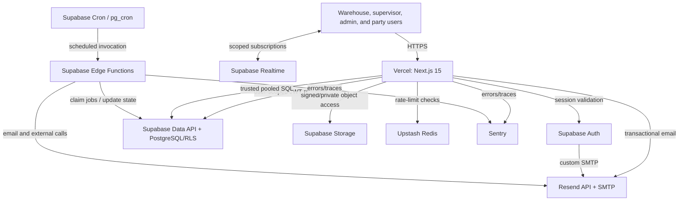
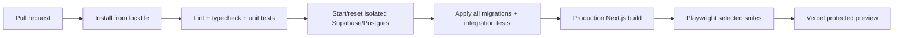

# Services & Infrastructure — Design

Status: Draft

Depends on:

- `specs/00-steering/product.md`
- `specs/00-steering/tech.md`
- `specs/00-steering/structure.md`
- `specs/00-steering/testing.md`
- `specs/01-core-data-model/requirements.md`
- `specs/01-core-data-model/design.md`
- `specs/02-rbac-roles/requirements.md`
- `specs/02-rbac-roles/design.md`
- `specs/03-offline-mode-and-client-storage/` for offline reconciliation boundaries
- `specs/04-services-and-infrastructure/requirements.md`

## 1. Architecture decision

The application is one Next.js 15 deployment on Vercel backed by one Supabase project per remote environment. Supabase provides PostgreSQL, Auth, Storage, Realtime, Edge Functions, and Cron. Drizzle owns schema definitions and trusted typed SQL. Resend, Upstash, and Sentry provide email, rate limiting, and monitoring.

v1 background work uses PostgreSQL-backed jobs/outbox records processed by Supabase Edge Functions and scheduled by Supabase Cron/`pg_cron`. BullMQ is deferred because it requires a continuously running worker service not otherwise present in the locked Vercel + Supabase deployment topology.

User-scoped database access defaults to the Supabase SSR session client/Data API so the caller JWT reaches RLS without connection-local identity manipulation. Drizzle uses Supabase's transaction pooler for trusted server-side runtime transactions and a direct connection for migrations. A user-scoped Drizzle transaction wrapper is permitted only after real-Postgres verification proves transaction-local role/JWT claims are safe through the selected pooler mode.

## 2. System context



## 3. Foundational schema touchpoints

This spec does not redefine feature-domain tables. Infrastructure protects, backs up, migrates, observes, or links files/jobs to the following tables from `01-core-data-model`:

| Core table | Infrastructure concern |
|---|---|
| `parties` and `party_roles` | RLS, migration, backup, and party-scoped file/email references. |
| `items` and `item_categories` | Migration, backup, RLS, and critical query monitoring. |
| `locations` | Migration, backup, and floor-critical availability. |
| `lots` | Critical inventory integrity, backup/recovery, and job idempotency references. |
| `wrr_documents` and `wrr_items` | CIPL Storage linkage, email/job references, backup, and recovery. |
| `wrr_inspection_logs` | Protected evidence-file linkage and notification jobs. |
| `inventory_transactions` | Immutable critical ledger, backup/RPO, and correlation. |
| `forex_rates` | Scheduled/manual data operation and monitoring. |
| `pick_lists` and `pick_list_items` | Generated document linkage and background work. |

RBAC tables proposed by spec `02` are also migrated, backed up, and queried through the same protected access paths. Infrastructure-owned operational records reference domain resources by `(resource_type, resource_id)` unless an owning feature requires a strict foreign key.

## 4. Service responsibilities

| Service | Authoritative responsibility | Explicit non-responsibility |
|---|---|---|
| Vercel | Next.js builds, immutable previews/releases, Node/Edge execution, custom domain. | Durable jobs, database backups, permanent logs. |
| Supabase PostgreSQL | Domain state, authorization state, ledgers, jobs/outbox, durable service records. | Large binary object contents. |
| Supabase Auth | Identity, passwords, invitations/recovery, sessions/tokens. | Application roles and party scope. |
| Supabase Storage | Private CIPL/evidence/document/label objects. | Business metadata authority and database backup. |
| Supabase Realtime | Authorized update signals. | Durable workflow state or guaranteed event delivery. |
| Supabase Edge Functions | Short background/external-service handlers. | Unbounded jobs or persistent workers. |
| Supabase Cron | UTC schedules and recovery sweeps. | Complex workflow state by itself. |
| Drizzle | Schema definitions and trusted typed server SQL. | Browser database access or automatic user identity propagation. |
| Resend | Auth SMTP and application email delivery. | Durable business audit or workflow state. |
| Upstash | Distributed rate-limit counters/analytics. | Authorization, locking inventory, or durable queues. |
| Sentry | Error/performance diagnosis and alerting. | Business audit, secrets storage, or raw document capture. |

## 5. Environment topology

### 5.1 Environment matrix

| Concern | Local | CI/test | Staging/preview | Production |
|---|---|---|---|---|
| Next.js | Local Node process | Test/build runner | Vercel Preview or staging deployment | Vercel Production |
| PostgreSQL/Auth/Storage | Supabase CLI local stack | Ephemeral Supabase/Postgres | Dedicated staging Supabase project; optional isolated branch per PR | Dedicated production Supabase project |
| Data | Synthetic seed | Synthetic fixtures | Synthetic/UAT data; no unsanitized production copy | Production data |
| Resend | Test recipient/domain or mocked adapter | Mock/fake transport except contract test | Staging sender and restricted recipients | Verified production senders |
| Upstash | Development database or in-memory adapter for unit tests | Isolated test database/mock | Staging database | Production database |
| Sentry | Disabled or local debug | Test DSN only for integration check | `staging`/`preview` environment | `production` environment |
| Access | Developer machine | CI service identity | Vercel Deployment Protection | Application Auth/RBAC |

### 5.2 Remote environment baseline

Use two persistent Supabase projects:

- Staging: schema rehearsal, integration/UAT, nonproduction Auth/email/webhook testing.
- Production: live warehouse operations only.

Supabase Branching is a plan-dependent enhancement. When available, each relevant PR may receive an isolated schema branch with synthetic seed data. Without Branching, PR database tests run against an ephemeral local/CI stack; arbitrary PRs do not push schema to shared staging.

### 5.3 Region selection

Vercel Functions, Supabase, Upstash, and Sentry/Resend processing should be placed/configured as close as practical to the Philippine warehouse while satisfying vendor availability and legal requirements. The selected region pair is documented before provisioning and load-tested from the warehouse network. Cross-region calls are measured rather than assumed acceptable.

## 6. Repository and configuration layout

Expected infrastructure-owned paths:

```text
/app/api/health
/app/api/webhooks/resend
/lib/config
/lib/db
/lib/supabase
/lib/email
/lib/rate-limit
/lib/jobs
/lib/observability
/supabase/config.toml
/supabase/migrations
/supabase/functions
/tests/integration/infrastructure
/tests/e2e/infrastructure
```

The exact implementation paths are finalized in `tasks.md` after the project scaffold is approved. Feature-specific code remains in its feature area and imports these shared boundaries.

### 6.1 Configuration validation

`lib/config` provides separate validated server and client schemas:

- Client schema contains only allowlisted public values.
- Server schema contains secrets and private endpoints.
- Production validation rejects local URLs, placeholder secrets, staging project references, and malformed domains.
- Test validation permits deterministic fake values only under the test environment.
- Code reads configuration through the validated module rather than scattered `process.env` calls.

### 6.2 Environment variable inventory

Names are proposed and may be aligned with generated vendor defaults during implementation.

| Variable | Browser? | Purpose |
|---|---:|---|
| `NEXT_PUBLIC_APP_URL` | Yes | Canonical environment application URL. |
| `NEXT_PUBLIC_SUPABASE_URL` | Yes | Supabase project URL. |
| `NEXT_PUBLIC_SUPABASE_PUBLISHABLE_KEY` | Yes | Public Supabase key; RLS remains mandatory. |
| `SUPABASE_SERVICE_ROLE_KEY` | No | Narrow server administration and trusted jobs. |
| `DATABASE_URL_RUNTIME` | No | Supavisor transaction-pooler URL for serverless Drizzle runtime. |
| `DATABASE_URL_DIRECT` | No | Direct/session connection for migrations and approved tools. |
| `RESEND_API_KEY` | No | Application transactional email. |
| `RESEND_FROM_AUTH` | No | Auth sender identity. |
| `RESEND_FROM_OPERATIONS` | No | Operational sender identity. |
| `RESEND_WEBHOOK_SECRET` | No | Webhook signature verification. |
| `UPSTASH_REDIS_REST_URL` | No | Upstash REST endpoint. |
| `UPSTASH_REDIS_REST_TOKEN` | No | Upstash credential. |
| `RATE_LIMIT_IDENTIFIER_SECRET` | No | HMAC key for privacy-preserving identifiers. |
| `NEXT_PUBLIC_SENTRY_DSN` | Yes | Client reporting endpoint; contains no authority. |
| `SENTRY_DSN` | No | Server/Edge reporting endpoint if separately configured. |
| `SENTRY_AUTH_TOKEN` | Build only | Source-map/release upload. |
| `SENTRY_ORG`, `SENTRY_PROJECT` | Build/server | Release configuration. |
| `JOB_INVOKE_SECRET` | No | Authenticates scheduled worker invocation where required. |

Supabase Edge Function secrets live in Supabase's secret management; cron-invocation values live in Supabase Vault. Provider personal access tokens used by CI are CI secrets, not application runtime variables.

## 7. Next.js and Vercel runtime design

### 7.1 Runtime selection

- Default every server route/action to Node.js.
- Use Edge only for lightweight, verified-compatible concerns such as routing middleware.
- Do not initialize Drizzle TCP clients, Resend administration, or service-role clients in browser or Edge bundles.
- Keep server-only modules marked/imported so accidental client inclusion fails the build.

### 7.2 Server Action and Route Handler boundary

Every mutation performs, in order:

1. Parse request and establish correlation ID.
2. Validate origin/CSRF expectations and session.
3. Apply endpoint-specific rate limit where required.
4. Validate input with the approved schema validator.
5. Resolve RBAC capability/scope.
6. Execute an idempotent or transaction-protected business operation.
7. Enqueue follow-up outbox/jobs in the same transaction when applicable.
8. Emit redacted telemetry and return a typed response.

Server Actions are not trusted merely because Next.js generated their endpoint.

### 7.3 Deployment protection

- Enable Vercel Standard Protection for preview/deployment URLs.
- E2E automation uses a dedicated protection-bypass secret stored only in CI where necessary.
- Do not embed bypass secrets in preview links, browser code, or test snapshots.
- Production application access remains controlled by Supabase Auth/RBAC unless a separate network restriction is approved.

### 7.4 Security headers

The baseline policy includes:

- `Strict-Transport-Security` on production after HTTPS/domain validation.
- `Content-Security-Policy` with explicit Supabase, Sentry, and required asset/connect origins.
- `frame-ancestors 'none'` unless an approved embedding use case exists.
- `X-Content-Type-Options: nosniff`.
- restrictive `Referrer-Policy`.
- `Permissions-Policy` allowing camera only on scanner/capture routes that require it.

CSP starts in report-only mode in staging, then enforcement is promoted after violations are resolved. Nonces/hashes are used where required; broad `unsafe-*` directives require documented justification.

## 8. Database access architecture

### 8.1 Four access paths

| Path | Client | Connection | Use |
|---|---|---|---|
| User RLS | Supabase SSR session client/Data API | HTTPS/stateless | Default protected user reads/writes and RPC calls. |
| Trusted runtime SQL | Drizzle | Supavisor transaction pooler, prepared statements disabled | Server-only transactions/jobs that deliberately run with trusted privilege. |
| Verified user Drizzle | Drizzle transaction wrapper | Supavisor transaction pooler | Optional only after identity-isolation integration tests. |
| Migration/admin | Supabase CLI/Drizzle tooling/approved SQL tools | Direct or session connection | Schema deployment, dump/restore, controlled administration. |

### 8.2 Why the Data API is the default RLS path

The Supabase session client forwards the user JWT through the supported API path, where `auth.uid()` and RLS evaluate the caller. It avoids stale pooled TCP identity and serverless connection-resume problems. It also makes an absent user identity fail closed.

Drizzle remains authoritative for schema/types and is used where server-side transactional SQL is required. If a feature needs both user identity and complex SQL, prefer a reviewed PostgreSQL function invoked through the user session client. A direct user-scoped Drizzle wrapper is an optimization/escape hatch, not the starting assumption.

### 8.3 Runtime Drizzle settings

- Use the transaction-pooler endpoint intended for serverless traffic.
- Disable prepared statements because transaction pooling does not support them reliably.
- Keep client/pool size small and explicitly bounded per function instance.
- Apply connection, statement, lock, and idle-in-transaction timeouts.
- Detect stale connections before high-value transactions or recycle on connection timeout.
- Retry only safe/idempotent operations for classified transient failures.

### 8.4 Migration connection

Migrations use `DATABASE_URL_DIRECT` or the approved session endpoint. Runtime code never receives this variable in browser or Edge contexts. CI migration identities receive schema-change privilege but are isolated by environment.

### 8.5 Migration discipline

- Migrations are sequential, immutable after merge/application, and one concern per file.
- No routine remote Dashboard schema changes.
- CI starts from an empty database and applies every migration.
- Staging applies first and runs real-Postgres tests.
- Production migration runs once under a deployment lock.
- Breaking changes use expand/migrate/contract across releases.
- Rollback defaults to app rollback plus database forward-fix; destructive down migrations are not run automatically.

## 9. Supabase Auth design

### 9.1 SSR clients

Create three explicit Supabase boundaries:

- Browser client for safe user-session operations and Realtime.
- Server session client that reads/writes Auth cookies through supported Next.js APIs.
- Server admin client containing the service-role key, imported only by narrow administration/job modules.

The server validates the user through Supabase Auth before constructing the RBAC context. Cookie presence alone is not authentication proof.

### 9.2 Auth configuration

- Disable public signup.
- Configure exact production site URL.
- Allowlist local and approved preview/staging callback URLs; avoid broad wildcard callbacks where possible.
- Configure invitation, recovery, and email-change templates.
- Use Resend custom SMTP for production.
- Set session duration/refresh and security-notification options with spec `02`.
- Enable leaked-password protection/MFA according to approved plan and policy before launch.

### 9.3 Admin operations

Invitation, deactivation, and session revocation execute through a server-only service after RBAC authorization. Service-role calls carry a correlation ID and produce durable RBAC security events. Generic public responses prevent account enumeration.

## 10. Supabase Storage design

### 10.1 Bucket plan

| Bucket | Content | Access |
|---|---|---|
| `cipl-documents` | Vendor CIPL/packing references. | Private; WRR/resource scope. |
| `inspection-evidence` | Damage/mismatch photos and evidence. | Private; stricter inspection/admin scope. |
| `generated-documents` | WRR, pick list, acknowledgement receipt outputs. | Private; source document scope. |
| `barcode-labels` | Generated label assets. | Private by default; operational capability. |

Bucket names are finalized with feature specs, but protected content never moves to a public bucket merely for convenient URLs.

### 10.2 Object path convention

```text
<resource-type>/<resource-uuid>/<version-or-object-uuid>/<sanitized-filename>
```

The database stores bucket and object path, MIME type, size, hash, uploader, and timestamp as required by the owning feature. Signed URLs are short-lived and generated after authorizing the source record.

### 10.3 Upload flow

1. Authenticate and authorize intended source resource/action.
2. Validate declared MIME, extension, and size.
3. Generate the server-controlled path.
4. Upload directly with a scoped signed upload token or through the server based on size/risk.
5. Verify resulting object metadata/hash and persist source linkage.
6. Record failure/cleanup if either object or database linkage fails.

Arbitrary HTML/script content is not previewed in the app origin. PDF/image preview uses sandboxing/content disposition and CSP. Malware scanning or a restricted allowlist is a production launch decision.

### 10.4 Object lifecycle and recovery

Database backups do not include Storage object contents. A scheduled inventory/export process must copy protected objects and manifests to an approved secondary destination. Restore verifies hashes and source-record links. Retention/deletion jobs are separately authorized and produce an audit record.

## 11. Supabase Realtime design

- Publish only approved tables and minimal columns/events.
- Subscribe through authenticated channels subject to RLS.
- Use events as invalidation signals; fetch authoritative state after receiving them.
- On reconnect or browser visibility restore, refetch queue/notification state.
- Use deterministic record IDs and timestamps to ignore stale UI updates.
- Do not place confidential document bodies or secrets in broadcast payloads.
- If Realtime fails, polling/manual refresh remains available and workflow writes continue.

## 12. Email architecture

### 12.1 Two delivery paths

| Path | Sender | Use |
|---|---|---|
| Supabase Auth -> Resend SMTP | Auth-specific verified sender/subdomain | Invitation, recovery, email change, security notices. |
| Application/Edge Function -> Resend API | Operational verified sender/subdomain | WRR/inspection alerts, notifications, documents, reports. |

Auth and operational email use separate sender addresses or subdomains. Production DNS config includes SPF, DKIM, and DMARC. Open/click tracking is disabled unless a business requirement and privacy review justify it.

### 12.2 Durable email lifecycle

Application emails use `email_deliveries` records rather than fire-and-forget calls from transactions.

| Field | Purpose |
|---|---|
| `id` | Internal delivery UUID. |
| `template_key`, `template_version` | Reproducible content identity. |
| `recipient_hash` and protected recipient data | Diagnostics without broad plaintext logging. |
| `resource_type`, `resource_id` | Business source reference. |
| `status` | `queued`, `sending`, `sent`, `delivered`, `bounced`, `complained`, `suppressed`, `failed`. |
| `provider_email_id`, `message_id` | Provider correlation. |
| `idempotency_key` | Prevent duplicate send. |
| `attempt_count`, `next_attempt_at`, `last_error_code` | Retry control. |
| timestamps/correlation | Operations and audit. |

Sensitive body content is rendered at send time from approved data or stored only when retention requirements demand it.

### 12.3 Send behavior

- Commit the business transaction and queued delivery atomically where possible.
- Worker claims the delivery/job and sends with a stable Resend idempotency key.
- Transient failures retry with backoff.
- Permanent suppression/bounce becomes operator-visible and does not loop indefinitely.
- Email failure never reverses already committed inventory movement.

### 12.4 Webhook behavior

`/api/webhooks/resend`:

1. Reads the raw request body.
2. Verifies the provider signature before JSON processing.
3. Checks/stores the unique webhook delivery ID.
4. Returns success for already processed events.
5. Applies state updates idempotently using provider timestamp because delivery order is not guaranteed.
6. Records sanitized unknown/event failures for investigation.

`webhook_receipts` retains provider, event ID, event type, received/processed timestamps, status, correlation, and redacted error. Raw payload retention is minimized and policy-driven.

## 13. Rate-limiting design

### 13.1 Limiter classes

| Class | Examples | Algorithm | Dependency failure |
|---|---|---|---|
| Auth abuse | sign-in adjunct, recovery, invite | Sliding window by HMAC(email)+IP | Fail closed or safe generic unavailable response. |
| Privileged mutation | RBAC changes, overrides | Sliding/token bucket by user+IP | Fail closed. |
| Public webhook | provider endpoint | Signature first/appropriate IP-global guard | Do not reject valid retries solely due to a shared coarse limit; use dedupe. |
| Warehouse operation | scans, receiving confirmation | Auth user/device + operation-specific token bucket | Prefer idempotency and bounded burst; dependency failure policy documented per action. |
| Expensive feature | chatbot/report export | Strict per-user token/sliding window | Fail closed with retry guidance. |
| Low-risk read | selected search/read APIs | Broad per-user/IP guard | May fail open with Sentry warning. |

Exact limits remain configuration, not hard-coded business rules. Tests use deterministic clock/limiter adapters.

### 13.2 Identifier privacy

Normalize account identifiers, then HMAC with `RATE_LIMIT_IDENTIFIER_SECRET`. Redis keys include environment and limiter namespace. Raw emails, party names, tokens, and document IDs are excluded unless a non-sensitive opaque ID is appropriate.

### 13.3 Upstash timeout

The rate-limit wrapper interprets timeout/dependency failure explicitly instead of accepting the library's generic behavior for every endpoint. It emits a redacted Sentry metric/event and follows the limiter class's fail-open/fail-closed policy.

## 14. Background jobs and outbox design

### 14.1 Operational tables

#### `service_jobs`

| Field | Purpose |
|---|---|
| `id` | Job UUID. |
| `job_type`, `payload_version`, `payload` | Versioned validated handler input. |
| `resource_type`, `resource_id` | Optional source reference. |
| `status` | `queued`, `leased`, `succeeded`, `retry_wait`, `failed`, `cancelled`. |
| `idempotency_key` | Unique business-effect key. |
| `priority` | Small bounded priority scale. |
| `available_at` | Earliest claim time. |
| `lease_owner`, `lease_expires_at` | Crash-safe claim. |
| `attempt_count`, `max_attempts` | Retry budget. |
| `last_error_code`, `last_error_summary` | Redacted diagnostics. |
| `actor_user_id`, `executor`, `correlation_id` | Attribution. |
| `created_at`, `started_at`, `completed_at`, `updated_at` | Lifecycle. |

#### `webhook_receipts`

Durably deduplicates external provider events and records processing outcome.

#### `email_deliveries`

Tracks email-specific lifecycle and provider correlation; it may link to a `service_jobs` send job.

These tables are infrastructure operational state, not replacements for feature audit or domain ledgers.

### 14.2 Enqueue pattern

Feature code inserts a domain mutation and corresponding `service_jobs`/delivery record in one PostgreSQL transaction. The job payload contains identifiers, not a stale copy of all business data. At execution, the handler refetches authoritative state and revalidates whether the effect is still appropriate.

### 14.3 Claim pattern

The worker claims a bounded batch using a transaction and row locking (`FOR UPDATE SKIP LOCKED` or an equivalent reviewed function), sets a lease, commits, and processes outside the claim transaction. Completion updates only when the lease owner matches. Expired leases return to retry through a recovery sweep.

### 14.4 Retry and failure

- Exponential backoff with jitter.
- Error taxonomy: transient dependency, rate limit, invalid payload, authorization/state conflict, permanent provider rejection, unknown.
- Retry only transient classes.
- Dead-letter after `max_attempts` or permanent error.
- Authorized operator may replay only after reviewing current state; replay retains original and new correlation.

### 14.5 Scheduling

- `pg_cron` schedules UTC worker invocations and maintenance sweeps.
- `pg_net` invokes Edge Functions over HTTPS where needed.
- Project URL and invocation token live in Supabase Vault.
- Schedule definitions are migrations/configuration, not dashboard-only knowledge.
- Business schedules document their Asia/Manila interpretation and daylight-saving assumptions (the Philippines does not currently use DST, but UTC storage remains canonical).
- Keep concurrency and duration below Supabase Cron/Edge Function limits; split work into batches.

### 14.6 When to reconsider BullMQ

Create a new approved infrastructure revision if any workload requires:

- a persistent worker with processing beyond Edge Function limits;
- sustained high queue throughput/concurrency;
- complex dependency graphs, pause/resume, or queue-level priorities not met safely;
- low-latency job dispatch that polling/cron cannot meet;
- workloads unsuitable for database-backed queue contention.

That revision must add a worker hosting service, deployment, scaling, monitoring, Redis durability, and recovery design—not only the BullMQ package.

## 15. Observability design

### 15.1 Sentry initialization

- Client config for browser errors with aggressive PII scrubbing.
- Server config for Server Components, Actions, Route Handlers, and Node integrations.
- Edge config only for actual Edge/Middleware code.
- Next.js instrumentation registers server/edge monitoring at startup.
- Build integration creates a release from source revision and uploads source maps using a build-only token.

### 15.2 Event policy

Attach:

- environment and release;
- route/operation/job type;
- correlation ID;
- safe user UUID or irreversible surrogate only when approved;
- party/flow identifiers only when necessary and non-sensitive;
- dependency/error category.

Strip:

- cookies, JWTs, authorization headers, database URLs, API keys;
- passwords, recovery/invitation links;
- uploaded file bodies and document contents;
- unbounded request/response payloads;
- unnecessary names, emails, phone numbers, addresses, tax IDs, and pricing details.

Session Replay is off by default. Tracing sample rates are environment-specific and cost-capped. Expected authorization denials and validation failures are measured without flooding error alerts.

### 15.3 Correlation

Generate or accept a valid trusted-format request ID at the ingress boundary, then propagate it to database audit/security events, service jobs, email delivery records, provider tags/metadata, webhook processing, and Sentry. Never trust an arbitrary long client value as a log field.

### 15.4 Alert matrix

| Signal | Severity | Owner/action |
|---|---|---|
| Sign-in or protected shell unavailable | Critical | On-call investigates Auth/Vercel/Supabase. |
| Inventory mutation error spike | Critical | Stop/promote rollback; verify ledger integrity. |
| Migration failure | Critical | Block release; no retry without diagnosis. |
| Database capacity/connection exhaustion | Critical | Protect writes, inspect pool/queries/plan. |
| Job dead letters or backlog age breach | High | Review dependency and safe replay. |
| Email bounce/failure spike | High | Check Resend/domain/suppression; operations notified. |
| Upstash unavailable | High/Medium | Verify fail policy and abuse exposure. |
| Realtime unavailable | Medium | Confirm fallback/refetch; workflows continue. |
| Storage upload/download failures | High | Protect evidence/document workflow and investigate. |

## 16. Health and readiness

`/api/health` returns a minimal status, build revision, and timestamp without secrets, provider URLs, query details, or user data.

- Liveness: application process can serve a basic response.
- Readiness: optional shallow checks for critical configuration/database; protected or provider-internal detail remains in telemetry.
- Deep checks run from controlled monitoring/operations, not an unauthenticated public endpoint.
- Health checks never perform inventory mutations or send email.

## 17. CI/CD design

### 17.1 Pull-request pipeline



No PR pipeline receives production secrets. Migration tests include RLS and SQL functions against real Postgres as required by `testing.md`.

### 17.2 Staging release

1. Serialize staging migration.
2. Apply migrations through Supabase CLI/approved pipeline.
3. Deploy Edge Functions/configuration.
4. Deploy/promote Next.js staging build.
5. Run integration, E2E, webhook, email, Storage, job, and smoke checks.
6. Observe for the defined soak period when the change is operationally risky.

### 17.3 Production release

1. Verify approved spec/tasks and sign-offs for included features.
2. Confirm backup/recovery readiness for risky migrations.
3. Acquire deployment/migration lock.
4. Apply backward-compatible migration phase.
5. Deploy Edge Functions and application in documented compatible order.
6. Run non-destructive production smoke tests.
7. Verify Sentry release, cron jobs, job backlog, Auth, and database health.
8. Record release owner, revision, migrations, and outcome.

### 17.4 Rollback

- Application: promote previous known-good Vercel deployment when schema remains compatible.
- Edge Function: redeploy previous compatible function revision.
- Database: prefer forward-fix. Restore/PITR only when impact analysis justifies replacing current database state.
- Migration rollback scripts are manually reviewed and never assumed safe for destructive changes.
- If a migration and app release cannot be independently rolled back, the release is not production-ready.

## 18. Backup and disaster recovery

### 18.1 Database

- Enable daily managed backups at minimum.
- Enable PITR for production to meet the target RPO.
- Monitor backup/PITR status.
- Take an approved logical backup before high-risk migrations when useful.
- Test restore into an isolated project on a recurring schedule and before launch.

### 18.2 Storage

Database backup does not protect object bytes. A scheduled export copies object contents plus a manifest containing bucket, path, size, hash, source resource, and timestamp to an approved secondary destination. Restore verifies hashes and re-establishes database linkage without making private objects public.

### 18.3 Configuration recovery

Maintain a controlled recovery inventory for:

- Vercel project/domain/environment settings;
- Supabase project configuration, migrations, Auth templates/redirects, Storage buckets/policies, Realtime publications, Edge Functions, Cron, and Vault secret names;
- Resend domains, DNS records, senders, API keys, and webhooks;
- Upstash databases/tokens/limiter namespaces;
- Sentry projects, DSNs, alerts, releases, and sampling;
- DNS provider records and ownership.

Secret values remain in approved secret stores, not recovery documents. Recovery documents explain how authorized owners regenerate/rotate them.

### 18.4 Restore validation

After isolated restore:

1. Apply/verify migration history.
2. Validate row counts/checksums for critical tables.
3. Verify immutable inventory ledger constraints.
4. Verify RLS with representative roles/parties.
5. Reconcile Storage manifests and object hashes.
6. Verify Auth configuration without emailing real users.
7. Disable or redirect external jobs/email/webhooks in the restore environment.
8. Run application smoke and selected E2E tests.

## 19. Security operations

### 19.1 Provider access

- Individual provider accounts only.
- MFA for production administrators where supported.
- Least-privilege project/team roles.
- Quarterly access review and immediate offboarding.
- Separate CI service identities/tokens from human credentials.
- Provider audit logs/change records retained according to policy.

### 19.2 Secret lifecycle

| Secret class | Storage | Rotation trigger |
|---|---|---|
| Vercel runtime secrets | Vercel environment settings | Exposure, personnel/access change, scheduled review. |
| Supabase runtime/admin keys | Vercel/Supabase secrets | Exposure or project key rotation. |
| Database credentials | Vercel/CI secret store | Exposure, operator change, scheduled rotation. |
| Edge Function secrets | Supabase secrets/Vault | Exposure, handler/service change. |
| Provider API/webhook keys | Vercel/Supabase/CI as scoped | Exposure, endpoint change, scheduled rotation. |
| Sentry auth token | CI only | Exposure or build identity change. |

Rotation runbooks include overlap where supported, deployment, verification, and revocation of old credentials.

### 19.3 Webhook security

- HTTPS only.
- Verify current provider signature over raw body.
- Enforce body-size/content-type limits.
- Deduplicate at-least-once delivery.
- Process out of order safely.
- Return quickly after durable receipt where processing could exceed timeout.
- Never authorize a business action solely because a payload contains a known resource ID.

## 20. Cost and capacity controls

Maintain a service register with owner, plan, region, monthly budget, hard/soft limits, alert thresholds, renewal, and escalation.

Primary capacity indicators:

- Vercel function invocations, duration, memory, build minutes, bandwidth.
- Supabase compute, database size, connections, query latency, egress, Realtime usage, Storage, Edge invocations, Cron backlog.
- Resend sends, bounces, complaints, suppression, webhook failures.
- Upstash commands, storage, latency, rate-limit analytics cardinality.
- Sentry errors, spans, attachments, source maps, and quota discard rate.

Core inventory writes receive budget/capacity priority over Realtime decoration, verbose tracing, report exports, and chatbot traffic.

## 21. Incident runbooks

Every runbook includes symptoms, severity, first checks, safe mitigations, data-integrity checks, escalation, communications, recovery, and evidence to preserve.

Required runbooks:

- Vercel deployment/runtime outage.
- Supabase database outage or connection exhaustion.
- Failed/blocked migration.
- Auth invitation/sign-in/recovery outage.
- RLS or service-role exposure incident.
- Storage upload/download or object-loss incident.
- Realtime degradation.
- Resend delivery/domain/webhook incident.
- Upstash outage or rate-limit misconfiguration.
- Edge Function/Cron failure and job backlog/dead letters.
- Sentry outage/quota exhaustion.
- Secret leak/rotation.
- Database or Storage restore.

Warehouse-facing runbooks explicitly state whether operations pause, switch to approved offline Tier 1 behavior, or use a controlled manual continuity process.

## 22. Requirement traceability

| Requirement | Design sections |
|---|---|
| FR-1 Environment isolation | 5 |
| FR-2 Environment configuration | 6 |
| FR-3 Next.js/Vercel runtime | 7 |
| FR-4 Domains/transport/headers | 7.3-7.4, 19 |
| FR-5 PostgreSQL connections | 8.1-8.4 |
| FR-6 Drizzle/RLS | 8 |
| FR-7 Database integrity/performance | 8.5, 15, 17-18 |
| FR-8 Supabase Auth | 9 |
| FR-9 Supabase Storage | 10, 18.2 |
| FR-10 Supabase Realtime | 11 |
| FR-11 Resend/Auth SMTP | 12 |
| FR-12 Upstash | 13 |
| FR-13 Background jobs | 14 |
| FR-14 Sentry/provider telemetry | 15 |
| FR-15 Health/correlation | 15.3, 16 |
| FR-16 CI/CD | 17 |
| FR-17 Backup/recovery | 18 |
| FR-18 Secrets/access | 19 |
| FR-19 Cost/capacity | 20 |
| FR-20 Incident/change management | 17, 21 |

## 23. Decisions and validation still required

1. Provider plans, regions, production domain, and account owners.
2. PITR, Supabase Branching, Vercel custom environments, and deployment-protection plan capabilities.
3. Final RPO/RTO/SLO and support-hours commitment.
4. Storage secondary-backup destination and malware/restricted-upload strategy.
5. Auth session, password, administrator MFA, and redirect policy with spec `02`.
6. Exact rate limits after realistic load/abuse testing.
7. Sentry sampling, retention, alert destinations, and privacy approval.
8. Audit/business/provider log retention periods.
9. Real-Postgres validation of any user-scoped Drizzle transaction wrapper; until validated, the Supabase session client/Data API remains mandatory for user RLS paths.
10. Final job schedules and Edge Function batch/concurrency settings after workload specs `07` through `19` are drafted.

## 24. Official implementation references

Verified 2026-08-04:

- [Supabase: connect to PostgreSQL](https://supabase.com/docs/guides/database/connecting-to-postgres)
- [Supabase: connection management](https://supabase.com/docs/guides/database/connection-management)
- [Supabase: deployment and branching](https://supabase.com/docs/guides/deployment)
- [Supabase: migrations](https://supabase.com/docs/guides/deployment/database-migrations)
- [Supabase: backups](https://supabase.com/docs/guides/platform/backups)
- [Supabase: production checklist](https://supabase.com/docs/guides/deployment/going-into-prod)
- [Supabase: Auth custom SMTP](https://supabase.com/docs/guides/auth/auth-smtp)
- [Supabase: scheduled Edge Functions](https://supabase.com/docs/guides/functions/schedule-functions)
- [Supabase: Cron](https://supabase.com/docs/guides/cron)
- [Vercel: environments](https://vercel.com/docs/deployments/environments)
- [Vercel: environment variables](https://vercel.com/docs/environment-variables)
- [Vercel: deployment protection](https://vercel.com/docs/deployment-protection)
- [Next.js 15: instrumentation](https://nextjs.org/docs/15/app/api-reference/file-conventions/instrumentation)
- [Upstash: Rate Limit](https://upstash.com/docs/redis/sdks/ratelimit-ts/overview)
- [Upstash: rate-limit algorithms](https://upstash.com/docs/redis/sdks/ratelimit-ts/algorithms)
- [Resend: domains](https://resend.com/docs/dashboard/domains/introduction)
- [Resend: webhooks](https://resend.com/docs/webhooks/introduction)
- [Sentry: Next.js](https://docs.sentry.io/platforms/javascript/guides/nextjs/)
