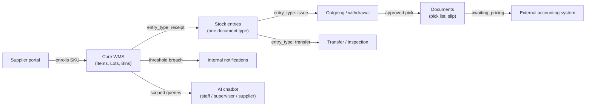
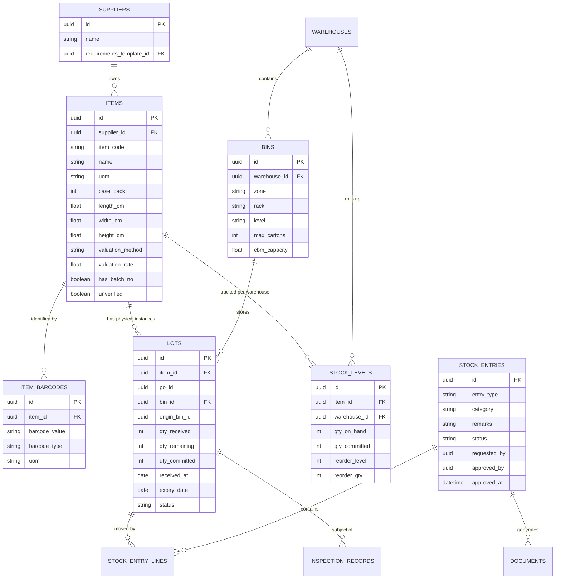
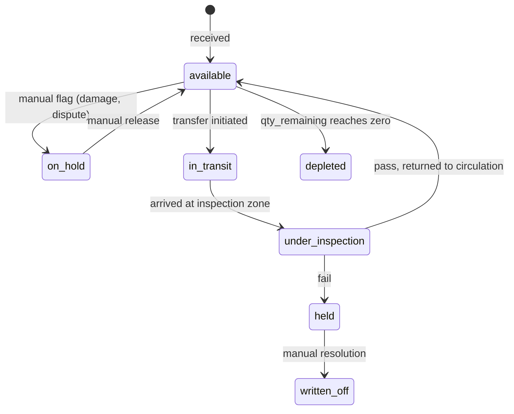
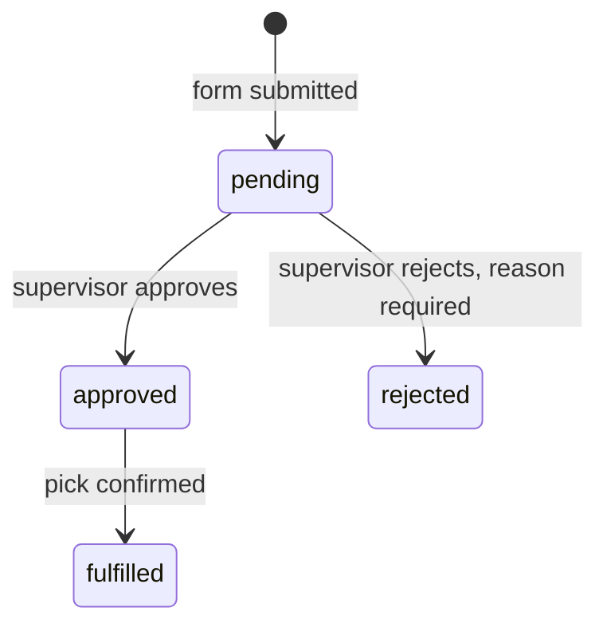
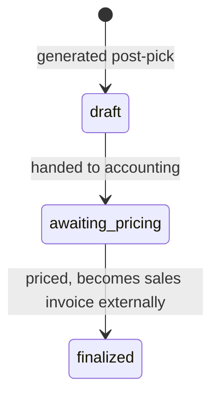
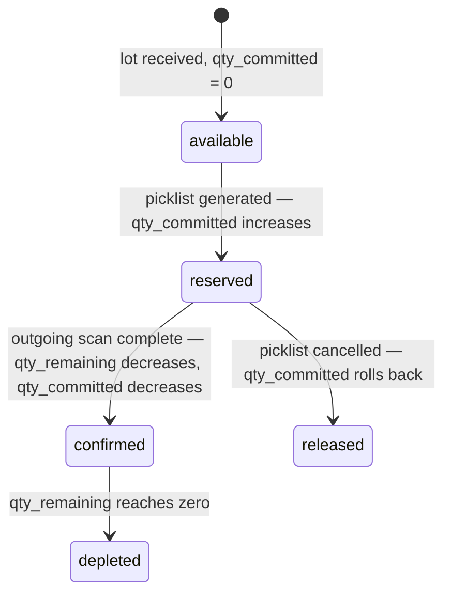

# Hybrid 3PL Warehouse Inventory System — System Design & Architecture

## 1. Purpose and scope

This document defines the system architecture for a hybrid 3PL / consignment warehouse inventory system spanning two physical warehouses. It covers the supplier portal, incoming/receiving, outgoing/withdrawal (with approval governance), transfer/inspection, sales document handoff, internal notifications, and the AI chatbot layer.

This is the source of truth for data model, status lifecycles, and cross-feature rules. The UI/UX design document and agent development document both build on the definitions here and should not redefine them independently.

### 1.1 Design principles established during requirements gathering

- **RBAC over runtime choice.** Wherever a user's context determines behavior (supplier enrollment form, chatbot scope, dashboard data), that context is resolved from the authenticated session, never from a dropdown or user-supplied parameter. This closes off an entire class of privilege-leak bugs. Role definitions, page-level access, and action-level permissions are fully specified in §8.
- **SKU identity is separate from physical placement.** A barcode identifies a product (SKU). It does not identify a location. The same SKU can and will exist as multiple physical lots scattered across different racks in different warehouses.
- **Status governs eligibility, not location.** Whether a lot can be picked for FIFO/FEFO is determined entirely by its `status` field. On-hold, in-transit, under-inspection, and depleted lots are excluded by the same single rule everywhere in the system. There is no special-cased exclusion logic per feature.
- **Approval is a recorded decision, not a status flip.** Every approval-gated action is backed by an actual form submission and an actual approver identity, timestamp, and (when relevant) reason — not a boolean toggle.
- **Every physical movement is the same kind of document, differentiated by type.** Following the reference ERPNext structure, incoming receipt, outgoing withdrawal, and inter-location/inspection transfer are not three separate schemas — they are all `stock_entries`, distinguished by an `entry_type` field. This mirrors how ERPNext's Stock Entry document handles Material Receipt, Material Issue, and Material Transfer as one document type rather than three, and it means one ledger answers "what happened to this lot" regardless of which flow triggered it.
- **Stock is tracked per warehouse, not as one global number.** A SKU's "quantity on hand" is meaningless without a warehouse qualifier once the system spans two warehouses. Every stock-level view (item master, dashboard, low-stock check) is computed per warehouse and rolled up only when explicitly needed.
- **Inventory commitment is two-stage, not one.** Picklist generation reserves stock (committed); outgoing scan confirmation decrements it (hard close). Available-to-promise is computed as `qty_on_hand − qty_committed` at all times. Neither figure alone is sufficient — see §3.2 and §5.3.3.

---

## 1.2 Technology stack

This section names concrete technology choices so the rest of the document can reference them directly (e.g. "enforced at the Strict Data Isolation layer" rather than "enforced at the data layer, however implemented"). Two viable stacks were explored in earlier work on this project; both are listed so the choice is explicit rather than assumed.

### 1.2.1 Recommended stack (cloud-first)

| Layer | Choice | Why |
|---|---|---|
| Frontend framework | Next.js 15 (App Router) | Server components suit data-dense tables (the inventory grid, pick lists) without shipping a large client bundle; matches prior work on this project |
| UI component layer | Tailwind CSS + shadcn/ui | Fast to build dense forms and tables consistently across supplier, staff, and supervisor portals |
| Backend / API | Next.js API routes, or a dedicated Node service (NestJS) if the API surface grows large enough to warrant separating it from the frontend deploy | Keeps one language (TypeScript) across frontend and backend, reducing context-switching for a small team |
| Database | Secure Data Engine via Supabase | Native row-level security maps directly onto the RBAC/scoping rules in §1.1 — `supplier_id` scoping can be enforced as an actual RLS policy, not just application-layer discipline |
| Auth | Secure Identity | Session-based role resolution (staff / supervisor / supplier) plugs directly into RLS policies |
| File storage | Secure Storage | PDF pick lists, withdrawal slips, barcode label images |
| Background jobs | Redis + BullMQ | Low-stock threshold rechecks, notification dispatch, scheduled report generation |
| Realtime updates | Supabase Realtime (Postgres logical replication) | Live-updating pending-approval queue and notification feed without polling |
| Barcode generation | `bwip-js` or `jsbarcode` (Code 128 / GS1-128) | Server-side generation at SKU creation, per the immutability rule in §6 |
| PDF generation | `@react-pdf/renderer` or Puppeteer-based HTML-to-PDF | Pick lists and withdrawal slips need print-accurate layout |
| AI / chatbot | Vercel AI SDK via OpenRouter, model-agnostic | Matches prior project work; OpenRouter avoids hard-coupling to one model vendor for the three chatbot personas in the agent development document |
| Deployment | Vercel (frontend/API) + Supabase (managed Postgres) | Lowest operational overhead; revisit only if usage or cost outgrows the platform's pricing tiers |
| Containerization (optional) | Docker for local dev parity | Even on a managed stack, a docker-compose setup keeps local development consistent across contributors |
| Client-side storage | `localStorage` + `sessionStorage` + `IndexedDB` | Partitioned by purpose — see §9 for full assignment. `localStorage` for durable UI preferences, `sessionStorage` for in-progress form state, `IndexedDB` for offline outbox, read cache, and sync log |
| Offline sync layer | Custom outbox + `/api/sync` endpoint | Queues safe actions (scan confirms, lot creation, QI outcomes) during connectivity loss; syncs in `created_at` order on reconnect — see §10 for full offline mode spec |
| Connectivity detection | `navigator.onLine` + `/api/ping` heartbeat | `onLine` alone is unreliable in warehouse environments; two-signal approach prevents false online reads from a router with no internet |
| Transactional email | Resend + React Email | Native Next.js integration; React Email for co-located template authoring; covers alert emails, invites, password reset, and sync conflict escalations — see §12.4 |
| Rate limiting | Upstash (`@upstash/ratelimit`) | Redis-based, runs in Next.js middleware at the edge before any API handler; serverless-friendly with no persistent connection management — see §12.8 |
| Error monitoring | Sentry | Official Next.js App Router SDK; captures client and server errors in one project; instrumented from day one with sensitive data scrubbing — see §12.9 |

---

## 2. High-level system map



Two warehouses share the same core schema. `bins` (locations) carry a `warehouse_id`, and `stock_levels` is keyed by `(item_id, warehouse_id)` — so every location-aware feature (suggestion engine, transfer, pick list sequencing, low-stock check) is warehouse-scoped by that pair, not by separate per-warehouse tables.

---

## 3. Core data model

### 3.1 Entity overview



### 3.2 Table definitions

#### `suppliers`
| Column | Type | Notes |
|---|---|---|
| id | uuid | PK |
| name | string | |
| requirements_template_id | uuid FK | Points to the supplier's enrollment form schema. One per supplier — RBAC resolves this from session, never user-selected. |

#### `requirements_templates`
| Column | Type | Notes |
|---|---|---|
| id | uuid | PK |
| schema_json | jsonb | Field definitions: name, type, required, validation rule. Authored once by admin during supplier onboarding. |

#### `skus`
| Column | Type | Notes |
|---|---|---|
| id | uuid | PK |
| supplier_id | uuid FK | |
| name | string | |
| barcode_value | string | Generated once at creation. Never regenerated — reprints reuse this value. |
| uom | string | |
| case_pack | int | |
| length_cm / width_cm / height_cm | float | Drives CBM calculation per carton |
| unverified | boolean | True if created via the floor-side standalone enrollment fallback rather than the supplier portal |

#### `lots`
| Column | Type | Notes |
|---|---|---|
| id | uuid | PK |
| sku_id | uuid FK | |
| po_id | uuid | Groups cartons received in the same session |
| location_id | uuid FK | Current physical location |
| origin_location_id | uuid, nullable | Set only when a lot enters `in_transit`/`under_inspection`; used for return-to-origin |
| qty_received | int | |
| qty_remaining | int | Total physical quantity still in the warehouse. Decremented only on outgoing scan confirmation. |
| qty_committed | int | Quantity reserved by approved picklists not yet confirmed at the outgoing gate. Incremented on picklist generation; decremented on outgoing scan confirmation. |
| received_at | date | |
| expiry_date | date, nullable | Drives FEFO ordering where applicable |
| status | enum | See §4 — the single field governing eligibility |
| placement_override_reason | string, nullable | Set when a receiving worker overrides the suggested location |
| customer_part_no | string, nullable | Metadata encoded from WRR during Pre-Receiving |
| supplier_part_no | string, nullable | Metadata encoded from WRR during Pre-Receiving |
| shipping_lot | string, nullable | Metadata encoded from WRR during Pre-Receiving |
| mfg_lot_no | string, nullable | Metadata encoded from WRR during Pre-Receiving |

> **Derived field — available to promise:** `qty_available = qty_remaining − qty_committed`. This is computed on read, never stored. It is the figure used by the FIFO/FEFO engine when allocating withdrawal requests, by the supplier dashboard's "available" count, and by low-stock threshold checks. See §5.3.3 for the full two-stage commitment flow.

#### `stock_levels`
| Column | Type | Notes |
|---|---|---|
| id | uuid | PK |
| item_id | uuid FK | |
| warehouse_id | uuid FK | |
| qty_on_hand | int | Aggregate of `lots.qty_remaining` for this item+warehouse. Decremented only on outgoing scan confirmation. |
| qty_committed | int | Aggregate of `lots.qty_committed` for this item+warehouse. Incremented on picklist generation; decremented on outgoing scan confirmation. |
| reorder_level | int | Low-stock threshold — compared against `qty_on_hand − qty_committed`, not `qty_on_hand` alone |
| reorder_qty | int | |

#### `locations`
| Column | Type | Notes |
|---|---|---|
| id | uuid | PK |
| warehouse_id | uuid FK | |
| zone / rack / level | string | Physical addressing |
| max_cartons | int | Count-based capacity |
| cbm_capacity | float | Volume-based capacity |

#### `stock_entries`
| Column | Type | Notes |
|---|---|---|
| id | uuid | PK |
| entry_type | string | `receipt`, `issue`, `transfer` |
| status | string | `pending_arrival` (WRR), `received`, `completed`, `cancelled` |
| remarks | string | |
| requested_by | uuid | |
| approved_by | uuid, nullable | |
| approved_at | datetime, nullable | |

#### `stock_entry_lines`
| Column | Type | Notes |
|---|---|---|
| id | uuid | PK |
| stock_entry_id | uuid FK | |
| sku_id | uuid FK | |
| expected_qty | int | Quantity declared on the CIPL / WRR |
| scanned_qty | int | Quantity physically scanned at the dock |
| customer_part_no | string, nullable | |
| supplier_part_no | string, nullable | |
| shipping_lot | string, nullable | |
| mfg_lot_no | string, nullable | |
| expiry_date | date, nullable | |

#### `withdrawal_requests`
| Column | Type | Notes |
|---|---|---|
| id | uuid | PK |
| category | enum | `fifo_standard` \| `fifo_override` |
| remarks | string | Required only when category is `fifo_override` |
| status | enum | `pending` \| `approved` \| `rejected` |
| requested_by | uuid | |
| approved_by | uuid, nullable | |
| approved_at | datetime, nullable | |
| rejection_reason | string, nullable | Required when status is `rejected` |

#### `withdrawal_lines`
| Column | Type | Notes |
|---|---|---|
| id | uuid | PK |
| withdrawal_request_id | uuid FK | |
| lot_id | uuid FK | One row per lot allocated — a single SKU line can produce multiple rows if FEFO splits across lots |
| qty | int | |

#### `documents`
| Column | Type | Notes |
|---|---|---|
| id | uuid | PK |
| withdrawal_request_id | uuid FK | |
| type | enum | `pick_list` \| `withdrawal_slip` |
| status | enum | `draft` \| `awaiting_pricing` \| `finalized` — only meaningful for `withdrawal_slip` |
| pdf_path | string | |
| generated_at | datetime | |

#### `inspection_records`
| Column | Type | Notes |
|---|---|---|
| id | uuid | PK |
| lot_id | uuid FK | |
| transfer_request_id | uuid FK | |
| inspected_by | uuid | |
| outcome | enum | `pass` \| `fail` |
| remarks | string | Required |
| inspected_at | datetime | |

#### `transfer_requests`
| Column | Type | Notes |
|---|---|---|
| id | uuid | PK |
| lot_id | uuid FK | |
| reason | string | |
| initiated_by | uuid | |
| created_at | datetime | |

#### `notifications`
| Column | Type | Notes |
|---|---|---|
| id | uuid | PK |
| type | enum | `low_stock` \| `withdrawal_pending` |
| target_role | enum | `inventory_staff` \| `supervisor` \| `both` |
| sku_id | uuid FK, nullable | |
| withdrawal_request_id | uuid FK, nullable | |
| read_by | uuid[] | Tracks per-user read state |
| sent_at | datetime | |
| suppressed_until_recovery | boolean | Prevents re-firing the same low-stock alert while still below threshold |

---

## 4. Status lifecycles

### 4.1 Lot status (the single eligibility gate)



**Rule enforced everywhere:** any query feeding a FIFO/FEFO suggestion, a withdrawal search, a low-stock calculation, or the supplier dashboard's "available" figure filters on `status = 'available'`. No feature implements its own exclusion logic — this is the one rule that makes on-hold, in-transit, under-inspection, and depleted all behave consistently without special-casing.

### 4.2 Withdrawal request status



A request's `category` (`fifo_standard` vs `fifo_override`) does not change how many approvals are required — both paths require exactly one supervisor approval. Category only changes what's displayed to the approver (override requests are visually flagged and carry mandatory remarks).

### 4.3 Document status (withdrawal slip only)



Pick lists do not carry this lifecycle — they are operational documents, finalized the moment they're generated, since they never touch pricing.

### 4.4 Inventory commitment state (per lot)

This is not a `status` field — it is the progression of `qty_committed` and `qty_remaining` on a lot across the two-stage commitment model described in §5.3.3.



---

## 5. Feature flows

### 5.1 Supplier portal

**Enrollment:** Session resolves `supplier_id` → loads that supplier's `requirements_template` → single form component renders fields dynamically from the schema → validation → on submit, SKU created and barcode generated server-side in the same transaction → confirmation screen shows barcode + printable label.

**Why RBAC over a dropdown:** a dropdown would let any authenticated supplier session reference another supplier's template by changing a parameter — a privilege-leak surface for no benefit. Session-resolved template removes that surface entirely.

**Analytics dashboard:** All queries scoped by `WHERE supplier_id = :session_supplier_id` at the data layer (not just hidden in UI). Shows stock-on-hand, aging, movement history, and status visibility for held/in-transit/under-inspection quantities so a supplier understands why "available" dropped without a withdrawal having occurred. The "available" figure shown here is always `qty_remaining − qty_committed`, never raw `qty_remaining`.

### 5.2 Incoming / receiving (session-based)

The receiving process uses an Advanced Shipping Notice (ASN) or Pre-Receiving workflow to encode incoming shipments before they arrive, acting as a standby database.

**Phase 1: Pre-Receiving (WRR Encoding)**
1. **CIPL Processing:** A Commercial Invoice and Packing List (CIPL) is received via email.
2. **WRR Generation:** A back-office user encodes the CIPL data into the system, creating a new Warehouse Receiving Report (WRR). 
   - This creates a `stock_entries` document (`entry_type = 'receipt'`, `status = 'pending_arrival'`).
   - The document's `stock_entry_lines` encode the expected SKUs, quantities, and critical metadata (`customer_part_no`, `supplier_part_no`, `shipping_lot`, `mfg_lot_no`).
3. **Reference Document:** A PDF of the WRR is generated and printed for the warehouse floor staff to use as a physical cross-reference.

**Phase 2: Physical Confirmation & Scanning**
A receiving session on the warehouse floor wraps one pending WRR (PO).

**Scan resolution:**
1. Barcode found → The system looks up the SKU in the active WRR. If found, it increments `scanned_qty` against the `expected_qty` and displays the supplier, dimensions, case pack, UOM, and the pre-encoded WRR metadata (shipping lot, customer part no).
2. Barcode missing → two distinct recovery paths:
   - **Reprint:** search existing SKUs by name/PO/supplier → reprint the *existing* `barcode_value`. Never generates a new barcode — this is what keeps the barcode-to-SKU mapping from forking.
   - **Standalone enrollment:** genuinely new item, minimal required fields, SKU created with `unverified = true`. If the item has additional metadata not in the WRR, a standalone enrollment form captures the extra info before continuing the scan. Flag surfaces wherever this SKU appears downstream until reconciled.

**Location suggestion engine — priority order:**
1. **Consolidate** — does an open lot of this exact SKU already have remaining carton-count *and* CBM capacity? Suggest that location first.
2. **Zone affinity** — no open lot has room; suggest an empty location in the same zone/rack family as existing lots of this SKU.
3. **Best fit** — neither applies; pick the smallest empty location satisfying both constraints.

Both constraints (carton count remaining, CBM remaining) are always surfaced together — a rack can be full on one dimension and empty on the other (oddly shaped/heavy items vs. small scattered gaps).

Worker may always override; override is logged with `placement_override_reason`, never blocked.

**Phase 3: Ledger Commit**
On confirmation by the staff, the system commits the physical receipt:
1. `stock_entries.status` flips from `pending_arrival` to `received`.
2. `lots` rows are created with `status = 'available'`, `qty_remaining = scanned_qty`, `qty_committed = 0`. Crucially, the metadata fields (`customer_part_no`, `shipping_lot`, etc.) are permanently copied from the `stock_entry_lines` onto these physical `lots`.
3. `stock_levels` aggregates are updated.

### 5.3 Outgoing / withdrawal

#### 5.3.1 Request (staff-facing form)

- Item-code-first search (find the SKU, the system finds the location — not the reverse).
- FIFO engine queries open lots for that SKU, **excluding any lot where `status != 'available'`**, sorted oldest-first (or by `expiry_date` where FEFO applies). Allocation is made against `qty_available = qty_remaining − qty_committed`, not raw `qty_remaining`, so lots already reserved by a concurrent picklist are not double-allocated.
- Staff either accepts the suggested lot (`category = fifo_standard`) or selects a different open lot (`category = fifo_override`, `remarks` required).
- Quantity validated against the lot's `qty_available`. If the chosen lot can't cover the full requested quantity, the request can span multiple lots — this produces multiple `withdrawal_lines` rows under one `withdrawal_request`.

#### 5.3.2 Approval (supervisor-facing)

- Supervisor is notified (`notifications.type = withdrawal_pending`, `target_role = supervisor`) the moment the form is submitted — this is a form submission triggering the pending state, not a manual status flip.
- Pending queue sorted oldest-first. Standard and override requests are visually distinguished.
- Approve (single tap) or reject (mandatory reason). One approval gate regardless of category — override does not require a second approval, only a clearer reason trail.

#### 5.3.3 Two-stage inventory commitment (Reserve → Confirm)

The system uses a two-stage model rather than decrementing inventory at either picklist generation or outgoing scan alone. Each stage is a distinct, auditable transaction in the stock entry ledger.

**Stage 1 — Reserve (picklist generation)**

Triggered immediately when a picklist is generated post-approval. For each `withdrawal_line`:

```
lots.qty_committed       += line.qty
stock_levels.qty_committed += line.qty
```

`qty_remaining` is unchanged. `qty_available` (computed as `qty_remaining − qty_committed`) drops immediately, preventing any concurrent withdrawal request from allocating the same physical stock.

The pick list displays the lot's `qty_committed` state to the picker — they can see what is allocated and to which order.

**Stage 2 — Confirm (outgoing scan)**

Triggered when the picker scans each lot's barcode at the outgoing gate, confirming physical departure. For each confirmed scan:

```
lots.qty_remaining         -= line.qty
lots.qty_committed         -= line.qty
stock_levels.qty_on_hand   -= line.qty
stock_levels.qty_committed -= line.qty
```

Both figures move together: `qty_remaining` falls (permanent decrement) and `qty_committed` falls by the same amount (releasing the reservation). Net effect on `qty_available` is zero at this point — the stock was already invisible to new allocations from Stage 1 onward.

**Cancellation / rollback**

If a picklist is cancelled after Stage 1 but before Stage 2:

```
lots.qty_committed         -= line.qty
stock_levels.qty_committed -= line.qty
```

`qty_remaining` is unchanged. The reservation is released and the stock becomes available again to the FIFO engine without any need for manual reconciliation.

**Why not decrement at picklist generation only (Option A)?**
- A cancelled or partially fulfilled pick leaves `qty_remaining` understated until manual correction.
- VMI reorder triggers fire against `qty_remaining`, so a false decrement can trigger unnecessary reorder events.

**Why not decrement at outgoing scan only (Option B)?**
- Between picklist generation and outgoing scan, the FIFO engine sees the stock as fully available. A second concurrent withdrawal can allocate the same lots, causing over-commitment that only surfaces at the gate.
- FEFO logic assigns lots by expiry — if a lot is being picked but not yet reserved in the system, another order can be allocated the same expiry lot, breaking FEFO accuracy.

**What each quantity means at any point in time:**

| Field | Meaning |
|---|---|
| `qty_remaining` | Physical stock in the warehouse (confirmed present) |
| `qty_committed` | Reserved by picklists not yet scanned out |
| `qty_available` (`remaining − committed`) | Available to allocate to new withdrawal requests |

**Low-stock threshold check** runs against `qty_available`, not `qty_on_hand`, so the reorder trigger reflects genuinely allocatable stock rather than total physical stock that may already be spoken for.

#### 5.3.4 Pick list (picker-facing, generated post-approval)

- Sequenced by physical path through the warehouse, not by order line number.
- A line spanning multiple lots/locations (FEFO split) displays as one logical line with multiple sub-locations — never as disconnected entries.
- Scan-to-confirm per line/location triggers Stage 2 of the commitment model (§5.3.3), catching a wrong-lot pick before dispatch.

#### 5.3.5 Post-pick documents

- `pick_list` and `withdrawal_slip` generated as separate, immutable records tied to one `withdrawal_request_id`.
- `withdrawal_slip` created at `status = awaiting_pricing` — it is quantity/lot-accurate but explicitly not a billable document. Handoff to the external accounting system (export, API, or shared view — implementation TBD) attaches pricing and produces the actual sales invoice, which references back via `withdrawal_request_id`.
- Stock threshold rechecked immediately on each outgoing scan confirmation (not batched) — this is what triggers low-stock notifications without lag.

### 5.4 Transfer / inspection

Used when a lot must leave normal circulation for inspection (damage report, client dispute, routine QC) and potentially return.

1. **Initiation:** `transfer_requests` row created, reason captured, `lots.origin_location_id` locked in, `lots.status → in_transit`.
2. **Arrival:** `lots.status → under_inspection`.
3. **Outcome:** `inspection_records` row created, `outcome` + mandatory `remarks`.
   - **Pass:** explicit choice between return-to-`origin_location_id` or fresh location-suggestion lookup (space may have been backfilled during inspection). `lots.status → available`.
   - **Fail:** `lots.status → held`. No automatic path back to `available`. A separate deliberate action resolves `held` to `written_off` or otherwise — failure is never self-healing.

Because eligibility is governed by `status` alone, a lot in `in_transit` or `under_inspection` is automatically invisible to the FIFO engine — no separate exclusion logic needed in the withdrawal flow.

Note: if a lot with `qty_committed > 0` enters transfer/inspection, the transfer initiation must either reject the action (lot is partially reserved) or force-release the commitment and notify the originating withdrawal request as cancelled. The preferred behavior is rejection with a clear error — do not silently release a commitment that a picker may already be acting on.

### 5.5 Internal notifications

- Two types only at this stage: `low_stock` (visible to both `inventory_staff` and `supervisor`) and `withdrawal_pending` (visible to `supervisor` only).
- Deduplication: a `low_stock` alert fires once on crossing the threshold; `suppressed_until_recovery` prevents refiring until stock recovers above threshold and drops again.
- Low-stock threshold comparison uses `qty_available` (`qty_remaining − qty_committed`), not `qty_on_hand` alone, so a lot that is fully committed does not suppress a legitimate reorder alert.
- Deep links from every alert to its source record (specific SKU view, or specific pending withdrawal request) — never to a generic queue.
- Optional internal email mirrors the in-app alert for the same audience. Suppliers are never in this notification loop.

### 5.6 Sales document handoff

The WMS's responsibility ends at producing a quantity-accurate `withdrawal_slip` (`status = awaiting_pricing`). Pricing, tax, and totals are computed externally. The link back is `withdrawal_request_id`, preserved on whatever the accounting system produces as the final sales invoice. The WMS never stores or displays monetary amounts.

### 5.7 AI chatbot

One backend service, three personas (staff, supervisor, supplier), differentiated by:
- **System prompt** — what the bot is told it can help with.
- **Available tool set** — staff gets stock/aging lookups; supervisor additionally gets pending-approval and override-history queries; supplier gets a strict subset scoped to their own SKUs.

**Enforcement happens at the tool/query layer, not the prompt layer.** Each tool call takes its scope (e.g. `supplier_id`) from the authenticated session token, never from anything the model decides or is told in conversation. This means no prompt construction by a supplier can return another supplier's data, because the underlying tool is structurally incapable of running that query — see the agent development document for the full tool contract.

Stock queries surfaced by the chatbot use `qty_available` (not `qty_remaining`) so answers about available stock reflect the commitment state accurately.

v1 is read-only across all three personas. The bot answers and recommends; a human still clicks the action.

### 5.8 Reporting and analytics

Analytics dashboards and AI-generated reports are two read modes over the same underlying queries, not separate systems:
- **Dashboard** — charts and numbers (aging buckets, movement velocity, sell-through).
- **AI report** — the same queries, narrated in plain language, either on-demand (chatbot) or scheduled (digest document).

All stock figures in reports display `qty_available` alongside `qty_on_hand` and `qty_committed` separately, so report consumers can distinguish between total physical stock, reserved stock, and genuinely allocatable stock.

This scope explicitly does **not** include statistical anomaly detection or predictive modeling unless separately commissioned — narration over current-state queries only.

---

## 6. Cross-cutting rules summary

| Rule | Why it exists |
|---|---|
| `status = 'available'` is the only FIFO/FEFO eligibility filter | One rule instead of per-feature special-casing for on-hold, in-transit, under-inspection, depleted |
| Barcode value is immutable once generated | Reprints and the SKU/barcode mapping stay 1:1 forever |
| All supplier-scoped queries filter by session `supplier_id` at the data layer | Prevents leakage via UI bugs or chatbot prompt manipulation |
| Withdrawal documents are immutable once generated | Required once these feed an external accounting/invoicing handoff |
| Every approval action has an identity, timestamp, and (when overriding) a reason | Makes the audit trail real, not reconstructed after the fact |
| Origin location is captured before a lot leaves for inspection | Makes "return to origin" possible; without it, re-entry is indistinguishable from a fresh arrival |
| Inventory uses two-stage commitment: reserve on picklist generation, hard-decrement on outgoing scan confirmation | Prevents double-allocation between picklist generation and physical departure; keeps `qty_remaining` as a reliable record of physical reality; prevents false VMI reorder triggers from cancelled picks |
| Available-to-promise is always `qty_remaining − qty_committed`, never `qty_remaining` alone | Ensures FIFO engine, low-stock alerts, supplier dashboard, and chatbot all operate on allocatable stock, not total stock |
| A lot with `qty_committed > 0` cannot enter transfer/inspection without explicit commitment release | Prevents a picker acting on a valid picklist from arriving at an empty location because the lot was quietly moved |

---

## 8. Role-based access control (RBAC)

### 8.1 Role definitions

The system defines five role profiles. Four are internal warehouse roles; the fifth (Supplier) is the external portal persona covered in §5.1 and §5.7 and is out of scope for the internal staff pages below.

| Role | Description |
|---|---|
| **Admin** | Full system access including enrollment pipelines, RBAC configuration, and site settings. Typically one or two users per deployment. |
| **Supervisor** | Operational oversight across all warehouse functions. Final approval authority on the withdrawal queue. Full analytics access with export rights. No access to enrollment or system configuration. |
| **Manager** | Day-to-day coordination. Can endorse/escalate withdrawal requests but cannot issue final approval. Analytics access scoped to their assigned accounts and zones, with export rights. No access to enrollment or system configuration. |
| **Warehouseman** | Task-focused floor staff. Access limited to operational pages needed for their assigned work. No analytics, no approval queue, no configuration. |
| **Warehouseman QC** | Inherits all Warehouseman access plus the Quality Inspection page. Assigned explicitly per user — not granted to all floor staff by default. |

### 8.2 Approval chain

The Approval Queue is a single page and a single route. The action buttons rendered within it differ by role — there is no separate queue per role, and no duplicate queue views to keep in sync.

| Role | Action available in Approval Queue |
|---|---|
| Admin | Override / Force Approve / Reject |
| Supervisor | Final Approve / Reject |
| Manager | Endorse / Escalate |
| Warehouseman / Warehouseman QC | No access |

Manager endorsement does not change the request's `status` — it appends an endorsement record and re-surfaces the request to the Supervisor queue with the endorsement visible. The `withdrawal_requests.approved_by` field is only populated by a Supervisor or Admin action, consistent with §3.2's requirement that every approval records an actual approver identity.

### 8.3 Dashboard layout by role

The `/dashboard` route serves two distinct layouts resolved from the authenticated session role. No role-selection dropdown exists — layout is determined entirely server-side.

**Full KPI layout** (Admin, Supervisor, Manager)
- CBM utilization per warehouse
- VMI burn rates and reorder triggers
- Inbound/outbound volume over time
- Lot aging buckets
- Pending approvals count
- Alerts summary

**Task layout** (Warehouseman, Warehouseman QC)
- Today's picking queue and zone assignment
- Urgent alerts scoped to their assigned zone/tasks only
- Quick scan shortcut button
- No KPI blocks

### 8.4 Page-level access matrix

| Page | Admin | Supervisor | Manager | Warehouseman | Warehouseman QC |
|---|---|---|---|---|---|
| Dashboard | ✅ Full KPI | ✅ Full KPI | ✅ Full KPI | ✅ Task view | ✅ Task view |
| Incoming / Receiving | ✅ | ✅ | ✅ | ✅ | ✅ |
| Outgoing / Withdrawal | ✅ | ✅ | ✅ | ✅ | ✅ |
| Inventory | ✅ | ✅ | ✅ | ✅ Scan + view | ✅ Scan + view |
| Picking | ✅ | ✅ | ✅ | ✅ | ✅ |
| Quality Inspection | ✅ | ✅ | ✅ | ❌ | ✅ |
| Data Analytics | ✅ Full + Export | ✅ Full + Export | ✅ Scoped + Export | ❌ | ❌ |
| Chatbot | ✅ | ✅ | ✅ | ✅ | ✅ |
| Notifications / Alerts | ✅ | ✅ | ✅ | ✅ Scoped | ✅ Scoped |
| Approval Queue | ✅ Override | ✅ Final Approve | ✅ Endorse | ❌ | ❌ |
| VMI Enrollment | ✅ | ❌ | ❌ | ❌ | ❌ |
| Trading Enrollment | ✅ | ❌ | ❌ | ❌ | ❌ |
| Location Enrollment | ✅ | ❌ | ❌ | ❌ | ❌ |
| Parties Enrollment | ✅ | ❌ | ❌ | ❌ | ❌ |
| RBAC Settings | ✅ | ❌ | ❌ | ❌ | ❌ |
| Site Configuration | ✅ | ❌ | ❌ | ❌ | ❌ |
| AI Model Usage | ✅ | ❌ | ❌ | ❌ | ❌ |
| Audit Log | ✅ | ❌ | ❌ | ❌ | ❌ |

### 8.5 Data Analytics — scoping and export rules

Analytics access varies not just by whether a role can see the page, but by what data they see within it and what they can export.

| Role | Data scope | Export (PDF report + CSV) |
|---|---|---|
| Admin | All tenants, all warehouses, all accounts | ✅ Unrestricted |
| Supervisor | All tenants, all warehouses, all accounts | ✅ Unrestricted |
| Manager | Scoped to their assigned accounts and warehouse zones | ✅ Scoped — export is always filtered to their scope server-side, regardless of URL parameters |
| Warehouseman / Warehouseman QC | No access | ❌ |

Manager-level export scoping is enforced at the query layer, not the UI layer. A Manager cannot export cross-tenant data by constructing a direct API call — the session's assigned scope is applied as a query constraint before data is returned, consistent with the RBAC-over-runtime-choice principle in §1.1.

### 8.6 Notifications — scoping by role

The Notifications / Alerts page is accessible to all roles, but what appears in the feed differs.

| Role | Notification scope |
|---|---|
| Admin | All notification types, all warehouses |
| Supervisor | All notification types, all warehouses |
| Manager | `low_stock` and `withdrawal_pending` for their assigned accounts/zones |
| Warehouseman / Warehouseman QC | `low_stock` and task-relevant alerts for their assigned zone only. `withdrawal_pending` is not surfaced to floor staff. |

Deep links from notifications always resolve to the specific record (SKU, withdrawal request) — never to a generic list — and only if the receiving role has access to that record's page. A Warehouseman following a deep link to a withdrawal approval would be redirected, not shown a partial view.

### 8.7 Quality Inspection sub-role assignment

`warehouseman_qc` is not a separate role hierarchy — it is a permission extension on top of `warehouseman`. Assignment is explicit per user in RBAC Settings (Admin only). There is no self-service or automatic promotion to QC.

When a user's role is `warehouseman_qc`, they see the Quality Inspection page in their sidebar navigation. When their role is `warehouseman`, the page does not appear and the route returns a 403 — it is not hidden via CSS.

### 8.8 Audit Log

The Audit Log is an Admin-only page under Settings. It is a read-only, append-only record of every consequential action taken in the system — it cannot be edited, filtered out, or deleted by any role including Admin.

**What is logged**

Every row in the audit log captures: who performed the action (user id + display name + role at time of action), what action was taken, which record was affected (with a deep link), the before/after state where applicable, and a timestamp.

The following event categories are captured:

| Category | Events logged |
|---|---|
| **Authentication** | Login, logout, failed login attempts, session expiry |
| **RBAC** | Role assignment changes, QC sub-role grants/revocations, new user creation, user deactivation |
| **Inventory** | Lot creation (receiving), lot status changes (on-hold, release, transfer initiation, inspection outcome, written-off), placement override (with reason), picklist generation (Stage 1 commitment), outgoing scan confirmation (Stage 2 decrement), picklist cancellation (commitment rollback) |
| **Withdrawals** | Request submission, endorsement (Manager), final approval (Supervisor), rejection (with reason), force override (Admin) |
| **Enrollment** | VMI enrollment created/modified, Trading enrollment created/modified, Location created/modified, Party created/modified |
| **Configuration** | Site configuration changes, AI model usage setting changes, RBAC Settings changes |
| **Documents** | Pick list generated, withdrawal slip generated, withdrawal slip status change (`awaiting_pricing` → `finalized`) |

**Data model**

```
audit_logs
  id              uuid        PK
  actor_id        uuid        FK → users
  actor_role      enum        Role at time of action — stored explicitly, not joined, so role changes don't rewrite history
  action          string      e.g. "lot.status_changed", "withdrawal.approved", "rbac.role_assigned"
  resource_type   string      e.g. "lot", "withdrawal_request", "user"
  resource_id     uuid        The affected record
  before_state    jsonb       Nullable — snapshot of relevant fields before the action
  after_state     jsonb       Nullable — snapshot of relevant fields after the action
  metadata        jsonb       Nullable — freeform context (e.g. rejection reason, override reason, placement override note)
  created_at      timestamptz Server-side only — never client-supplied
```

`actor_role` is stored as a value at the time of the action, not as a foreign key to the current role assignment. This ensures that if a user's role changes later, historical audit entries still reflect what role they held when they acted.

**UI features (Admin only)**

- Filterable by date range, actor, role, event category, and resource type
- Full-text search across `action` and `metadata`
- Deep link from each log entry to the affected record (if it still exists)
- Export to CSV for external compliance or investigation purposes
- No delete, no edit, no bulk-clear controls — the page is intentionally read-only at the UI and API layer

**Retention**

Audit log retention policy is not yet defined (see §7, open item 6). The table should be partitioned by month (`created_at`) from the start — consistent with the append-only partitioned log pattern already established for stock entries — so that archival or cold-storage offload can be added later without a migration.

### 8.9 Sidebar navigation structure (Admin role)

The Admin sidebar is the reference navigation structure. All other roles render a strict subset of these groups and items — no group or item is added for non-Admin roles that does not appear here first.

Navigation items are rendered server-side from the authenticated session role. No item is hidden via CSS — items the current role cannot access are simply not emitted in the response. A direct URL to a restricted route still returns a 403 regardless of whether a nav item appears.

**Group structure**

The sidebar is organized into four collapsible groups plus two standalone items pinned above and below the groups respectively.

```
[Pinned top]
  Dashboard                          /dashboard

[Group 1 — Main]  (collapsible, default: open)
  Incoming / Receiving               /receiving
  Outgoing / Withdrawal              /withdrawal
  Inventory                          /inventory
  Picking                            /picking
  Quality Inspection                 /quality-inspection
  Data Analytics                     /analytics
  Chatbot                            /chatbot

[Group 2 — Alerts]  (collapsible, default: open)
  Notifications & Alerts             /notifications
  Approval Queue                     /approvals

[Group 3 — Enrollment]  (collapsible, default: collapsed)
  VMI Enrollment                     /enrollment/vmi
  Trading Enrollment                 /enrollment/trading
  Location Enrollment                /enrollment/locations
  Parties Enrollment                 /enrollment/parties

[Group 4 — Settings]  (collapsible, default: collapsed)
  RBAC Settings                      /settings/rbac
  Site Configuration                 /settings/config
  AI Model Usage                     /settings/ai
  Audit Log                          /settings/audit-log

[Pinned bottom]
  User profile / account             /account
```

**Collapse behavior**

- Main and Alerts default open on every session — these are the pages used most frequently by all roles.
- Enrollment and Settings default collapsed — they are accessed infrequently and their items should not compete visually with operational navigation.
- Collapse state is persisted per user in `localStorage` so a user who prefers Enrollment open does not have to re-expand it every session.
- Collapse state is per-group only — individual items within a group are never independently collapsible.

**Active state**

The currently active route is highlighted at the item level, not the group level. The group containing the active item is always expanded regardless of the user's stored collapse preference — navigating to `/enrollment/vmi` via a deep link opens the Enrollment group automatically.

**Role-based sidebar subsets**

Each non-Admin role renders a subset of the Admin structure above, preserving group identity where items remain. A group with no visible items for a role is omitted entirely — not rendered as an empty collapsed group.

| Group | Admin | Supervisor | Manager | Warehouseman / QC |
|---|---|---|---|---|
| Dashboard (pinned) | ✅ | ✅ | ✅ | ✅ |
| Main | All 7 items | All 7 items | All 7 items | Receiving, Withdrawal, Inventory, Picking (+ QI for QC) |
| Alerts | Both items | Both items | Both items | Notifications only |
| Enrollment | All 4 items | ❌ Group hidden | ❌ Group hidden | ❌ Group hidden |
| Settings | All 4 items | ❌ Group hidden | ❌ Group hidden | ❌ Group hidden |

**Implementation prompt (for the frontend developer or AI coding assistant)**

> Build a collapsible sidebar navigation component for the WMS admin panel using Next.js 15 App Router, Tailwind CSS, and shadcn/ui. The sidebar has four collapsible groups — Main, Alerts, Enrollment, and Settings — plus a Dashboard item pinned at the top and a user account item pinned at the bottom.
>
> Each group renders as a trigger row with a label, an icon, and a chevron that rotates on open/close. Clicking the trigger toggles the group. Child items render as indented links beneath the trigger when the group is open.
>
> The navigation config is a typed array of group objects. Each group has a `key`, `label`, `icon`, `defaultOpen` boolean, and an `items` array. Each item has a `label`, `href`, and `requiredPermission` string. The sidebar accepts a `permissions` prop (string array resolved server-side from the session role) and filters both items and groups at render time — a group with no visible items after filtering is not rendered at all.
>
> Collapse state is stored in `localStorage` keyed by `sidebar-group-{key}`. On mount, read stored state and override `defaultOpen` where a stored value exists. Do not use `useState` for the initial open/closed value — derive it from stored state on mount to avoid a flash of incorrect state.
>
> The active item is determined by comparing each `href` against `usePathname()`. The group containing the active item is always expanded regardless of stored collapse state. Apply an active style (background highlight, left accent border) to the matching item. Apply a subtle highlight to the group trigger row when any of its children is active.
>
> Icons: use `lucide-react`. Suggested icons — Dashboard: `LayoutDashboard`, Receiving: `PackageCheck`, Withdrawal: `PackageMinus`, Inventory: `Boxes`, Picking: `ClipboardList`, Quality Inspection: `ShieldCheck`, Analytics: `BarChart2`, Chatbot: `Bot`, Notifications: `Bell`, Approval Queue: `CheckSquare`, VMI Enrollment: `FileText`, Trading Enrollment: `Handshake`, Location Enrollment: `MapPin`, Parties Enrollment: `Users`, RBAC Settings: `Lock`, Site Configuration: `Settings`, AI Model Usage: `Cpu`, Audit Log: `ScrollText`.
>
> The sidebar should be responsive: on desktop it is a fixed-width left rail (240px); on mobile it is hidden by default and toggled open as an overlay via a hamburger button in the top nav. Use a `Sheet` component from shadcn/ui for the mobile overlay.
>
> Do not use a dropdown menu component for the groups — the groups are accordion-style inline expanders within the sidebar rail, not floating dropdowns.

---

## 7. Open items carried forward (not yet finalized)

These were flagged during design and intentionally left as decisions for implementation time:

1. Exact field schema for `requirements_templates` per supplier type (what genuinely varies: custom fields, case-pack defaults, consignment vs. owned-stock terms).
2. Technical mechanism for the accounting handoff (export file, API call, or shared database view).
3. Scope of "AI-generated reports" — confirmed as narration over existing queries, not anomaly detection, but specific report templates (daily digest? on-demand only?) are not yet enumerated.
4. Whether internal notification preferences (per-user mute, digest vs. real-time) are needed beyond the v1 unified feed.
5. Behavior when a lot with active commitments (`qty_committed > 0`) is flagged for transfer/inspection — confirmed preference is rejection at initiation with a clear error, but the exact error UX and whether a supervisor can force-override this block is not yet decided.
6. Audit log retention policy — how long entries are kept before archival or deletion, and whether a cold-storage offload strategy is needed. Table is partitioned by month from the start to make this decision non-breaking whenever it is made.
7. Sync conflict UX for Supervisor — when an offline action syncs and is rejected or conflicts with server state, the Supervisor needs to see it and resolve it. The exact UI (dedicated conflict page, inline banner in Alerts, or a badge on the affected record) is not yet decided.

---

## 9. Client-side storage strategy

Browser storage in this system is strictly partitioned by purpose. No feature writes to browser storage without going through the shared utility module described in §9.5 — this is the enforcement point for the logout-clear rule and the key-prefix discipline.

### 9.1 Storage type assignment

| What | Storage type | Rationale |
|---|---|---|
| Session token / auth | Cookie (Supabase Auth managed) | Required for Next.js middleware and RLS. Never moved to `localStorage` manually. |
| Sidebar collapse state | `localStorage` | Durable across sessions. Cleared on logout. |
| Table and dashboard UI preferences | `localStorage` | Durable, non-sensitive. Cleared on logout. |
| In-progress form state | `sessionStorage` | Tab-scoped. Auto-clears on tab close. Not synced between tabs. |
| Active receiving session buffer | `sessionStorage` | Tab-scoped. Correct for per-session work — a second tab handling a different PO must not share state. |
| Offline action outbox | `IndexedDB` | Structured, survives page refresh, supports ordered processing. See §10. |
| Offline read cache | `IndexedDB` | TTL-gated snapshots of picklists, SKU lookups, active lots. See §10. |
| Sync log | `IndexedDB` | Conflict history for Supervisor review. See §10. |
| Inventory live state, lot status, approvals | ❌ Server only | Must always be authoritative. Never cached for write decisions. |

### 9.2 `localStorage` usage

Keys are prefixed `wms-` to avoid collisions with any third-party scripts.

| Key | Value | Cleared on logout |
|---|---|---|
| `wms-sidebar-{group-key}` | `"open"` \| `"closed"` | ✅ |
| `wms-table-page-size` | integer | ✅ |
| `wms-dashboard-collapsed-widgets` | string[] | ✅ |

All `localStorage` writes go through `lib/storage.ts` which exposes `get`, `set`, and `clearAll`. The logout handler calls `clearAll()` unconditionally — no feature is responsible for cleaning up its own keys.

### 9.3 `sessionStorage` usage

`sessionStorage` is appropriate for state that should not survive a tab close and must not bleed between tabs handling different sessions or POs.

| Key | Value | Notes |
|---|---|---|
| `wms-withdrawal-draft` | Partial withdrawal request form | Restored on back-navigation within the same tab |
| `wms-receiving-session` | Active PO id + scanned items buffer | Scoped to the tab running that receiving session |
| `wms-scan-buffer` | Last N scanned barcodes | Short-lived; consumed on batch confirm |

### 9.4 Cookies

Managed entirely by Supabase Auth's SSR package. No application code writes cookies directly. The session token must live in a cookie (not `localStorage`) because Next.js middleware runs on the server and cannot read `localStorage` — moving it would break route protection and RLS.

### 9.5 Storage utility module (`lib/storage.ts`)

All browser storage writes in the application go through this module. Direct calls to `localStorage`, `sessionStorage`, or `indexedDB` outside this module are a code-review rejection.

The module exposes:

```typescript
// localStorage
storage.local.get(key: string): string | null
storage.local.set(key: string, value: string): void
storage.local.clearAll(): void          // called on logout — clears all wms-* keys

// sessionStorage
storage.session.get(key: string): string | null
storage.session.set(key: string, value: string): void
storage.session.clearAll(): void        // called on tab unload if needed

// IndexedDB (async)
storage.idb.getOutbox(): Promise<OutboxEntry[]>
storage.idb.addToOutbox(entry: OutboxEntry): Promise<void>
storage.idb.markSynced(id: string, outcome: SyncOutcome): Promise<void>
storage.idb.getCache(key: string): Promise<CachedValue | null>
storage.idb.setCache(key: string, value: unknown, ttl: number): Promise<void>
storage.idb.clearStaleCache(): Promise<void>
```

---

## 10. Offline mode

### 10.1 Scope and rationale

Floor staff (Warehouseman, Warehouseman QC) frequently operate in areas of the warehouse with poor or no connectivity. The system must remain functional for their core tasks during connectivity loss and sync their activity to the server once connectivity is restored.

Offline support is scoped exclusively to the action types that are safe to queue without live server state — see §10.2. Actions that require live `qty_available` checks, approval chain state, or configuration data are disabled offline. The offline capability does not extend to Admin, Supervisor, or Manager roles — their work (approvals, analytics, enrollment, configuration) requires real-time server state and must be done online.

### 10.2 Safe vs. unsafe actions offline

**Safe to queue offline — these actions do not require live server state at the time they are performed:**

| Action | Why it is safe |
|---|---|
| Outgoing scan confirmation (Stage 2) | The picklist was already generated and the lot already committed server-side at Stage 1. The offline worker is closing a transaction that is already locked — no live `qty_available` check is needed. |
| Receiving scan + lot creation | New lots do not conflict with existing ones. The PO reference and SKU exist server-side already. Duplicate scans are detected and flagged on sync, not silently merged. |
| Placement override during receiving | Non-conflicting write — a location assignment on a lot the current receiving session created. |
| Quality Inspection outcome | Single-writer per lot in practice. The inspector physically holds the item — no concurrent resolution is possible. |

**Unsafe offline — disabled when the client detects it is offline:**

| Action | Why it is unsafe |
|---|---|
| Withdrawal request submission | The FIFO/FEFO engine runs server-side against live `qty_available`. An offline client cannot know what has been committed since connectivity was lost and may queue a request against fully committed stock. |
| Picklist generation (Stage 1 commitment) | Same reason — commitment requires accurate live `qty_available`. |
| Approval queue actions | Approval decisions must be real-time. A queued approval that syncs hours later against a request that was already rejected or superseded is an audit integrity problem. |
| Any enrollment action | Configuration changes must be deliberate and online. |
| Analytics and reporting | Data must be current. Stale cached analytics would be actively misleading. |

### 10.3 IndexedDB schema

Three object stores handle all offline state.

**`outbox`** — queued actions pending sync

| Field | Type | Notes |
|---|---|---|
| id | string (uuid) | Client-generated |
| action_type | enum | `"scan_confirm"` \| `"lot_create"` \| `"placement_override"` \| `"qi_outcome"` |
| payload | object | Full action data — enough for the server to apply it with no additional context |
| created_at | number (epoch ms) | Client clock — used for ordering only, never trusted as authoritative time |
| attempts | number | Sync retry count |
| status | enum | `"pending"` \| `"syncing"` \| `"failed"` |

**`offline_cache`** — read-only reference data needed to work offline

| Field | Type | Notes |
|---|---|---|
| key | string | e.g. `"picklist:{id}"`, `"sku:{barcode}"`, `"lot:{id}"` |
| value | object | Server snapshot at cache time |
| cached_at | number (epoch ms) | |
| ttl_seconds | number | After TTL expires, treat as stale even if still offline — do not make decisions against expired cache |

Cache is populated proactively when the user loads the Picking or Receiving pages while online. It is refreshed after every successful sync. Stale cache (past TTL) is surfaced to the user with a warning banner — the system does not silently serve expired data for operational decisions.

**`sync_log`** — outcome record of every sync attempt

| Field | Type | Notes |
|---|---|---|
| id | string (uuid) | |
| outbox_id | string | FK to the originating outbox entry |
| synced_at | number (epoch ms) | |
| outcome | enum | `"applied"` \| `"conflict"` \| `"rejected"` |
| server_response | object | Full server response — preserved for Supervisor conflict resolution |

### 10.4 Connectivity detection

`navigator.onLine` alone is unreliable — it returns `true` when connected to a router with no internet, which is a common scenario in warehouse environments. The system uses a two-signal approach:

1. **`navigator.onLine`** — coarse signal, fires `online`/`offline` events.
2. **Lightweight server ping** — on every `online` event, ping `/api/ping` (a 1-byte endpoint, no auth required). Only treat connectivity as restored when the ping succeeds. Retry the ping every 15 seconds while `navigator.onLine` is `true` but the ping is failing.

Connectivity state is held in a React context (`OfflineContext`) available to all pages, so any component can read `isOnline` without coupling to the detection logic.

### 10.5 Sync flow on reconnect

Triggered when the connectivity ping succeeds after a period of failure.

```
1. Set connectivity state → online
2. Lock the outbox (set all "pending" entries to "syncing" atomically)
   — no new entries accepted while sync is in progress
3. Read all "syncing" entries ordered by created_at ASC
   — sequence matters: lot_create must sync before scan_confirm on that lot
4. For each entry:
   a. POST to /api/sync with { action_type, payload, client_id, outbox_id }
   b. Server validates, applies if valid, returns { outcome, detail }
   c. outcome = "applied"   → write to sync_log, delete from outbox
   d. outcome = "conflict"  → write to sync_log (with server_response), mark outbox entry "failed"
   e. outcome = "rejected"  → write to sync_log (with server_response), mark outbox entry "failed"
   f. On network error mid-sync → increment attempts, set back to "pending", abort and retry later
5. After all entries processed:
   a. Refresh offline_cache from server
   b. Surface any "failed" outbox entries to Supervisor via the Alerts notification feed
   c. Unlock outbox
6. Re-enable full UI
```

Entries with `attempts >= 3` and `status = "failed"` are not retried automatically — they surface as sync conflicts requiring Supervisor resolution.

### 10.6 Server-side sync validation (`/api/sync`)

The sync endpoint applies the same business rules as the live action endpoints. Offline origin does not bypass any validation.

| Action type | Server validation on sync |
|---|---|
| `scan_confirm` | Verify `withdrawal_line` still exists and `lots.qty_committed >= line.qty`. If yes, apply Stage 2 decrement normally. If the lot was cancelled server-side while the client was offline, return `outcome: "conflict"`. |
| `lot_create` | Check for duplicate `(po_id, sku_id, location_id)`. If duplicate found, return `outcome: "conflict"` with the existing lot id — do not auto-merge. |
| `placement_override` | Check that the lot's `status` is still `available`. Apply if so; return `outcome: "conflict"` if status changed. |
| `qi_outcome` | Check that `lots.status = "under_inspection"`. Apply if so; return `outcome: "conflict"` if status changed. |

All sync actions are written to the audit log with `metadata.source = "offline_sync"` and `metadata.client_created_at` from the outbox entry — so the audit trail distinguishes online actions from offline-queued ones and preserves the original client timestamp alongside the authoritative server timestamp.

### 10.7 Page behavior by connectivity state

| Page | Online | Offline |
|---|---|---|
| Dashboard | ✅ Full | ⚠️ Disabled — shows offline notice |
| Incoming / Receiving | ✅ Full | ✅ Offline-capable (lot creation + placement queued) |
| Outgoing / Withdrawal (request form) | ✅ Full | ⚠️ Disabled — requires live qty_available |
| Outgoing / Withdrawal (scan confirm) | ✅ Full | ✅ Offline-capable (Stage 2 queued) |
| Inventory | ✅ Full | ⚠️ Read-only from cache (no edits) |
| Picking | ✅ Full | ✅ Offline-capable (scan confirms queued) |
| Quality Inspection | ✅ Full | ✅ Offline-capable (outcomes queued) |
| Data Analytics | ✅ Full | ⚠️ Disabled — shows offline notice |
| Chatbot | ✅ Full | ⚠️ Disabled — requires API |
| Notifications / Alerts | ✅ Full | ⚠️ Read-only from cache |
| Approval Queue | ✅ Full | ⚠️ Disabled — real-time decisions only |
| Enrollment | ✅ Full | ⚠️ Disabled — config changes must be online |
| Settings | ✅ Full | ⚠️ Disabled — config changes must be online |
| Sync Conflicts (Alerts feed) | ✅ Full | ⚠️ Read-only from cache |

### 10.8 UI indicators

- **Connectivity pill** — persistent in the top nav bar. Three states: `Online` (green), `Offline` (amber), `Syncing` (blue with spinner). Never hidden, never only an icon without a label.
- **Offline banner** — shown at the top of any page that is disabled or read-only while offline. States clearly what is unavailable and why, and that actions will resume when connectivity is restored.
- **Cache staleness warning** — shown on Inventory and Notifications when the offline cache has exceeded its TTL. Does not block the page but flags that data may be outdated.
- **Sync conflict badge** — a count badge on the Notifications nav item when unresolved sync conflicts exist. Supervisor sees this; floor staff do not (conflicts surface to their manager, not back to them).

---

## 11. UI shell and consistency patterns

### 11.1 Persistent shell elements

These elements are present on every page regardless of role or route. They are part of the application shell, not individual page components — implemented once in the root layout and never overridden per page.

#### Top navigation bar

```
[Left]   Hamburger toggle (mobile only) · App logo + name
[Center] — (empty on desktop; page title mirrored here on mobile only)
[Right]  Connectivity pill · Notification bell (with badge) · User avatar
```

**Connectivity pill** — three states: `Online` (green), `Offline` (amber), `Syncing` (blue + spinner). Always labeled — never icon-only. See §10.8 for full spec.

**Notification bell** — unread count badge, role-scoped per §8.6. Clicking opens a slide-over panel anchored to the right edge of the viewport — not a new page navigation. The panel shows the notification feed inline so the user does not lose their place in the current page. The bell is visible to all roles; the badge count and feed contents differ by role.

**User avatar** — clicking opens a small dropdown menu containing: the user's display name, their role label (e.g. `Supervisor`), a link to `/account`, and a logout button. The role label is always visible in the dropdown — on shared devices, staff must be able to confirm at a glance who is currently logged in before taking any action. Logout calls `storage.local.clearAll()` and `storage.session.clearAll()` before redirecting.

#### Sidebar

Role-scoped collapsible navigation as specified in §8.9. Present on all pages. On mobile, hidden by default and toggled via the hamburger button as a `Sheet` overlay.

#### Toast stack

Positioned bottom-right, persistent across all pages. Three variants only:

| Variant | Color | Use |
|---|---|---|
| Success | Green | Form submitted, action confirmed, sync applied |
| Warning | Amber | Sync conflict detected, cache stale, partial success |
| Error | Red | Server error, validation failure, sync rejected |

Auto-dismisses after 4 seconds. Stays open if hovered. Never used for destructive confirmations — those use a modal (see §11.3). Never stacks more than 3 toasts at once — older ones are dismissed to make room.

### 11.2 Page-level shell elements

These appear consistently at the top of every page's content area, implemented as a shared `PageHeader` component.

```
[Content area top]
  Page title (H1)                    — always present
  Breadcrumb                         — shown on nested routes only (e.g. /enrollment/vmi)
  Primary action button              — right-aligned, present only where a primary action exists
```

The primary action button is the single most important action on that page — "New Withdrawal Request", "Start Receiving Session", "Add Location". There is never more than one primary action button per page. Secondary actions live in a row-level context menu or an overflow `⋯` menu within the content, not in the page header.

### 11.3 In-page search

No global search bar in the top nav. Every page that requires search gets a prominent in-page search input as the first interactive element in the content area, scoped to that page's data. The same component and keyboard shortcut (`⌘K` / `Ctrl+K` to focus) is used everywhere for consistency — but what it searches is always explicit from context.

**Pages with in-page search and their scope:**

| Page | Search scope |
|---|---|
| Inventory | SKU name, item code, barcode value, lot id |
| Incoming / Receiving | SKU name, barcode, PO reference |
| Outgoing / Withdrawal | SKU name, item code (item-code-first per §5.3.1) |
| Picking | Picklist id, SKU name, lot id |
| Quality Inspection | Lot id, SKU name, transfer request id |
| Approval Queue | Withdrawal request id, requester name, SKU name |
| Notifications / Alerts | Full-text across notification body |
| Audit Log | Actor name, action string, resource id |
| Parties Enrollment | Party name, contact |
| Location Enrollment | Zone, rack, level |
| VMI Enrollment | Supplier name, SKU |
| Trading Enrollment | Supplier name, SKU |

**Pages without in-page search:**

| Page | Reason |
|---|---|
| Dashboard | Aggregated KPIs — filter by date range only |
| Data Analytics | Filter controls replace search — date range, warehouse, account pickers |
| RBAC Settings | Short list — filter by role is sufficient |
| Site Configuration | Key-value settings list |
| AI Model Usage | Single settings page |
| Chatbot | The chatbot input is itself the query mechanism |
| Account | Single-user settings page |

### 11.4 Consistent state patterns

These must be implemented with the same component on every page that can enter these states. No page is exempt from providing all four states for any data it fetches.

**Loading — skeleton loaders**
Every data table, list, and card that fetches async data shows a skeleton loader while loading. Skeleton loaders match the shape of the content they replace — a table skeleton has the same column widths as the real table. Spinners are not used for content areas (only for the connectivity pill and in-button loading states).

**Empty state**
Every page that can return zero results has a designed empty state: a contextual icon, a short explanation of why it is empty, and where appropriate a call-to-action pointing to the logical next step. Examples:
- Approval Queue empty: "No pending approvals" — no CTA
- Inventory with no search results: "No lots match this search" + "Clear search" button
- Picking empty: "No active picklists assigned to you" — no CTA

**Error state**
Every page that fetches data handles server errors with a consistent inline error component: a short message, the HTTP status where relevant, and a "Retry" button that re-triggers the fetch. Silent failures and generic messages without a retry path are not acceptable.

**Confirmation dialogs**
Any action that is destructive, irreversible, or approval-gated uses the same `ConfirmDialog` modal before executing. The dialog always names the specific subject, states the consequence, and requires an explicit confirm click. Wording pattern: "Are you sure you want to [action] [subject]? [Consequence.]"

Examples:
- "Are you sure you want to reject this withdrawal request? The requester will be notified and the request must be resubmitted."
- "Are you sure you want to write off Lot #A-2041? This cannot be undone."

Confirm button is red for irreversible/destructive actions, blue for approval actions.

### 11.5 Role-aware rendering rules

Every component that conditionally renders based on role reads from the session context — never from a prop passed down from a parent, and never from `localStorage` or a URL parameter.

Two distinct behaviors depending on the nature of the restriction:

**Visible but disabled** — used when the user should know the feature exists but cannot use it at their role level. Render the control in a disabled state with a tooltip explaining why (e.g. "Final approval requires Supervisor role"). Example: a Manager viewing the Approval Queue sees the Approve button rendered but disabled.

**Not rendered at all** — used when the feature is entirely outside the user's role scope and they should never encounter it. Example: the Export button on Analytics is not rendered for Warehouseman — no disabled state, no tooltip.

The rule: if the user could reasonably expect the feature to be there, show it disabled. If they would never have reason to expect it, don't render it.

---

## 12. Services and infrastructure

This section defines the full service layer beyond the core application stack. Each entry specifies what it covers, what is already decided versus what needs scoping, and any constraints relevant to this system.

### 12.1 Authentication — Supabase Auth (extend existing)

Already in the stack. Two gaps to close before go-live:

**Session expiry on shared devices.**
Floor staff share tablets across shifts. Without aggressive expiry, one worker's session persists into the next shift. Configuration:
- Access token lifetime: 1 hour
- Refresh token rotation: enabled (each refresh issues a new refresh token and invalidates the old one)
- Idle logout: 15–30 minutes of client-side inactivity triggers `supabase.auth.signOut()` and `storage.local.clearAll()`

Idle detection is implemented client-side in the root layout, listening for `mousemove`, `keydown`, and `touchstart` events. A warning modal appears at T−2 minutes before the idle logout fires, giving active users a chance to extend their session.

**MFA enforcement by role.**
Multi-factor authentication is not required for all roles but is enforced for Admin and Supervisor given their access to RBAC settings, enrollment pipelines, and final approval authority. Supabase Auth supports TOTP-based MFA. MFA enrollment is required on first login for these roles — they cannot proceed to the application until enrollment is complete.

| Role | MFA required |
|---|---|
| Admin | ✅ Enforced |
| Supervisor | ✅ Enforced |
| Manager | Optional (recommended) |
| Warehouseman / QC | ❌ Not required |

### 12.2 Server-side caching — Redis (extend existing)

Redis is already in the stack for BullMQ job queues. Extend it to cache expensive read queries, reducing load on Postgres for data that is read frequently but does not need to be real-time to the second.

**Cache key strategy and TTLs:**

| Cache key | TTL | Invalidated by |
|---|---|---|
| `dashboard:kpi:{warehouse_id}` | 60s | Any stock level change |
| `analytics:report:{params_hash}` | 5 min | Manual flush or scheduled regeneration |
| `sku:barcode:{barcode_value}` | 10 min | SKU update or new barcode enrollment |
| `sku:lookup:{item_code}` | 10 min | SKU update |
| `stock:rollup:{item_id}:{warehouse_id}` | 30s | Stage 1 or Stage 2 stock write |
| `locations:available:{warehouse_id}` | 60s | Any lot placement change |

**What is never cached:**
- `qty_available` figures feeding the FIFO/FEFO engine — must be live Postgres reads with row-level locking to prevent double-allocation
- Approval Queue state — approvals must reflect current `withdrawal_requests` status with no lag
- Audit log reads — always query Postgres directly
- Anything inside the `/api/sync` endpoint — offline sync validation requires live data

Cache invalidation is handled by the `cache-invalidation` BullMQ queue (see §12.5), not inline in the write path — this keeps write latency low and avoids cache-invalidation logic spreading across every service that touches stock.

### 12.3 HTTP and edge caching — Next.js + Vercel Edge Cache

Next.js App Router `fetch` calls support `revalidate` and `cache` options that Vercel caches at the edge. Use selectively — only for data that changes infrequently and is safe to serve slightly stale.

**Candidates for edge caching:**

| Data | `revalidate` | Notes |
|---|---|---|
| Warehouse list | 3600s (1hr) | Almost never changes |
| UOM definitions | 3600s | Static reference data |
| Zone and rack definitions | 300s | Changes only during Location Enrollment |
| Requirements template schemas | 300s | Changes only during supplier onboarding |

**Never edge-cached:**
Any route that returns user-specific data, role-scoped data, stock figures, or approval state. These must bypass the edge cache entirely via `cache: 'no-store'` on their fetch calls.

### 12.4 Transactional email — Resend

Not currently in the stack. Required for email mirrors of in-app alerts (§5.5), account management emails, and sync conflict escalations.

**Why Resend:** native Next.js and React integration (React Email component library for template authoring), straightforward API, 3,000 emails/month on the free tier which is sufficient for v1 alert volumes. Revisit if volume grows.

**Email types:**

| Email type | Recipient(s) | Trigger |
|---|---|---|
| Low-stock alert | Inventory staff + Supervisor | `low-stock-check` job fires threshold breach |
| Withdrawal pending | Supervisor | Withdrawal request submitted |
| Sync conflict | Supervisor | `/api/sync` returns `conflict` or `rejected` |
| New user invite | New user | Admin creates account in RBAC Settings |
| Password reset | User | Self-service or Admin-triggered |
| MFA setup reminder | Admin, Supervisor | First login without MFA enrolled |

**Template authoring:** all email templates are built with React Email and co-located in `/emails` in the repository. They are rendered server-side at send time — no external template editor, no template IDs stored in a third-party dashboard that can drift from the codebase.

All emails include a deep link back to the relevant record in the WMS (specific SKU, specific withdrawal request, specific sync conflict). The deep link resolves correctly only for authenticated users — unauthenticated recipients are redirected to the login page and then forwarded after authentication.

### 12.5 Background jobs — BullMQ + Redis (extend existing)

Already in the stack. Queue definitions are specced here so the implementation has a complete picture from the start.

**Queue definitions:**

| Queue name | Triggered by | Job description | Retry policy |
|---|---|---|---|
| `low-stock-check` | Stage 2 outgoing scan confirmation | Query `qty_available` for affected SKU+warehouse against `reorder_level`. Fire `notification-dispatch` if threshold crossed and `suppressed_until_recovery = false`. | 3 retries, exponential backoff |
| `notification-dispatch` | Notification INSERT | Write in-app notification row; optionally dispatch email via Resend if recipient role has email alerts enabled. | 3 retries, exponential backoff |
| `report-generation` | Cron schedule (configurable per report type) | Run analytics queries, render PDF via `@react-pdf/renderer`, store in Supabase Storage at `/report-digests/{date}.pdf`, dispatch email with download link to recipients. | 2 retries; failure alerts via Sentry |
| `cache-invalidation` | Any write to `lots`, `stock_levels`, `withdrawal_requests` | Purge relevant Redis cache keys by pattern (e.g. `stock:rollup:{item_id}:*`). | 1 retry; failure is non-critical (cache TTL will self-heal) |
| `sync-conflict-alert` | `/api/sync` returning `conflict` or `rejected` | Write sync_log entry; fire `notification-dispatch` for Supervisor in-app alert; trigger email via `notification-dispatch`. | 3 retries |
| `idle-session-cleanup` | Cron (every 30 min) | Server-side sweep for sessions that have exceeded the idle threshold but whose client did not fire the logout. Revokes the refresh token via Supabase Auth Admin API. | 1 retry |
| `stale-cache-purge` | Cron (every 10 min) | Sweep IndexedDB offline caches past TTL (server signals via a cache-version endpoint that clients poll on reconnect). | N/A — server-side Redis only |

**Dead letter queue:** jobs that exhaust all retries are moved to a `dlq` queue. A separate worker processes the DLQ by logging to Sentry and firing an internal alert to Admin. The DLQ is never silently discarded.

### 12.6 Realtime — Supabase Realtime (scope existing)

Already in the stack. Subscription scope is deliberately narrow — subscribing to every table change creates unnecessary channel noise and increases Supabase Realtime connection costs.

**Authorized subscriptions:**

| Table | Event | Listener | Purpose |
|---|---|---|---|
| `notifications` | `INSERT` | All authenticated users | Triggers bell badge increment and slide-over feed update |
| `withdrawal_requests` | `INSERT`, `UPDATE` on `status` | Supervisor, Manager | Live Approval Queue updates — new requests appear and status changes reflect without page refresh |
| `lots` | `UPDATE` on `status` | All roles on Inventory page | Lot status changes (on-hold, under-inspection, pass/fail) reflect immediately for anyone viewing Inventory |
| `sync_log` | `INSERT` where `outcome IN ('conflict', 'rejected')` | Supervisor | Sync conflict badge update without polling |

**Tables explicitly excluded from Realtime:**
`audit_logs`, `stock_levels`, `documents`, `inspection_records`, `transfer_requests`. These are read on-demand — live subscriptions would generate high channel volume for marginal benefit.

**RLS on Realtime channels:** Supabase Realtime respects row-level security policies. Notifications broadcast only to users whose role matches `target_role`. Withdrawal request updates are scoped to the warehouse the request belongs to. No client receives data outside its RLS scope through a Realtime channel.

### 12.7 File storage — Supabase Storage (scope existing)

Already in the stack. Bucket structure and access policies are defined here.

**Bucket structure:**

```
/pick-lists/
  {withdrawal_request_id}.pdf

/withdrawal-slips/
  {withdrawal_request_id}.pdf

/barcode-labels/
  {sku_id}.pdf

/report-digests/
  {YYYY-MM-DD}-{report_type}.pdf
```

All buckets are private — no public access. Signed URLs are generated server-side with short expiry (15 minutes) for download links surfaced in the UI. A user requesting a signed URL for a document they do not have role access to is rejected at the API layer before the signed URL is generated.

**RLS policies per bucket:**

| Bucket | Read access | Write access |
|---|---|---|
| `pick-lists` | Warehouseman, Warehouseman QC, Manager, Supervisor, Admin | System only (generated by BullMQ job) |
| `withdrawal-slips` | Manager, Supervisor, Admin | System only |
| `barcode-labels` | All authenticated users | System only (generated at SKU creation) |
| `report-digests` | Manager, Supervisor, Admin | System only (generated by report-generation job) |

No user role has direct write access to any storage bucket. All file writes go through server-side API routes or BullMQ jobs using the Supabase service role key, which is never exposed to the client.

### 12.8 Rate limiting — Upstash

Not currently in the stack. Required before go-live.

**Why Upstash:** Redis-based, works natively with Vercel Edge Functions and Next.js middleware via `@upstash/ratelimit`, serverless-friendly (no persistent connection management), generous free tier.

**Rate limits by endpoint:**

| Endpoint | Limit | Window | Scope |
|---|---|---|---|
| `/api/sync` | 60 requests | 1 minute | Per authenticated user |
| `/api/auth/login` | 10 requests | 15 minutes | Per IP address |
| `/api/notifications` | 30 requests | 1 minute | Per authenticated user |
| `/api/reports/generate` | 5 requests | 1 hour | Per authenticated user |
| All other API routes | 200 requests | 1 minute | Per authenticated user |

Rate limit responses return HTTP 429 with a `Retry-After` header. The client surfaces a toast (warning variant) when it receives a 429 — never a silent failure.

Rate limiting is implemented in Next.js middleware so it runs at the edge before any API route handler executes. The middleware reads the authenticated user id from the session cookie for user-scoped limits, and the `x-forwarded-for` header for IP-scoped limits.

### 12.9 Error monitoring — Sentry

Not currently in the stack. Required from day one — not a post-launch addition.

**Why Sentry:** official Next.js SDK with App Router support, captures both client-side and server-side errors in one project, source map upload integrates with Vercel deployment, free tier covers v1 volume.

**What is instrumented:**

| Surface | What Sentry captures |
|---|---|
| Client (browser) | Unhandled JS errors, failed fetch calls, React error boundaries |
| Server (API routes) | Unhandled exceptions, database query failures, BullMQ job failures |
| `/api/sync` | Sync rejections and conflicts are logged as Sentry breadcrumbs with `outbox_id`, `action_type`, and `actor_id` as context — not as errors, but as structured events |
| BullMQ dead letter queue | Every DLQ entry fires a Sentry error event with the full job payload |
| Supabase RLS violations | 403 responses from the database are captured with the query context (never the data — only the query shape) |

**Context attached to every Sentry event:**
- `user.id` and `user.role` from the session (never PII beyond the internal user id)
- `warehouse_id` if resolvable from the request
- `route` and HTTP method
- Environment (`development`, `staging`, `production`)

**Sensitive data scrubbing:** Sentry's `beforeSend` hook strips any field matching `barcode_value`, `qty_*`, `supplier_id`, or `payload` from error events before transmission. Raw inventory data and supplier identifiers must never appear in the error monitoring platform.

### 12.10 Services summary

| Concern | Service | Status | Notes |
|---|---|---|---|
| Authentication | Supabase Auth | ✅ In stack | Add idle timeout + MFA enforcement for Admin/Supervisor |
| Database | Supabase Postgres + RLS | ✅ In stack | — |
| Realtime | Supabase Realtime | ✅ In stack | Scope subscriptions per §12.6 |
| File storage | Supabase Storage | ✅ In stack | Implement bucket structure + RLS per §12.7 |
| Server cache | Redis (via BullMQ infra) | ✅ In stack | Define cache keys and invalidation queues per §12.2 |
| HTTP/edge cache | Next.js + Vercel Edge | ✅ Implicit | Tag routes explicitly per §12.3 |
| Background jobs | BullMQ + Redis | ✅ In stack | Implement all queues per §12.5 |
| Transactional email | Resend | ❌ Add to stack | React Email templates, 6 email types per §12.4 |
| Rate limiting | Upstash | ❌ Add to stack | Middleware-level, per §12.8 |
| Error monitoring | Sentry | ❌ Add to stack | From day one, with sensitive data scrubbing per §12.9 |